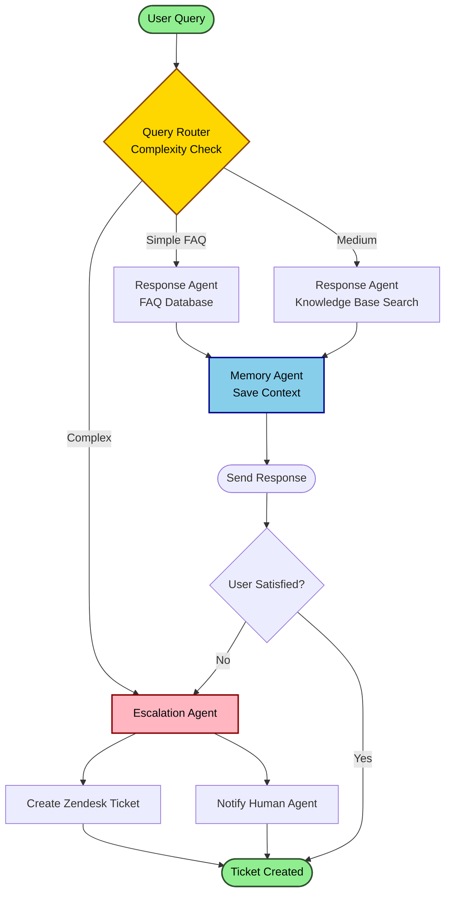
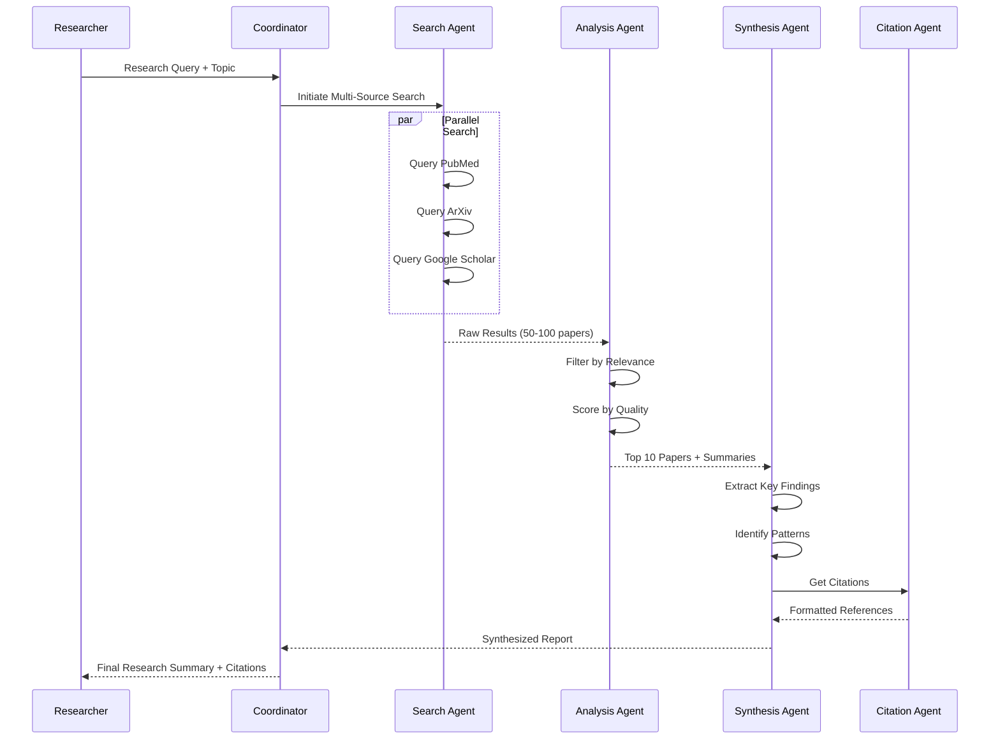
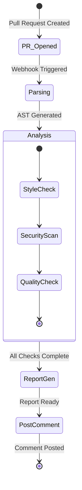
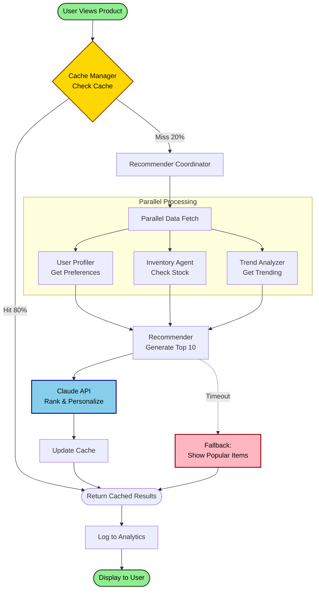

# Agentic AI Architecture Designer - Examples

## Example 1: Customer Support AI System

**User Request**: "Design an AI agent system for customer support that handles common queries and escalates complex issues."

**Requirements Gathered**:
- Scale: Small team (5 support agents), handling ~500 queries/day
- LLM: Claude 3.5 Sonnet
- Integration: Zendesk ticketing system, internal knowledge base
- Budget: $500/month for API costs
- Human-in-loop: Required for complex issues

**Generated Architecture (excerpt from architecture.md)**:

```markdown
# Customer Support AI Agent System

## 1. System Overview
Automated customer support system with 3-tier agent structure handling
500 queries/day with 80% automation rate and human escalation paths.

## 3. Agent Inventory
| Agent Name | Type | Responsibilities | Input | Output |
|------------|------|------------------|-------|--------|
| Query Router | Coordinator | Classify and route queries | User message | Agent assignment |
| Response Agent | Specialist | Handle FAQ/simple queries | Classified query | Direct response |
| Escalation Agent | Specialist | Route complex issues | Complex query | Zendesk ticket |
| Memory Agent | Memory | Track conversation history | Query + Context | Updated context |

## 12. Cost Estimation
- LLM calls per workflow: 2-4 (classify + respond)
- Expected volume: 500 queries/day = 15,000/month
- Token usage: ~1,000 tokens/query average
- Monthly cost: $450 (within $500 budget)
- Optimization: Cache common FAQs (saves ~30%)
```

**Generated Mermaid (workflow.mermaid)**:



**Generated MCP Config (excerpt from mcp-config.json)**:

```json
{
  \"mcpServers\": {
    \"customer-support-agents\": {
      \"command\": \"node\",
      \"args\": [\"server.js\"],
      \"env\": {
        \"ZENDESK_API_KEY\": \"${ZENDESK_API_KEY}\",
        \"KB_DATABASE_URL\": \"${KB_DATABASE_URL}\"
      }
    }
  },
  \"tools\": [
    {
      \"name\": \"search_knowledge_base\",
      \"description\": \"Search internal knowledge base for answers\",
      \"inputSchema\": {
        \"type\": \"object\",
        \"properties\": {
          \"query\": {\"type\": \"string\"},
          \"category\": {\"type\": \"string\", \"enum\": [\"billing\", \"technical\", \"account\"]}
        }
      }
    }
  ]
}
```

**Cost Analysis**: $450/month for 15K queries = $0.03 per query

---

## Example 2: Research Assistant with Actual Output

**User Request**: "Create an architecture for a research assistant that gathers information from multiple sources and synthesizes findings."

**Requirements Gathered**:
- Scale: Individual researcher use
- Volume: 10-20 research queries per day
- LLM: Claude 3.5 Sonnet for synthesis, Claude 3 Haiku for searches
- Integration: Academic databases (PubMed, ArXiv), Google Scholar
- Budget: $200/month

**Generated Workflow Mermaid (excerpt)**:



**Cost Analysis**: $120/month for 400 queries (tiered pricing: Haiku for searches, Sonnet for synthesis)

---

## Example 3: Code Review Automation (Simplified)

**User Request**: "Design an AI system that performs automated code reviews and suggests improvements."

**Key Architecture Elements**:
- **Agents**: Parser (AST analysis) → Style Checker → Security Scanner → Improvement Suggester → Report Aggregator
- **Integration**: GitHub/GitLab webhooks, CI/CD pipeline
- **Processing**: Async (reviews run in background)
- **Framework Recommendation**: LangChain with custom tools for code parsing

**Mermaid State Diagram (excerpt)**:


---

## Example 4-6: Summarized Scenarios

### Multi-Agent Collaboration Platform
- **Complexity**: High (5+ agents, message bus, shared memory)
- **Key Pattern**: Coordinator-worker with conflict resolution
- **Framework**: AutoGen (built for multi-agent collaboration)
- **Cost**: $1,200/month at 100K agent interactions

### Content Creation Workflow
- **Complexity**: Medium (human-in-loop at multiple stages)
- **Key Pattern**: Pipeline with approval gates
- **Framework**: CrewAI (role-based teams)
- **Cost**: $300/month for 50 pieces of content

### Financial Analysis System
- **Complexity**: High (real-time data, compliance requirements)
- **Key Pattern**: Data ingestion → Analysis → Risk assessment → Reporting
- **Framework**: Custom (financial domain complexity)
- **Cost**: $2,000/month (high-volume data processing)

---

## Complete Example: E-commerce Recommendation Engine

**User Request**: "Design an AI agent system for personalized product recommendations with real-time inventory awareness."

**Requirements**:
- Scale: 10,000 customers, 50K requests/day
- LLM: Claude 3.5 Sonnet
- Integration: Shopify API, inventory database, analytics
- Budget: $1,500/month
- Response time: <500ms

### Generated architecture.md (Complete)

```markdown
# E-commerce Recommendation Engine - AI Agent Architecture

## 1. System Overview
- **Purpose**: Provide personalized product recommendations in real-time
- **Key Capabilities**: User profiling, inventory awareness, trend analysis
- **Target Users**: E-commerce customers (10K active users)
- **Success Metrics**: 25% increase in conversion, <500ms response time

## 2. Architecture Diagram
See diagrams/workflow.mermaid

## 3. Agent Inventory
| Agent Name | Type | Responsibilities | Input | Output |
|------------|------|------------------|-------|--------|
| User Profiler | Specialist | Build user preference profiles | Browse history, purchases | User profile |
| Inventory Agent | Specialist | Check real-time stock levels | Product IDs | Availability + stock |
| Trend Analyzer | Specialist | Identify trending products | Sales data, time | Trending items |
| Recommender | Coordinator | Generate final recommendations | Profile + inventory + trends | Product list |
| Cache Manager | Memory | Cache frequent queries | Query hash | Cached results or null |

## 4. Communication Patterns
- **Async processing**: Recommendations generated in background
- **Cache-first**: Check cache before agent invocation (80% hit rate target)
- **Event-driven**: Inventory updates trigger cache invalidation
- **Parallel queries**: Profile + inventory + trends fetched simultaneously

## 5. Data Flow
1. User browses product page
2. Cache Manager checks for cached recommendations
3. If miss, Recommender coordinates:
   - User Profiler: Gets preference vector
   - Inventory Agent: Filters out-of-stock items
   - Trend Analyzer: Boosts trending items
4. Recommender generates top 10 products
5. Results cached for 5 minutes
6. Returned to user (<500ms total)

## 6. Memory & State Management
- **Short-term**: Session-based browsing history (Redis, 1hr TTL)
- **Long-term**: User preference profiles (PostgreSQL)
- **Cache**: Recommendation results (Redis, 5min TTL)
- **Shared state**: Inventory levels (updated every 30 seconds)

## 7. Error Handling Strategy
- **Retry policy**: 3 attempts with exponential backoff
- **Fallback**: Show popular products if personalization fails
- **Circuit breaker**: Stop calling failed services after 5 failures
- **Graceful degradation**: Skip trend analysis if slow, use profile only

## 8. Security Model
- **Authentication**: API key + JWT tokens
- **Rate limiting**: 100 requests/min per user
- **Data privacy**: User profiles encrypted at rest
- **Input validation**: Sanitize all product IDs and queries

## 9. Monitoring & Observability
- **Logging**: All agent invocations logged to CloudWatch
- **Metrics**: Response time (p50, p95, p99), cache hit rate, error rate
- **Tracing**: OpenTelemetry for end-to-end request tracking
- **Alerts**: Response time >500ms, error rate >1%

## 10. Scalability Plan
- **Horizontal scaling**: Run 3+ Recommender instances behind load balancer
- **Database**: Read replicas for user profiles
- **Cache**: Redis cluster with 10GB memory
- **CDN**: Cache static product images

## 11. Technology Stack
- **LLM/Model**: Claude 3.5 Sonnet (via Anthropic API)
- **Agent Framework**: LangChain (Python)
- **Backend**: FastAPI (Python 3.11)
- **Database**: PostgreSQL 15 (user data), Redis 7 (cache)
- **Message Queue**: None (direct API calls with caching)
- **Infrastructure**: AWS (ECS Fargate, RDS, ElastiCache)

## 12. Cost Estimation
- **LLM calls per workflow**: 1 call (only Recommender uses LLM)
- **Expected volume**: 50K requests/day = 1.5M/month
- **Cache hit rate**: 80% (only 300K LLM calls needed)
- **Token usage**: ~500 tokens/call (input: profile+inventory, output: recommendations)
- **Monthly cost**: 
  - Anthropic API: $900 (300K × $0.003)
  - Infrastructure: $400 (compute + database + cache)
  - **Total: $1,300** (within $1,500 budget)

## 13. Implementation Phases
- **Phase 1 (Week 1-2)**: MVP with basic profiling and recommendations
- **Phase 2 (Week 3-4)**: Add caching and inventory integration
- **Phase 3 (Week 5-6)**: Add trend analysis and optimize performance
```

### Generated workflow.mermaid (Complete)



### Generated mcp-config.json (Complete)

```json
{
  "mcpServers": {
    "ecommerce-recommendation-engine": {
      "command": "python",
      "args": ["-m", "uvicorn", "main:app", "--host", "0.0.0.0", "--port", "8000"],
      "env": {
        "ANTHROPIC_API_KEY": "${ANTHROPIC_API_KEY}",
        "SHOPIFY_API_KEY": "${SHOPIFY_API_KEY}",
        "DATABASE_URL": "${DATABASE_URL}",
        "REDIS_URL": "${REDIS_URL}"
      },
      "disabled": false
    }
  },
  "tools": [
    {
      "name": "get_user_profile",
      "description": "Retrieve user preference profile from database",
      "inputSchema": {
        "type": "object",
        "properties": {
          "user_id": {"type": "string", "description": "Unique user identifier"},
          "include_history": {"type": "boolean", "default": true}
        },
        "required": ["user_id"]
      }
    },
    {
      "name": "check_inventory",
      "description": "Check real-time inventory levels via Shopify",
      "inputSchema": {
        "type": "object",
        "properties": {
          "product_ids": {
            "type": "array",
            "items": {"type": "string"},
            "description": "List of product IDs to check"
          },
          "location": {"type": "string", "description": "Warehouse location"}
        },
        "required": ["product_ids"]
      }
    },
    {
      "name": "get_trending_products",
      "description": "Get currently trending products",
      "inputSchema": {
        "type": "object",
        "properties": {
          "category": {"type": "string", "description": "Product category"},
          "timeframe": {"type": "string", "enum": ["24h", "7d", "30d"], "default": "7d"},
          "limit": {"type": "integer", "default": 20}
        }
      }
    }
  ],
  "resources": {
    "maxConcurrentRequests": 50,
    "timeoutMs": 5000,
    "retryAttempts": 3,
    "rateLimiting": {
      "requestsPerMinute": 6000,
      "burstSize": 100
    }
  },
  "monitoring": {
    "loggingLevel": "info",
    "metricsEnabled": true,
    "tracingEnabled": true,
    "slowQueryThreshold": 500
  },
  "security": {
    "requireAuth": true,
    "allowedOrigins": ["https://yourstore.com"],
    "rateLimit": true,
    "encryptSensitiveData": true
  },
  "caching": {
    "enabled": true,
    "ttlSeconds": 300,
    "maxSize": "10GB",
    "strategy": "LRU"
  }
}
```

### Implementation Notes Summary

**Framework**: LangChain with FastAPI backend

**Week 1-2 Tasks**:
1. Set up FastAPI server with LangChain agents
2. Implement User Profiler using collaborative filtering
3. Connect to Shopify API for inventory
4. Basic recommendation logic

**Key Challenges**:
1. **Latency**: Mitigated with 80% cache hit rate
2. **Cost**: Optimized by caching and single LLM call per workflow
3. **Accuracy**: A/B testing to tune recommendation algorithm

**Performance Targets**:
- p95 response time: 450ms
- Cache hit rate: 80%
- Recommendation click-through: 15%
- Conversion lift: 25%

**Cost Optimization**:
- Cache frequent queries (saves $3,600/year)
- Use batch processing for trend analysis
- Implement smart fallbacks to avoid unnecessary LLM calls