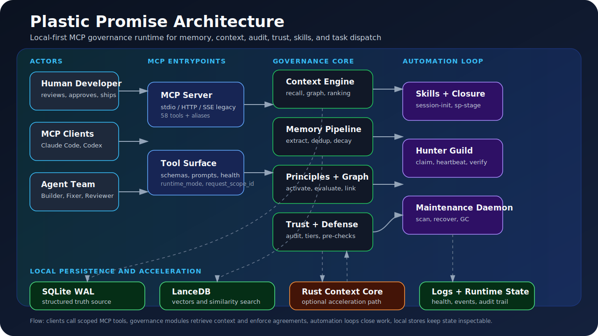

<!-- SEO Meta Tags
Description: Plastic Promise — local-first MCP runtime for AI agent memory, context supply, audit, trust, skills, and governed task dispatch. Commitment Engineering turns operating agreements into retrievable, traceable agent behavior.
Keywords: ai-governance, mcp-server, agent-memory, commitment-engineering, context-engine, llm-agent, multi-agent, trust-score, memory-decay, lancedb
Author: ALdaisuki
Canonical: https://github.com/ALdaisuki/plastic-promise-release
-->

<div align="center">

# Plastic Promise

### Local-first memory, context, audit, and task governance for MCP agents

中文版本: [docs/README.zh-CN.md](docs/README.zh-CN.md)

[](https://pypi.org/project/plastic-promise/)
[](https://www.python.org/)
[](https://www.rust-lang.org/)
[](https://modelcontextprotocol.io/)
[](LICENSE)
[](#status)


[Quick Start](#quick-start) · [Architecture](#architecture) · [Core Modules](#core-modules) · [Documentation](#documentation) · [Roadmap](docs/TODO%20List/README.md)

</div>

---

**Plastic Promise** is a local-first governance runtime for AI agents. It exposes memory, context supply, audit, trust, skill tracking, and task-dispatch capabilities through an MCP server, backed by SQLite and LanceDB.

The project is built around **Commitment Engineering**: instead of relying only on hard gates, an agent retrieves the relevant agreements, prior decisions, trust state, and verification rituals before it acts. The goal is not to block every mistake at the edge; the goal is to make useful behavior repeatable, traceable, reviewable, and self-improving.

---

## What it does

| Capability | What it provides |
|---|---|
| Agent memory | Stores experience, facts, decisions, entities, events, and patterns with quality gates and decay. |
| Context supply | Builds task-specific context packages from vector, text, symbolic, graph, worth, and recency signals. |
| Audit and defense | Checks actions against hard boundaries, trust tiers, and audit dimensions before shared-state changes. |
| Trust-driven autonomy | Maps observed reliability to autonomy, review requirements, and task-claim permissions. |
| Skills and closure | Tracks reusable workflows and step-closure reflections so lessons feed future work. |
| Hunter Guild dispatch | Routes work through a claim, heartbeat, completion, and verification lifecycle. |
| Extensions and market | Loads optional knowledge, workflow, capability, and adapter packs through validated metadata. |

---

## Architecture



```text
+--------------------------------------------------------------------------+
| Plastic Promise Local Governance Runtime                                 |
|                                                                          |
| +------------------+      +-------------------+      +----------------+ |
| | MCP Server       | ---> | Context Engine    | ---> | Storage Layer  | |
| | stdio / SSE      |      | recall + supply   |      | SQLite/LanceDB | |
| +--------+---------+      +---------+---------+      +--------+-------+ |
|          |                          ^                         ^         |
|          v                          |                         |         |
| +------------------+      +---------+---------+      +--------+-------+ |
| | Memory Pipeline  | ---> | Principles/Graph  |      | Trust/Defense  | |
| | extract/dedup/GC |      | activate/evaluate |      | audit + tiers  | |
| +--------+---------+      +-------------------+      +--------+-------+ |
|          |                                                     ^         |
|          v                                                     |         |
| +------------------+      +-------------------+      +--------+-------+ |
| | Skills/Tracking  | ---> | Daemon/Guild      | ---> | Agent Bridge   | |
| | workflow stages  |      | scans/task queue  |      | events/notify  | |
| +------------------+      +-------------------+      +----------------+ |
|                                                                          |
+--------------------------------------------------------------------------+

Legend:
  --->  primary call, data write, or lifecycle event
  ^     read/query dependency
  Boundary = local runtime owned by this repository
```

Full architecture diagrams:

- [C4 Level 1 — Context](docs/architecture/diagrams/c4-level1-context.txt)
- [C4 Level 2 — Container](docs/architecture/diagrams/c4-level2-container.txt)
- [C4 Level 3 — Component](docs/architecture/diagrams/c4-level3-component.txt)
- [Sequence diagram](docs/architecture/diagrams/sequence.mermaid)
- [Component diagram](docs/architecture/diagrams/components.mermaid)

---

## Quick Start

### Install

```bash
# From PyPI
pip install plastic-promise

# From source
git clone https://github.com/ALdaisuki/plastic-promise-release.git
cd plastic-promise-release
pip install -e ".[dev]"
```

Optional Rust accelerator:

```bash
cd rust/context-engine-core
pip install maturin
maturin develop --release
```

### Start the runtime

```bash
# One-click launcher: MCP server (:9020) + maintenance daemon + watchdog
python scripts/init_and_start.py

# If Ollama is unavailable, use fallback embedding mode
python scripts/init_and_start.py --skip-ollama-check
```

Run only the MCP server:

```bash
# stdio mode
python -m plastic_promise

# SSE mode on port 9020
python -m plastic_promise --sse 9020
```

Health check:

```bash
python -c "import urllib.request; print(urllib.request.urlopen('http://127.0.0.1:9020/health').read())"
```

### Connect an MCP client

Stdio example:

```json
{
  "mcpServers": {
    "plastic-promise": {
      "command": "python",
      "args": ["-m", "plastic_promise"]
    }
  }
}
```

Codex project config example (`.codex/config.toml` in a trusted checkout):

```toml
[mcp_servers.plastic_promise]
command = ".venv\\Scripts\\python.exe"
args = ["-m", "plastic_promise"]
startup_timeout_sec = 120
tool_timeout_sec = 120

[mcp_servers.plastic_promise.env]
PYTHONIOENCODING = "utf-8"
PLASTIC_DB_PATH = "data\\db\\plastic_memory.db"
PLASTIC_LANCEDB_PATH = "data\\lancedb"
```

SSE clients can connect to:

```text
http://127.0.0.1:9020/sse
```

---

## First useful calls

```text
session-init(task_description="start a governed coding session", context_mode="light")
memory_recall(query="release documentation", task_type="architecture")
context_supply(task_description="update README", task_type="architecture")
audit_pre_check(action_description="write docs", action_type="write")
memory_store(content="decision and rationale", memory_type="experience")
step-closure(task_description="completed docs update", mode="full", ...)
```

Hunter Guild lifecycle:

```text
task_enqueue -> task_claim -> task_heartbeat -> task_complete -> task_verify
```

---

## Core Modules

This module map follows a capability-first layout so readers can understand the system before reading source folders.

| Module group | Source area | Responsibility |
|---|---|---|
| MCP server | `plastic_promise/mcp/` | Declares tool schemas, stdio/SSE entrypoints, health endpoints, dashboard, prompts, and resources. |
| Context engine | `plastic_promise/core/context_engine.py` | Supplies layered context by combining retrieval, graph, principle, ranking, and degraded-mode signals. |
| Memory pipeline | `plastic_promise/memory/`, `plastic_promise/memory/pipeline.py` | Extracts, classifies, deduplicates, quality-scores, embeds, stores, reinforces, merges, and decays memories. |
| Storage layer | `plastic_promise/core/lancedb_store.py`, SQLite paths | Stores structured state in SQLite and vector/search state in LanceDB. |
| Principles and graph | `plastic_promise/core/principles.py`, `plastic_promise/principles/` | Activates, evaluates, and links operating principles to memory and context. |
| Audit, defense, trust | `plastic_promise/defense/`, `plastic_promise/core/step_auditor.py` | Enforces hard boundaries, trust tiers, audit reports, and pre-action checks. |
| Skills and workflow | `plastic_promise/skills/`, `plastic_promise/loop/` | Implements session lifecycle, smart remembering, step closure, and SuperPowers stage integration. |
| Hunter Guild dispatch | `plastic_promise/mcp/tools/task_queue.py`, `plastic_promise/core/task_*` | Manages task posting, claiming, heartbeat, completion, verification, and failure penalties. |
| Daemons and launcher | `scripts/init_and_start.py`, `daemons/maintenance_daemon.py`, `plastic_promise/launcher/` | Starts services, watches health, runs scans, and recovers routine lifecycle issues. |
| Extensions and market | `plastic_promise/extensions/`, `plugins/` | Loads optional packs through validated metadata without importing untrusted code during validation. |
| Rust context core | `rust/context-engine-core/` | Optional PyO3 acceleration path. Python remains the canonical full pipeline while Rust parity evolves. |

---

## MCP Tool Surface

The current source declares **51 MCP tools** in `plastic_promise/mcp/server.py`. Older documents may mention 48; those counts predate the review and market tool groups.

| Group | Tools |
|---|---|
| Memory | `memory_recall`, `memory_store`, `memory_update`, `memory_forget`, `memory_list`, `memory_gc`, `memory_correct`, `memory_reclassify`, `memory_sync_files` |
| Principles | `principle_activate`, `principle_evaluate` |
| Context | `context_supply`, `context_inject`, `context_graph`, `auto_context_inject` |
| Audit and defense | `audit_run`, `audit_pre_check`, `defense` |
| Reflection | `scarf_reflect`, `feedback_apply` |
| System | `system`, `issue_create`, `issue_transition`, `issue_list` |
| Experience packs | `pack_export`, `pack_import` |
| Domain federation | `domain` |
| Dispatch | `task_enqueue`, `task_claim`, `task_complete`, `task_verify`, `task_inbox`, `task_heartbeat`, `task_abandon` |
| Skill tracking | `skill_session_start`, `skill_session_complete`, `skill_session_trace`, `skill_session_audit`, `skill_auto_track` |
| Programmatic skills | `session-init`, `smart-remember`, `step-closure` |
| Review | `review_run` |
| Market | `market_list`, `market_install`, `market_upgrade`, `market_remove`, `market_enable`, `market_disable`, `market_status` |
| SuperPowers | `sp-stage` |

---

## Core Concepts

### Commitment Engineering

Plastic Promise treats agreements as living context. Agents are expected to retrieve relevant commitments before they act, explain degradation when context is missing, and close the loop after substantive output.

### Memory quality pipeline

```text
capture -> extract -> classify -> embed -> deduplicate -> quality gate -> decay init -> retrieve
```

Memory is admitted only when it passes quality checks. Reuse increases worth; stale or duplicated memories can decay, merge, or be forgotten.

### Context supply

`context_supply` produces a layered context package for a task. It combines semantic search, text search, graph links, principles, and ranking signals into core, related, and divergent context.

`session-init` stays lightweight and does not run full `context_supply` automatically. Its `context_mode` is `light` by default: it may return a bounded 1-2 item lexical memory preview, but material planning, code edits, reviews, and subagent dispatch still require an explicit `memory_recall` / `context_supply` call. Use `context_mode="none"` for pure bootstrap and `context_mode="full"` only when startup-time full retrieval is intentional.

### Step closure

`step-closure` records what changed, what was learned, why it happened, and what should improve next. That reflection updates memory and trust signals.

### Trust-score-driven autonomy

Trust is persisted and changes over time. Higher trust allows more autonomy; lower trust requires more explicit approval or read-only behavior.

### Explicit degraded mode

Local storage is the default. Optional external calls depend on configured agents, embedding providers, rerankers, or LLM integrations. If optional services are unavailable, Plastic Promise uses degraded mode and should label uncertainty instead of silently pretending the full path ran.

---

## Configuration Notes

| Area | Default |
|---|---|
| MCP server port | `9020` for SSE mode |
| Server entrypoint | `python -m plastic_promise` |
| One-click launcher | `python scripts/init_and_start.py` |
| Maintenance daemon | `daemons/maintenance_daemon.py` |
| Default local embedding path | Ollama `mxbai-embed-large`, with fallback embedder when configured |
| Structured database | `data/db/plastic_memory.db` unless `PLASTIC_DB_PATH` overrides it |
| Vector database | `data/lancedb` unless `PLASTIC_LANCEDB_PATH` overrides it |
| Codex repo skills | `.agents/skills/*/SKILL.md` |
| Reranker providers | Local Ollama plus cosine fallback by default; hosted providers require `PP_RERANK_PROVIDERS` opt-in |
| Runtime logs and PIDs | `var/log/`, `var/run/` |

Privacy boundary: Plastic Promise is local-first by default. Data can leave the machine only when you configure external agents, hosted embedding providers, hosted rerankers, or other network integrations.

---

## Development

```bash
pip install -e ".[dev]"
pytest
ruff check plastic_promise/
```

Makefile shortcuts are available for common local workflows:

```bash
make dev-install
make test-fast
make lint
make check
```

Optional service checks:

```bash
python scripts/init_and_start.py --check-only
python scripts/init_and_start.py --skip-ollama-check --check-only
```

Conventions:

- Use Conventional Commits.
- Prefer small, logical PRs.
- Update documentation when behavior changes.
- Include verification notes in PRs.
- Do not merge PRs without explicit maintainer authorization.

---

## Status

| Area | Status | Notes |
|---|---|---|
| MCP server | Active | stdio and SSE modes are implemented. |
| Memory pipeline | Active | Extraction, quality gate, LanceDB write, and decay are implemented. |
| Context supply | Active | Python path is canonical; Rust path is optional and still converging. |
| Hunter Guild | Experimental | Task lifecycle is wired; policy and scanner quality are still evolving. |
| Skills and SuperPowers | Active | `session-init`, `smart-remember`, `step-closure`, and `sp-stage` are exposed. |
| Extension market | Experimental | Pack validation and market commands exist; ecosystem is early. |
| Release pipeline | Active | PyPI and GitHub Actions release sync are configured. |
| Documentation | In progress | This release pass reconciles public docs with current source truth. |

---

## Documentation

| Document | Purpose |
|---|---|
| [docs/README.zh-CN.md](docs/README.zh-CN.md) | Chinese quickstart and user guide. |
| [docs/GOAL.md](docs/GOAL.md) | Chinese canonical goals, current status, and operating philosophy. |
| [docs/SYSTEM_FULL_CHAIN.md](docs/SYSTEM_FULL_CHAIN.md) | Release-facing architecture and operating chain. |
| [docs/DEVELOPER.md](docs/DEVELOPER.md) | Extension and plugin development guide. |
| [docs/architecture/architecture.md](docs/architecture/architecture.md) | Detailed architecture reference. |
| [docs/architecture/implementation-notes.md](docs/architecture/implementation-notes.md) | Practical implementation and operation notes. |
| [docs/TODO List/README.md](docs/TODO%20List/README.md) | Current unfinished roadmap items. |
| [CONTRIBUTING.md](CONTRIBUTING.md) | Contribution workflow. |
| [SECURITY.md](SECURITY.md) | Security policy and reporting process. |

---

## License

Plastic Promise is distributed under the [MIT License](LICENSE).
