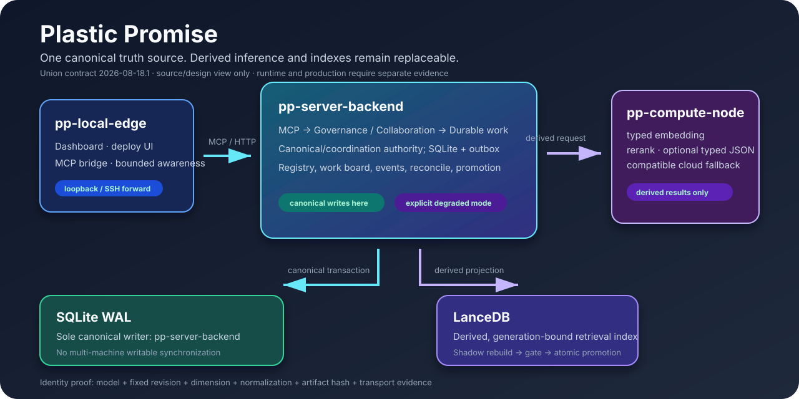
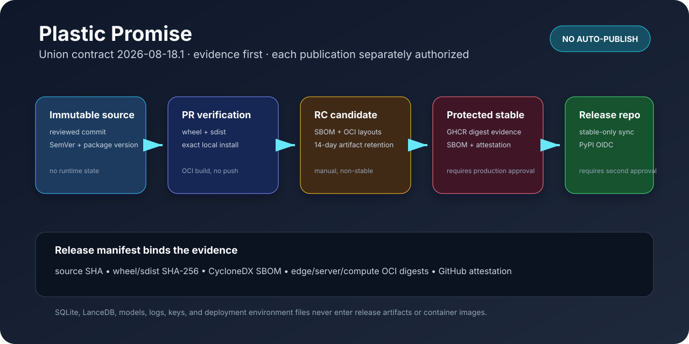
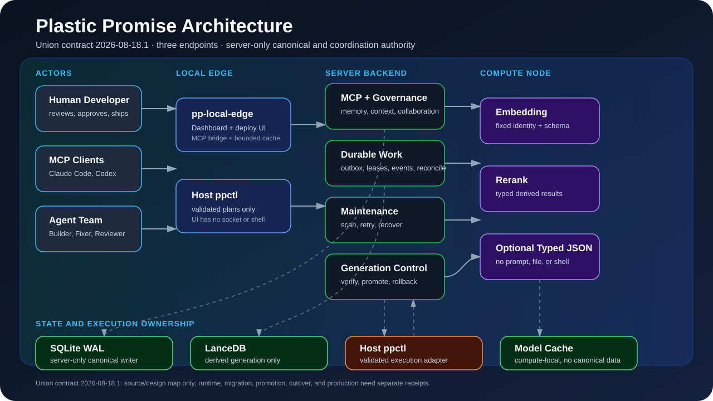
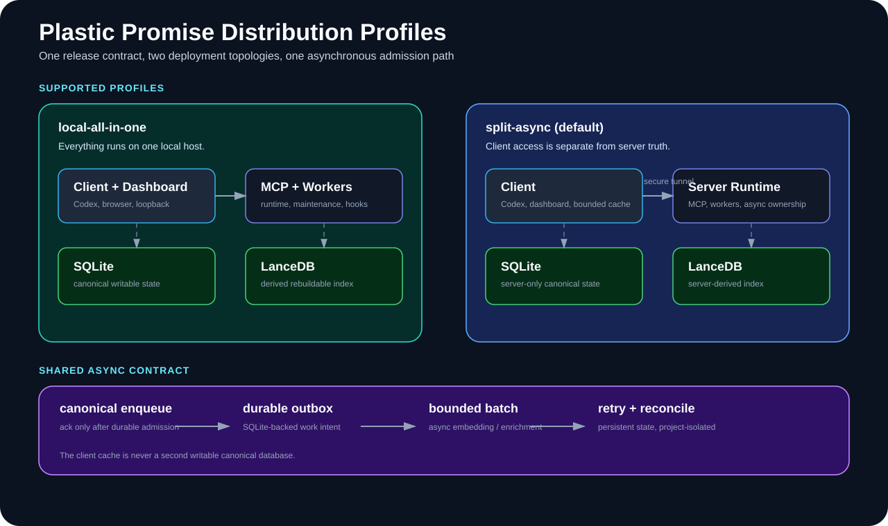

<!-- SEO Meta Tags
Description: Plastic Promise — local-first MCP runtime for AI agent memory, context supply, audit, trust, skills, and governed task dispatch. Commitment Engineering turns operating agreements into retrievable, traceable agent behavior.
Keywords: ai-governance, mcp-server, agent-memory, commitment-engineering, context-engine, llm-agent, multi-agent, trust-score, memory-decay, lancedb
Author: ALdaisuki
Canonical: https://github.com/ALdaisuki/plastic-promise-release
-->

<!-- Open Graph / Twitter
og:type: website
og:url: https://github.com/ALdaisuki/plastic-promise-release
og:title: Plastic Promise - Local-first MCP governance runtime
og:description: Local-first memory, context supply, audit, trust, skills, and governed task dispatch for MCP agents.
twitter:card: summary
twitter:title: Plastic Promise - Local-first MCP governance runtime
twitter:description: Local-first memory, context supply, audit, trust, skills, and governed task dispatch for MCP agents.
-->

<!-- GitHub Metadata
topics: ai-governance, mcp-server, agent-memory, multi-agent, local-first, lancedb, sqlite, rust-python
languages: Python, Rust
-->

<div align="center">

# Plastic Promise

### Local-first memory, context, audit, and task governance for MCP agents

中文版本: [docs/README.zh-CN.md](docs/README.zh-CN.md)

[](https://pypi.org/project/plastic-promise/)
[](https://github.com/ALdaisuki/plastic-promise/actions/workflows/ci.yml)
[](https://github.com/ALdaisuki/plastic-promise/actions/workflows/release-verify.yml)
[](https://www.python.org/)
[](https://www.rust-lang.org/)
[](https://modelcontextprotocol.io/)
[](LICENSE)


[Quick Start](#quick-start) · [Architecture](#architecture) · [Deployment](docs/deployment/README.md) · [Release Delivery](docs/release/delivery.md) · [Release Builder](docs/release-builder.md) · [Core Modules](#core-modules) · [Documentation](#documentation) · [Roadmap](docs/TODO%20List/README.md)

</div>

---

**Plastic Promise** is a local-first governance runtime for AI agents. It exposes memory, context supply, audit, trust, skill tracking, and task-dispatch capabilities through an MCP server, backed by SQLite and LanceDB.

The project is built around **Commitment Engineering**: instead of relying only on hard gates, an agent retrieves the relevant agreements, prior decisions, trust state, and verification rituals before it acts. The goal is not to block every mistake at the edge; the goal is to make useful behavior repeatable, traceable, reviewable, and self-improving.

> **Current integrated delivery authority:** the machine-readable
> [Union Six-PR Contract](docs/standards/union-six-pr-contract.json), revision
> `2026-08-18.1`, is the
> canonical scope for the composable-deployment and project-collaboration
> restoration line. A PR is complete only when every `delivery_scope`,
> `collaboration_scope`, and `required_evidence` item passes the evidence gates;
> one-sided completion is not PR completion. Source-level contracts described
> here are not runtime or production evidence.

<p align="center">
  
</p>

<details>
<summary>View runtime architecture infographic brief</summary>

```text
Canvas: 1280 x 640, dark infrastructure palette with cyan and violet paths.
Purpose: communicate canonical data ownership without presenting providers or
nodes as databases.

Sections:
1. LOCAL EDGE: Dashboard, Deployment Center, MCP bridge, and Codex hooks.
2. SERVER BACKEND: MCP, governance, durable work, maintenance, and routing.
3. TRUTH: only pp-server-backend writes SQLite; LanceDB is derived/rebuildable.
4. COMPUTE: pp-compute-node returns typed derived results only; an explicitly
   configured cloud provider may be used under the same identity contract.
5. SAFETY: no second SQLite writer, public inference listener, or frontend
   access to Docker, SSH private keys, or arbitrary shell execution.

Style: compact vector architecture, high contrast, no photos, no status claims.
Palette: #0F172A → #1E293B, cyan #22D3EE, violet #A78BFA, green #34D399.
```

</details>

## Controlled release delivery (target / unverified)

<p align="center">
  
</p>

This diagram describes a **target/unverified** release-control design. It does
not assert that an RC, signature, attestation, PyPI/GHCR publication, or
production deployment has occurred. The current `release-publish.yml` stable
publisher is not yet connected to the PR 6 selected Release Bundle/Model
Catalog/RC-attestation gate.

<details>
<summary>View release-delivery infographic brief</summary>

```text
Canvas: 1280 x 640, dark infrastructure palette with cyan flow arrows.
Purpose: show that release evidence progresses from immutable source through
PR verification and RC artifacts to protected stable publication.

Sections:
1. HEADER: Plastic Promise — evidence first, publication by explicit approval.
2. FLOW: source -> no-push PR verification -> RC artifact -> protected GHCR -> stable release repo.
3. EVIDENCE: source SHA, wheel/sdist hashes, SBOM, OCI digests, attestation.
4. BOUNDARY: no SQLite, LanceDB, models, logs, keys, or runtime files in artifacts.

Style: architectural, high contrast, compact vector typography; no photos and
no status claims that imply a release has already been published.
```

</details>

---

## Who it is for

Plastic Promise is for developers and agent teams that need more than a one-off memory store. It is useful when an MCP client, coding agent, or multi-agent workflow needs shared memory, explicit governance rules, auditable task handoff, and a local-first runtime that can explain what context was used before an action.

It is intentionally biased toward operational traceability:

| Need | Plastic Promise answer |
|---|---|
| Agents forget decisions between sessions | Store and retrieve memories with worth, decay, deduplication, and graph links. |
| Context retrieval is inconsistent | Use `context_supply` to produce a structured core/related/divergent context package. |
| Automation needs guardrails | Run defense, audit, trust, and principle checks before shared-state changes. |
| Multi-agent work is hard to verify | Route work through Hunter Guild claim, heartbeat, completion, and verification states. |
| Workflows become prompt folklore | Inject the pinned Matt Pocock workflow, invocation authority, and MCP handoffs automatically. |

---

## What it does

| Capability | What it provides |
|---|---|
| Agent memory | Stores experience, facts, decisions, entities, events, and patterns with quality gates and decay. |
| Context supply | Builds task-specific context packages from vector, text, symbolic, graph, worth, recency, project policy, and recommendation signals. |
| Audit and defense | Checks actions against hard boundaries, trust tiers, tool manifests, and audit dimensions before shared-state changes. |
| Trust-driven autonomy | Maps observed reliability to autonomy, review requirements, and task-claim permissions. |
| Skills and closure | Tracks reusable workflows and step-closure reflections so lessons feed future work. |
| Hunter Guild dispatch | Routes work through a claim, heartbeat, completion, and verification lifecycle. |
| Extensions and market | Loads optional knowledge, workflow, capability, and adapter packs through validated metadata. |

---

## Architecture

<p align="center">
  
</p>

The README-level vector diagram shows the three endpoint modules and their state
ownership. It is intentionally higher level than the detailed specification so
the first architecture view stays readable on GitHub. **Endpoint Contract V2
and the PR 3 source-level artifact policy are current in this worktree:** they
resolve the secret-free topology, role ownership, typed admission, result
fencing, and inspectable role/platform/variant descriptors. The independently
running endpoint containers and production cutover shown by the diagram remain
target work; this is not a claim that an image was built or production migrated.

The endpoint images, generated native launch assets, and Dashboard timestamp formatter use
logical `TZ=UTC`; canonical timestamps remain timezone-aware UTC. This does not change the
Linux, macOS, or Windows host timezone and does not mount host timezone files.

### C4 deployment view — Contract V2 and artifact policy current; runtime deployment target

The target standard distribution will keep three endpoint modules and change
only their placement. Contract V2 now assigns `pp-server-backend` as the sole
canonical SQLite, LanceDB-promotion, and deployment-receipt authority;
`pp-local-edge` receives only a sanitised status projection; and
`pp-compute-node` returns typed derived inference only. The PR 3
`ContainerArtifactCompiler` resolves inspectable base/CPU/CUDA policy but does
not run Docker, Compose, a tunnel, or a deployment. Existing V1 manifests and
node endpoints remain compatibility paths. Runtime activation, `ppctl`
execution, migrations, promotion, and release publication remain work for PRs
4–6.

```text
+-------------------------- User host --------------------------+
| Browser / Codex Hooks -> pp-local-edge                        |
| Dashboard + Deployment Center + MCP bridge                    |
|                       host-only validated plans -> ppctl       |
+-------------------------------+-------------------------------+
                                | loopback / restricted SSH
                                v
+------------------------- Server host -------------------------+
| pp-server-backend                                              |
| MCP + governance + durable work + Maintenance + routing        |
| SQLite WAL: sole canonical writer | LanceDB: derived generation|
+-------------------------------+-------------------------------+
                                | restricted reverse SSH
                                v
+------------------------- Compute host ------------------------+
| pp-compute-node: typed embedding / rerank / optional JSON      |
| no SQLite, LanceDB promotion, file, shell, or arbitrary prompt |
+---------------------------------------------------------------+
```

<p align="center">
  
</p>

<details>
<summary>View infographic generation brief</summary>

```text
Canvas: 1280 x 760, dark high-contrast architecture infographic.
Purpose: compare endpoint placement while preserving the same ownership rules.

Sections:
1. HEADER: Plastic Promise Distribution Profiles.
2. LOCAL: pp-local-edge, pp-server-backend, and optional pp-compute-node.
3. SPLIT: local edge, server backend, and compute node on separate hosts.
4. ASYNC: manifest -> ppctl -> durable queue -> typed result -> reconcile.

Rules: SQLite is canonical; LanceDB is derived; client cache is never a writable
truth source; deployment changes placement, not ownership.
```

</details>

### Contracted durable async sequence

```text
pp-local-edge     => pp-server-backend : submit MCP or deployment request
pp-server-backend => SQLite            : canonical transaction + durable work
pp-server-backend => pp-compute-node   : leased typed inference request
pp-compute-node   => pp-server-backend : identity-bound result or failure
failure           ~> durable queue     : retain work and use text degradation
health poll       ~> local + cloud     : recover after consecutive stable probes
pp-server-backend => LanceDB           : update only verified derived generation
```

The client cache never becomes a second writable truth source. SQLite owns
canonical memory and governance state; LanceDB remains rebuildable. The V2
manifest, endpoint admission, receipt, and fencing schema are current; the
runtime execution and production recovery path in this diagram are target-only.

### C4 release-delivery context

```text
+---------------- Developer / reviewer ----------------+
| reviewed source ref + release decision                |
+--------------------------+----------------------------+
                           | PR: build verification only
                           v
+---------------- GitHub Actions -----------------------+
| wheel/sdist + exact install | OCI build (no push)      |
+--------------------------+----------------------------+
                           | manual RC
                           v
+---------------- Candidate evidence -------------------+
| SBOM + short-lived artifacts | TestPyPI rehearsal      |
+--------------------------+----------------------------+
                           | protected stable approval
                           v
+---------------- Release authority --------------------+
| GHCR immutable digests -> manifest -> release repo    |
| PyPI OIDC only after a separate stable-only approval   |
+--------------------------------------------------------+
```

The release path has no MCP write authority. It records public release evidence
only; canonical SQLite, derived LanceDB, models, logs, keys, and runtime state
remain outside source distributions and OCI images.

Full architecture diagrams:

- [Vector overview - English](docs/architecture/plastic-promise-flow.svg)
- [Vector overview - Chinese](docs/architecture/plastic-promise-flow.zh-CN.svg)
- [Distribution profiles - English](docs/architecture/distribution-profiles.svg)
- [Distribution profiles - Chinese](docs/architecture/distribution-profiles.zh-CN.svg)
- [Three-endpoint target architecture - English](docs/architecture/three-endpoint-deployment/architecture.md)
- [Three-endpoint target architecture - Chinese](docs/architecture/three-endpoint-deployment/architecture.zh-CN.md)
- [Composable deployment roadmap](docs/roadmap/composable-deployment.md)
- [可组合部署路线图](docs/roadmap/composable-deployment.zh-CN.md)
- [C4 Level 1 — Context](docs/architecture/diagrams/c4-level1-context.txt)
- [C4 Level 2 — Container](docs/architecture/diagrams/c4-level2-container.txt)
- [C4 Level 3 — Component](docs/architecture/diagrams/c4-level3-component.txt)
- [Sequence diagram](docs/architecture/diagrams/sequence.mermaid)
- [Component diagram](docs/architecture/diagrams/components.mermaid)
- [Release-delivery architecture](docs/architecture/release-delivery/architecture.md)
- [Release-delivery architecture - Chinese](docs/architecture/release-delivery/architecture.zh-CN.md)
- [Release-delivery workflow](docs/architecture/release-delivery/workflow.mermaid)
- [Release-delivery workflow - Chinese](docs/architecture/release-delivery/workflow.zh-CN.mermaid)
- [Release delivery and installation profiles](docs/release/delivery.md)

---

## Quick Start

### Install

> PyPI publication is not available yet. Use a source checkout or a reviewed
> wheel/OCI artifact. The command `pip install plastic-promise` becomes valid
> only after the stable PyPI release is published.

```bash
# From source
git clone https://github.com/ALdaisuki/plastic-promise-release.git
cd plastic-promise-release
pip install -e ".[dev]"
```

The base and `dev` installs do not include an in-process model runtime, which
keeps the server cloud profile lightweight. Install the local
`sentence-transformers` provider explicitly when that execution mode is wanted:

```bash
pip install -e ".[dev,local-inference]"
```

Optional Rust accelerator:

```bash
cd rust/context-engine-core
pip install maturin
maturin develop --release
```

### Start the runtime

```bash
# One-click launcher: MCP server (:9020) + maintenance daemon + watchdog
python scripts/init_and_start.py

# Non-interactive startup can pin a runtime mode
python scripts/init_and_start.py --mode rust-full

# Legacy compatibility only: skip the optional Ollama probe
python scripts/init_and_start.py --skip-ollama-check
```

If no mode is provided in an interactive terminal, the launcher asks which runtime mode to use before it starts services. Non-interactive startup defaults to `rust-full` to preserve the Rust-first full warmup path.

The one-click launcher and direct MCP entrypoint set `PLASTIC_PROJECT_ID=project:plastic-promise` unless `PLASTIC_PROJECT_ID` or `PP_PROJECT_ID` is already set. Direct MCP starts can still override either key explicitly so `memory_recall` and `context_supply` keep core and related context in the intended project boundary instead of degrading to `project:unknown`.

| Mode | Rust supply | LanceDB startup warmup | Typical use |
|---|---:|---:|---|
| `light` | no | no | Fastest startup; defer LanceDB and use the Python path. |
| `normal` | no | no | Python path with lazy LanceDB init available later. |
| `rust-normal` | yes | no | Rust-first context supply without startup rebuild. |
| `full` | no | yes | Python path plus LanceDB init/backfill/rebuild on startup. |
| `rust-full` | yes | yes | Rust-first context supply plus full startup LanceDB maintenance. |

For `full` and `rust-full`, the backfill/rebuild work belongs to launcher startup warmup. Once the MCP process is running, request-time heavy initialization opens the LanceDB/domain backends but should keep `LDB_BACKFILL_ON_INIT=0` and `LDB_REBUILD_ON_INIT=0` so a normal `context_supply` or debug recall cannot rerun maintenance inside the hot request path.

After startup, MCP clients can inspect or hot-switch the process mode with `runtime_mode(action="get")` and `runtime_mode(action="set", mode="rust-normal")`.

The launcher prepends the project root to child-process `PYTHONPATH`, so script services such as the Maintenance Daemon import the same local package tree as the MCP Server. The daemon also self-bootstraps its project root for direct starts.

Run only the MCP server:

```bash
# stdio mode
python -m plastic_promise

# Streamable HTTP mode on port 9020
python -m plastic_promise --streamable-http 9020

# Legacy alias, still supported for older scripts
python -m plastic_promise --sse 9020
```

Run only the Maintenance Daemon after an MCP Server is already available:

```bash
python daemons/maintenance_daemon.py
```

Health check:

```bash
python -c "import urllib.request; print(urllib.request.urlopen('http://127.0.0.1:9020/health').read())"
```

`/health` is also the deployment identity contract. It returns `pid`,
`source_root`, `source_revision`, `fusion_policy`, and `fusion_attestation`;
the attestation carries `schema=retrieval-fusion-identity/v1`, the requested
policy, candidate ID, and configuration hash. The launcher accepts a newly
started server only when health matches the spawned PID and current source root,
plus the expected Git revision when available. It reuses an existing process on
port 9020 only after the same source-root/revision checks pass; HTTP 200 alone is
not ownership evidence.

On Windows, `python scripts/init_and_start.py --stop` reads only
`var/run/mcp_server.pid` and `var/run/maintenance_daemon.pid` from the current
checkout, then verifies the command line contains that checkout's source root.
It does not scan for or terminate other Python processes or other worktrees.

### Recommended local model profiles

For a CUDA/WSL2 compute node (for example an RTX 5080) Plastic Promise
recommends the following local profiles. The default compute profile uses
separate local llama.cpp servers for embedding and reranking. Operators may
select another compatible runtime, but Plastic Promise requires structured
vectors/scores, exact model identity, and a fixed output dimension. Text
generation, including prompt-based `yes`/`no`, is never accepted as reranking.

| Profile | Embedding | Dimensions | Rerank | Model budget | Recommended for |
| --- | --- | --- | --- | --- | --- |
| CUDA quality | `Qwen3-Embedding-4B-GGUF` via llama.cpp | 2560, L2 | `Qwen3-Reranker-0.6B-GGUF` via llama.cpp structured rerank endpoint, or an official CrossEncoder worker | Operator-selected quantization + runtime workspace | Default for English, Chinese and code retrieval on a 16 GB-class GPU |
| Low memory | `Qwen3-Embedding-0.6B-GGUF` via llama.cpp | 1024, L2 | `Qwen3-Reranker-0.6B-GGUF` | Smaller operator-selected quantization | GPU-capacity or latency pressure |
| Compatibility | BGE GGUF or a local BGE embedding worker | Native dimension, L2 | BGE sequence-classification reranker | Depends on selected artifacts | Governed compatibility fallback |

Upstream revision policy:

- The repository never fabricates or ships a placeholder upstream revision.
- The installer resolves the exact revision and artifact/layer digest selected by
  the operator, then writes the result to a local `model-manifest.json`.
- Production activation rejects mutable-only tags and placeholder revisions;
  the manifest must contain the model name, fixed revision, output dimension,
  normalization, and observed digest.
- Generated manifests stay local and are not committed to Git. A real node's
  manifest is deployment evidence for that node, not a universal upstream
  revision for every installation.

Revisions are operator deployment configuration, not repository defaults: pin the
exact upstream revision you verified in your node `.env` and never rely on a
mutable tag alone.

Identity rules: fix the embedding output at the model's declared native
dimension (2560 for the recommended 4B profile and 1024 for the recommended
0.6B profile) with L2 normalization. The manifest records model name, immutable
revision, artifact digest, dimension, normalization, and backend. A later MRL
dimension reduction is a new embedding identity that requires a fresh shadow
rebuild and generation promotion.

### Connect an MCP client

Stdio example:

```json
{
  "mcpServers": {
    "plastic-promise": {
      "command": "python",
      "args": ["-m", "plastic_promise"]
    }
  }
}
```

Claude Code project config example (`.mcp.json` in a trusted checkout):

On a Mac client using the standard SSH LocalForward, use the local forwarded
port `19020`; the server-side listener remains private on `9020`.

```json
{
  "mcpServers": {
    "plastic-promise": {
      "type": "http",
      "url": "http://127.0.0.1:19020/mcp"
    }
  }
}
```

Codex project config example (`.codex/config.toml` in a trusted checkout):

```toml
[mcp_servers.plastic_promise]
url = "http://127.0.0.1:19020/mcp"
startup_timeout_sec = 120
tool_timeout_sec = 120

[profiles.stdio-fallback.mcp_servers.plastic_promise]
command = ".venv/bin/python"
args = ["-m", "plastic_promise"]
startup_timeout_sec = 120
tool_timeout_sec = 120

[profiles.stdio-fallback.mcp_servers.plastic_promise.env]
PYTHONIOENCODING = "utf-8"
PLASTIC_DB_PATH = "data\\db\\plastic_memory.db"
PLASTIC_LANCEDB_PATH = "data\\lancedb"
```

Modern shared MCP clients should connect to:

```text
http://127.0.0.1:19020/mcp
```

Legacy SSE clients can still connect to:

```text
http://127.0.0.1:19020/sse
```

---

## First useful calls

```text
session-init(task_description="start a governed coding session", context_mode="light", project_id="project:example")
memory_recall(query="release documentation", task_type="architecture")
context_supply(task_description="update README", task_type="architecture")
audit_pre_check(action_description="write docs", action_type="write")
memory_store(content="decision and rationale", memory_type="experience")
step-closure(task_description="completed docs update", mode="full", ...)
```

Hunter Guild lifecycle:

```text
session-init(project_id="project:example")
  -> task_enqueue(project_id="project:example")
  -> task_claim(project_id="project:example")
  -> task_heartbeat(project_id="project:example")
  -> task_complete(project_id="project:example")
  -> task_verify(project_id="project:example")
```

All seven Task Queue tools require the same canonical `project_id`, including
`task_inbox` and `task_abandon`. A successful `session-init` binds that project
to the trusted loopback MCP session. Caller fields such as `agent_name`,
`from_agent`, `trust_score`, and `verified_by` remain routing/display claims;
mutation authority comes from the server-owned session actor and cannot be
granted by those fields.

### Local operator dashboard

The one-click launcher enables Dashboard V2 and bounded retrieval explanations
by default (`PP_DASHBOARD_V2=1`, `PP_RETRIEVAL_EXPLAIN=1`). Open the operator
console after starting the Streamable HTTP server:

```text
http://127.0.0.1:9020/dashboard
```

When the server is reached through the standard SSH forward, use
`http://127.0.0.1:19020/dashboard`. The notice area shows the active defaults
for structured slicing, semantic enrichment, knowledge semantics, and cloud
inference. Inspect them under **Effective configuration** and stage provider
changes under **Cloud desired configuration**. API keys stay in the
compute-node secret channel and are never returned to the browser.

The dashboard is loopback-only and project-scoped. A local operator can select
a project discovered from canonical server activity; each request remains
bound to one selected project, and this selector is not a remote tenant-auth
boundary. It is read-only by default and now includes passive-context/capture
traces, proposal and outbox health,
trace-only hit@k/MRR summaries, plus the governed memory-proposal queue.
Missing duration evidence is shown as unavailable; the UI never substitutes a
synthetic `0 ms`.

`PP_DASHBOARD_REVIEW_ACTIONS=1` enables the dashboard's only write surface:
adopting or rejecting a pending memory proposal. The POST route is registered
only when a server-side review provider is available, requires same-origin JSON
with a non-simple confirmation header, and delegates to `feedback_apply` with
server-owned actor, call ID, project scope, trust score, and defense decision.
The browser cannot supply or widen those authority fields. Leaving the flag at
its default `0` keeps every Dashboard V2 route read-only.

When an authenticated loopback control-plane forward is also configured, the
same Dashboard exposes **推理节点** and **部署预检** views. The node view is a
bounded, read-only projection of server-governed health, capacity, model
identity, queue state, latency, and stable routing/degradation codes; it never
reveals endpoints, credentials, receipts, task payloads, or provider results.
The preflight view is only a resource-planning preview of stable profiles and
available capacity. It does not download models, create state, migrate SQLite,
or approve an installation plan; the future deploy controller remains the only
hard installation gate.

The **脱敏诊断** page has no background telemetry. Only an authenticated operator
click can create its browser-local JSON download, and the server constructs it
from a strict allowlist of component states, bounded counters, and
configuration-presence booleans. It excludes endpoints, hosts, paths,
credentials, configuration values, node/model identities, raw task or request
data, receipts, and SQLite rows.

---

## Architecture Modules

This map names the deep modules, the interface at each seam, and the implementation
that owns the behavior. Deployment profiles move modules between hosts; they do
not duplicate the modules or create a second write authority.

| Module | Interface at the seam | Implementation | Owns |
|---|---|---|---|
| MCP Gateway | MCP tools, `/mcp`, health, dashboard routes | `plastic_promise/mcp/` | Transport, schemas, runtime identity, routing, prompts, resources, and bounded operator views. |
| Governance Core | `session-init`, `defense`, principles, audit, workflow stages | `plastic_promise/defense/`, `plastic_promise/skills/`, `plastic_promise/loop/`, selected `core/` modules | Trust, action policy, principle activation, workflow evidence, and runtime events. |
| Memory and Context | `memory_*`, `context_supply`, `context_graph` | `plastic_promise/memory/`, `plastic_promise/core/context_engine.py` | Extraction, classification, chunking, recall, rank fusion, graph traversal, quality, worth, and decay. |
| Async Control Plane | durable outbox, task lifecycle, maintenance registry | `plastic_promise/core/task_*`, `plastic_promise/mcp/tools/task_queue.py`, `daemons/maintenance_daemon.py` | Durable admission, bounded background work, retries, reconcile, heartbeat, and verification. |
| Storage Adapters | canonical SQLite transactions and derived search operations | `_SQLiteStorage`, `plastic_promise/core/lancedb_store.py` | SQLite truth, lineage, audit state, outbox state, and rebuildable LanceDB projections. |
| Runtime Operations | launcher CLI, runtime modes, watchdog, dashboard | `scripts/init_and_start.py`, `plastic_promise/launcher/`, `plastic_promise/mcp/dashboard_v2/` | Startup ownership, process identity, health, recovery, and local operation. |
| Extension Adapters | provider and market contracts | `plastic_promise/extensions/`, `plugins/` | Optional embedding, rerank, knowledge, workflow, capability, and adapter packs. |
| Distribution | variant contract and fail-closed release validation | `release/variants/standard.json`, `scripts/validate_release_variant.py`, `scripts/release-sync.py` | Supported deployment profiles, public content policy, provenance gates, and attested publication. |
| Rust Context Core | PyO3 context-supply adapter | `rust/context-engine-core/` | Optional snapshot retrieval acceleration while Python retains write-side authority and fallback. |

---

## MCP Tool Surface

The current source exposes **58 MCP tools** in `plastic_promise/mcp/server.py`, including compatibility aliases such as `session_init` for `session-init`. Older documents may mention 48, 51, 56, or 57; those counts predate the runtime mode tool, market tools, review tools, commercial audit export, MGP shadow bridge, and alias surface.

| Group | Tools |
|---|---|
| Memory | `memory_recall`, `memory_store`, `memory_update`, `memory_forget`, `memory_list`, `memory_gc`, `memory_correct`, `memory_reclassify`, `memory_sync_files` |
| Principles | `principle_activate`, `principle_evaluate` |
| Context | `context_supply`, `context_inject`, `context_graph`, `auto_context_inject` |
| Audit and defense | `audit_run`, `audit_pre_check`, `defense` (`evaluate_tool` explains `allow`, `ask`, or `deny` from tool manifest metadata) |
| Reflection | `scarf_reflect`, `feedback_apply` |
| System and runtime | `system`, `runtime_mode`, `issue_create`, `issue_transition`, `issue_list` |
| Experience packs | `pack_export`, `pack_import` |
| Domain federation | `domain` |
| Dispatch | `task_enqueue`, `task_claim`, `task_complete`, `task_verify`, `task_inbox`, `task_heartbeat`, `task_abandon` |
| Skill tracking | `skill_session_start`, `skill_session_complete`, `skill_session_trace`, `skill_session_audit`, `skill_auto_track` |
| Programmatic skills | `session-init`, `smart-remember`, `step-closure` |
| Review | `review_run` |
| Commercial audit | `commercial_audit_export` |
| MGP shadow | `mgp_shadow_bridge` |
| Market | `market_list`, `market_install`, `market_upgrade`, `market_remove`, `market_enable`, `market_disable`, `market_status` |
| Official workflow | `sp-stage` (compatibility name) |

`sp-stage` keeps its public name for existing clients, but its registered stages and routes come only from pinned `mattpocock/skills@ed37663cc5fbef691ddfecd080dff42f7e7e350d`. The `UserPromptSubmit` Hook injects the selected official flow, full chain, declared branches, current and next stage, `[user]`/`[model]` invocation authority, and the project/session/flow IDs that must be reused by `session-init` and every later `sp-stage` call. The combined memory, temporary-proposal, and route rendering has one strict total budget: whole optional sections may be omitted, but partial XML-like contracts are never emitted. Scope values are XML-text escaped, and the default budget preserves an exact scoped route call even with a 300-character project ID. Every explicit `/skill-name` selects a route rooted at that official Skill. A natural-language Skill phrase counts as user intent only when it is a positive command at the start of the prompt. Questions, negations, status statements, and mentions never create a user attestation. Ordinary code-generation commands, including positive command clauses parsed from `general` Hook input, enter `tdd-to-review`; architecture and refactoring tasks enter `codebase-design`; other recognized command families enter their reachable model routes. Read-only explanations, status statements, and negated prompts without a later positive action stay on `routing`; a trailing negative scope constraint does not erase an earlier affirmative task. `implement` and `grill-me` are composite Skills, so their internal test/review or questioning loops are not repeated as outer cursor stages. Their receipts must attest actual internal calls in `evidence.invoked_skills`; the server records deterministic entity-only child chains with `tracking_basis=composite_receipt` rather than claiming independent Hook observation. A persisted parent route may hand off only to a declared branch at an aligned adjacent stage; both `small-build` and `prototype-detour` share the parent `grill-with-docs` branch point, while unrelated route switches remain rejected. A call without `execution_receipt` returns pinned execution guidance only. After the client actually runs the named Codex Skill, it submits a bounded caller attestation containing the skill, upstream revision, `SKILL.md` SHA256, completed status, and non-secret JSON evidence. The server cannot cryptographically prove that a client ran the Skill. A valid receipt runs the governance adapter, then receipt and cursor commit atomically in SQLite under a project/session/flow scope. Receipt-scoped tracking IDs make adapter retries entity-idempotent across the post-adapter commit window; identical receipt replays are idempotent, and conflicting material for the same scope/route step is rejected. `skill_auto_track` remains an explicit compatibility endpoint for external clients and cannot advance this cursor; Codex does not currently expose automatic `PreToolUse`/`PostToolUse` Skill tracking. Production permits one MCP writer per SQLite database; the process-local lock is not a distributed exactly-once lease.

The local parser deliberately supports a bounded command grammar and fails closed to `routing` for ambiguous prose. A future semantic-routing classifier may consume the current compute-node structured-JSON capability to shadow or enrich model-route selection, but it cannot create user-only attestations and must fall back to the deterministic local result when compute routing is unavailable.

---

## Core Concepts

### Commitment Engineering

Plastic Promise treats agreements as living context. Agents are expected to retrieve relevant commitments before they act, explain degradation when context is missing, and close the loop after substantive output.

### Memory quality pipeline

```text
capture -> extract -> classify -> embed -> deduplicate -> quality gate -> decay init -> retrieve
```

Memory is admitted only when it passes quality checks. Reuse increases worth; stale or duplicated memories can decay, merge, or be forgotten.

Long memories are embedded through bounded chunks before derived vectors are
written to LanceDB. The server owns canonical text and index promotion but does
not execute embedding, rerank, or structured inference. Those operations are
routed to an authenticated `pp-compute-node`; the recommended local backend is
llama.cpp, while cloud and Ollama remain explicit operator-selected adapters.

`PP_MEMORY_CHUNKING=shadow` keeps the legacy embedding requests and index identity,
while recording a deterministic structure-aware candidate manifest for comparison.
`PP_MEMORY_CHUNKING=structure-v1` is the launcher default and enables that
structural baseline before embedding input is sent to the compute node. It
recognizes Markdown heading paths,
paragraphs, fenced code, lists, and tables; isolates atomic blocks; preserves
verbatim source spans; and processes the complete tail within the bounded
`EMBEDDER_STRUCTURE_MAX_CHUNKS` request budget. When the budget is exceeded, it
keeps the beginning and tail and marks the middle coverage as resource-limited.
`EMBEDDER_CHUNK_CHARS` becomes the soft packing target and
`EMBEDDER_STRUCTURE_HARD_CHARS` is the oversized-block limit. The current budget
unit remains explicitly `characters-fallback` when a provider does not expose
tokenizer counts. `EMBEDDER_STRUCTURE_MAX_SOURCE_CHARS` is a hard input guard.
Shadow does not create child rows or change retrieval identity, while
`structure-v1` binds all chunking
configuration into the persisted embedding model identity so enabling or
rolling back the active baseline triggers derived-index migration.

After `structure-v1` has produced canonical chunks, semantic enrichment adds
retrieval-only metadata without changing chunk text, order, heading paths, or
source spans. The launcher defaults to
`PP_MEMORY_CHUNK_ENRICHMENT=shadow` with
`PP_MEMORY_CHUNK_ENRICHMENT_PROVIDER=openai-compatible`; the actual structured
JSON call is owned by `pp-compute-node`, not the server backend. Shadow mode
queues bounded analysis and stores validated, content-addressed derived cache
entries without changing active vectors or canonical chunks. Use `on` only
after a reviewed offline rebuild/migration, then keep it enabled for matching
writes and repairs. Model, immutable revision, provider/backend, prompt, schema,
and artifact digest are bound into the derived identity.

Semantic chunk enrichment is therefore enabled by default in bounded shadow
mode; it does not imply that unconfigured cloud credentials are used. The
provider request uses temperature zero and a strict JSON response contract.
The response is still independently validated:
unknown or missing fields, a non-verbatim summary/evidence/keyword/entity,
identifier mismatches, invalid JSON, timeouts, and unavailable models all fail
closed to the original chunk. The
If the cloud API is absent, unhealthy, or rejected, the work is explicitly
deferred for retry/reconcile; it is not reported as successful and it does not
silently switch to a server-local model. Enrichment remains inactive unless
`PP_MEMORY_CHUNKING=structure-v1` is also enabled.

The read-only shadow report can be run against the canonical SQLite memories
or an explicit JSON/JSONL corpus. It reports truncation, candidate coverage,
block kinds, chunk-count ratio, and local planning latency without calling an
embedding model or writing any index:

```powershell
python scripts/benchmark_chunking_shadow.py --source data/db/plastic_memory.db
python scripts/benchmark_chunking_shadow.py --source tests/fixtures/recall_quality/v1.json
```

The report keeps record ids and diagnostics only; source text is not emitted.
Use the report to choose the next real-model recall benchmark, not as a release
quality conclusion by itself.

`PP_MEMORY_SUMMARY_INDEX=1` enables the feature-gated summary index write path.
SQLite remains the truth source for `raw_content`, L0/L1/L2 summary layers, and
the exact summary-only `embedding_text` / `embedding_hash` used for indexing.
LanceDB remains a derived index: it receives the vector plus compact
`search_text`, not the raw turn or full L2 narrative. With the flag unset, the
legacy LanceDB `text=content` behavior is preserved.

### Context supply

`context_supply` produces a layered context package for a task. It combines vector search, BM25 keyword search, FTS, graph links, principles, and ranking signals into core, related, and divergent context. Strong BM25 hits are preserved through reranking/MMR by default so exact identifiers are not lost; tune this bounded behavior with `PP_BM25_PRESERVATION`, `PP_BM25_PRESERVATION_THRESHOLD`, and `PP_BM25_PRESERVATION_LIMIT`.

`memory_recall` and `context_supply` accept `response_mode=standard|compact|debug`. Compact mode removes large audit evidence and shortens context items. Debug mode returns bounded diagnostics plus a trace reference instead of embedding the complete audit, channel rankings, and per-item evidence in model context. The legacy `debug=true` parameter maps to `response_mode=debug`.

`memory_recall` now uses the versioned `memory-recall-response-v1` shape with canonical result fields at the top level in every response mode. The historical duplicate `data` mirror is intentionally removed; clients that read `data.core`, `data.related`, or `data.divergent` must migrate to `core`, `related`, and `divergent`. `session-init(response_mode="standard")` remains available when a caller needs the complete bootstrap payload rather than the default compact projection.

`session-init` stays lightweight and does not run full `context_supply` automatically. Its `context_mode` is `light` by default and its MCP response defaults to `response_mode=compact`; use `response_mode=standard` only when complete bootstrap details are required. `sp-stage` defaults to `guidance_level=summary`; set `guidance_level=full` to request full exemplar or dispatch templates.

Concurrent heavy context calls can carry `stage_session_id`, `flow_line_id`, and `request_id`. Plastic Promise derives a `request_scope_id` from those fields, includes it in audit metadata and `context_supply` output, and uses it to isolate `memory_recall` cache entries across overlapping official workflow stages or agent flows.

`memory_recall` and `context_supply` also return context recommender metadata. Recommendations annotate selected context without bypassing project policy, exclusions, trust boundaries, or retrieval budgets. Live evaluation can attach versioned ground truth to record hit@k, MRR, and forbidden-hit evidence in the call span rather than the normal response.

In `rust-full`, `memory_recall(response_mode="debug")` stays on the Rust snapshot hot path when Rust is healthy and preferred. It returns bounded Rust pipeline diagnostics and falls back to Python only when the Rust path is unavailable or throws. Complete evidence remains queryable through the returned call/trace identifier.

The Engram-inspired canonical hot lookup and ContextGate instrumentation are off by default and can be observed with `PP_CANONICAL_HOT_LOOKUP=1` and `PP_CONTEXT_GATE=1`; prompt layers only change when separate enforcement flags are explicitly enabled.

### Passive memory loop

Before inference, `auto_context_inject(event="before_invoke")` can perform a compact, project-scoped preload. The route defaults to `PP_PASSIVE_CONTEXT=off`; `shadow` traces selection without injecting text, and `on` returns an injection. The returned block is marked `ephemeral` and `untrusted-reference`; it is never persisted as a memory. Retrieved IDs, principle names, and memory text are escaped before entering the wrapper so stored markup cannot close the untrusted block. `PP_PASSIVE_CONTEXT_MAX_CHARS` defaults to 1000, falls back to that value when invalid, and is clamped to 300-8000 characters. The limit applies to the final combined canonical-memory, temporary-proposal, and workflow-routing output, not to each section independently.

After inference, the same adapter audits only the original `user_text`. Injected memory blocks and assistant output are excluded. Explicit facts, preferences, and decisions enter a durable SQLite outbox and governed proposal review queue only when both `PP_PASSIVE_MEMORY=on` and `PP_MEMORY_PROPOSALS=on`; defaults remain fail-closed. Queue depth, retry attempts, exponential backoff, and stale-lease recovery are controlled by the `PP_PASSIVE_MEMORY_*` variables in `.env.example`.

When explicit extraction misses, `PP_PASSIVE_SEMANTIC_CAPTURE=shadow|on` queues durable cloud JSON classification and returns immediately. The worker reuses the structured-chunk Provider, batches up to 20 inputs, and partitions every claim by project, visibility, configuration revision, and Provider identity. It may merge or split facts, but accepted evidence must be copied from the submitted user inputs. `on` persists proposals through `ProposalAutomation`, preserving each contributing turn as scoring evidence.

`PP_MEMORY_PROPOSAL_AUTO_ADOPT=shadow|on` enables a separate durable promotion worker. Eligible score revisions are idempotent jobs; vector evidence is batched, retry/dead reasons are persisted, and Maintenance reconciliation repairs missing jobs. `evaluate_auto_promotion()` remains the only policy authority: `shadow` records would-promote, while `on` uses the existing canonical atomic promoter only after all gates pass. Both gates default to `off`; Maintenance itself is still separately controlled.

#### Codex passive-memory hooks

The project-level `.codex/hooks.json` maps Codex `UserPromptSubmit`, `Stop`, and `SessionEnd` events to the project `.venv` Python on every platform. This avoids silently using the macOS system Python, which may be older than the package's Python 3.10 minimum. Registration alone does no memory work. `UserPromptSubmit` opens an authenticated durable Agent session and stores a short-lived, server-issued HMAC continuation in a session-scoped `0600` state file. `Stop` and `SessionEnd` resume that exact session across fresh MCP transports; the continuation is project/flow/actor/Hook scoped, expires after a bounded interval, is revoked on successful SessionEnd, and never grants caller-selected role, policy, lease, or durable-session authority. `Stop` keeps passive capture pending-only and separate from canonical memory. `SessionEnd` removes local state only after a durable closed receipt; deferred closure keeps retry state. The source and isolated E2E prove cursor resume and lease release, but production activation and live runtime evidence remain separate PR 5 gates.

The hook is fail-open: MCP connection, timeout, malformed response, or state-file errors never block Codex. It calls the Streamable HTTP MCP endpoint directly and never starts another Codex process. Create `.venv` with Python 3.10+ and install the project editable before enabling/trusting the hooks. On a Mac client using the standard SSH LocalForward, the default endpoint is `http://127.0.0.1:19020/mcp`; the server-side listener remains `http://127.0.0.1:9020/mcp`. Set `PP_CODEX_HOOK_MCP_URL` only when an explicitly provisioned local-development or alternate-forward endpoint is intended. Remote bearer credentials belong in `PP_CODEX_HOOK_BEARER_TOKEN`, not in `.codex/hooks.json`.

Turn state defaults to the ignored project path `var/codex-hooks`, uses a mode-0700 directory and mode-0600 files, is bounded by `PP_CODEX_HOOK_MAX_TEXT_CHARS`, expires through `PP_CODEX_HOOK_STATE_TTL_SEC`, and contains only the redacted original prompt needed to join `UserPromptSubmit` to `Stop`. Bounded cleanup persists a non-secret cursor so later files cannot be starved by an earlier live batch. On macOS, install the independent 15-minute cleanup timer after creating `.venv`:

```bash
.venv/bin/python scripts/manage_codex_hook_cleanup_launchd.py install
launchctl print "gui/$(id -u)/org.plastic-promise.codex-hook-cleanup"
```

Run one cleanup immediately with `.venv/bin/python -m plastic_promise.passive_memory.codex_hook --cleanup-states`; remove the timer with `.venv/bin/python scripts/manage_codex_hook_cleanup_launchd.py uninstall`. Long-term writes still pass through the existing proposal, secret, project, trust, and outbox gates.

When proposal review is enabled, a public `smart-remember` call reports `success=true`, `action=proposed`, and `status=pending` after the candidate is durably queued; it does not claim that a long-term memory was stored. Server-owned `step-closure` reflection keeps its autonomous write path through trusted runtime provenance, so conversation-derived preferences cannot spoof that bypass.

Ordinary memory writes add bounded topic tags and conservative `related_to`, `contradicts`, or `supersedes` edges without rewriting source text. Edges are mirrored to `memory_lineage` and the behavior graph. Recall expands at most one hop from an admitted hit and reuses the same synthesis and project-isolation gates.

Rollback disables new serving paths while preserving SQLite evidence:

```bash
PP_PASSIVE_CONTEXT=off
PP_PASSIVE_MEMORY=off
PP_MEMORY_PROPOSALS=off
PP_PASSIVE_SEMANTIC_ROUTING=off
PP_PASSIVE_SEMANTIC_CAPTURE=off
PP_MEMORY_PROPOSAL_AUTO_ADOPT=off
PP_BM25_PRESERVATION=0
```

### Step closure

`step-closure` records what changed, what was learned, why it happened, and what should improve next. That reflection updates memory and trust signals.

### Trust-score-driven autonomy

Trust is persisted and changes over time. Higher trust allows more autonomy; lower trust requires more explicit approval or read-only behavior.

### Governance runtime events

Tool calls and Hunter Guild task transitions are recorded as `runtime_events` with `pending`, `running`, `completed`, or `error` status plus request scope, trust tier, defense decision, and audit trace metadata. These events complement span logs by preserving state transitions that can be replayed or audited.

### MGP shadow bridge

`mgp_shadow_bridge` maps MGP-like memory governance operations to Plastic Promise semantics. P1 mode is audit-first: `shadow` records policy decisions without mutating memory, and `inject` is reserved for a later phase.

### Explicit degraded mode

Local storage is the default. Optional external calls depend on configured agents, embedding providers, rerankers, or LLM integrations. If optional services are unavailable, Plastic Promise uses degraded mode and should label uncertainty instead of silently pretending the full path ran.

Embedding and reranking are separate compute-node roles. The recommended local
profile uses llama.cpp for both, with an embedding GGUF and a reranker GGUF
exposed through separate structured endpoints. Ollama and in-process
CrossEncoder/BGE adapters remain explicit compatibility choices. If reranking
is unavailable, the server preserves original order; it never asks a generation
model to invent scores.

#### Resource-aware local inference

The local compute node is deliberately non-competitive. Its runtime resource
guard is enabled by default (`PP_LOCAL_NODE_RESOURCE_GUARD=on`) and samples
aggregate GPU utilization before admitting a new request. The default admission
limit is 70% (`PP_LOCAL_NODE_RESOURCE_GPU_UTILIZATION_LIMIT=70`), avoiding false
deferrals from ordinary desktop GPU activity while still yielding to sustained
games, rendering, or accelerator work. When another device,
game, renderer, or accelerator workload is active, the node returns a bounded
HTTP 429 `node_overloaded` response with `Retry-After` instead of fighting for
the same GPU. Embedding and structured JSON defer for retry/reconcile; rerank keeps
the server contract of preserving original order. The health response exposes
only a redacted `resource_guard` projection.

The external llama.cpp launcher uses the same ten-second read-only gate before
creating workers and supports reversible operations:

```bash
scripts/start_llama_cpp_compute_workers.sh --status
scripts/start_llama_cpp_compute_workers.sh --stop
scripts/start_llama_cpp_compute_workers.sh --start
```

Set `PP_LLAMA_CPP_RESOURCE_GATE=off` only for an explicitly controlled
maintenance window. Normal local, split-accelerated, and release profiles keep
both resource gates enabled. This is especially important on a 16 GiB-class
GPU when the quality profile keeps two 4B models resident.

### Hosted embedding, reranking, and chunk analysis

The recommended baseline keeps embedding and reranking local on a compute node,
while structured semantic enrichment is visible and enabled in safe shadow
mode. The launcher sets `PP_MEMORY_CHUNK_ENRICHMENT=shadow` and
`PP_MEMORY_CHUNK_ENRICHMENT_PROVIDER=openai-compatible`; no network call is
considered active until a compute-node provider, immutable model revision, API
root, and cost policy are validated. Hosted calls use bounded input/output
sizes, retries, deadlines, circuit breaking, response validation,
content-hash caching, and redacted diagnostics.
Any provider API key belongs only in a permission-600 compute-node environment
file or an interactive secret store; it must never be committed, put in a
command line, copied into the server environment, or logged.

For a server-backend profile, do not install or start Ollama on the server and
do not place hosted-provider credentials in the server environment. Hosted
embedding, reranking, and structured analysis are compute-node capabilities;
their credentials and provider endpoints stay in the private compute-node
projection. The server records bounded intent and accepts identity-bound
derived results. If no eligible compute node is healthy, the operation remains
durable and reports a bounded defer/retry or terminal-order degradation reason;
it never constructs a server-local provider.

Use an API root, not a documentation site, wiki, or product homepage. Obtain the
supplier's documented endpoint, typically an `/v1` root such as
`https://provider.example/v1`, and verify it independently before configuring
the compute-node projection (`EMBEDDER_BASE_URL`, `PP_RERANK_BASE_URL`, or
`PP_INFERENCE_BASE_URL`). A configured endpoint is not
evidence that authentication or model access works; the runtime reports
`provider`, `model`, `revision`, `dimension`, bounded usage, and a safe failure
reason instead of claiming success.

OpenAI-compatible embedding APIs that expose a fixed native dimension may
reject the optional `dimensions` request field. After independently proving
that native output matches `PP_EMBEDDING_DIM`, set
`EMBEDDER_SEND_DIMENSIONS=0`; response validation remains strict and the native
request mode becomes part of the derived-index identity.

Probe candidate providers before writing any credential to the server
environment file:

```bash
python scripts/smoke_cloud_providers.py
```

The smoke uses synthetic text only, reads keys through hidden prompts, and
prints neither credentials, vectors, nor source material. `--keys-from-stdin`
is reserved for a protected interactive pipeline; keys are intentionally not
accepted through command-line options or environment variables.

The server dispatch contract is provider-neutral. A frontend may submit
normalized `id`, `text`, and `base_score` fields and omit `embedding`; the
server records only bounded operation intent and identity requirements, while
an authenticated `pp-compute-node` performs any local or hosted provider call.
A provided vector is accepted for that request only when its dimension, finite
nonzero values, declared embedding identity, and SHA-256 material receipt all
match. This is structural validation, not cryptographic proof that the claimed
model produced the vector. Frontend vectors therefore remain request-scoped
and never receive authority to write the formal LanceDB index. Provider names,
models, base URLs, paths, prompts, responses, and credentials remain inside the
compute-node boundary and are rejected from frontend and collaboration input.

PR 5 source now treats structured JSON as a first-class `pp-compute-node`
capability alongside embedding and rerank. It is disabled by default until a
backend, model, fixed revision, and bounded provider configuration are
activated and identity-revalidated. The compute node enforces prompt, payload,
token, timeout, UTF-8, and response limits; `pp-server-backend` may request the
capability but cannot construct or invoke its local, hosted, or raw provider.
This source/test capability does not establish live provider activation,
runtime evidence, production acceptance, or publication.

Synchronous reranking is safe as a stateless request, but applying an old result
to shared state is not. Backend results bind the request to query, candidate-set,
embedding material, policy, and scoring hashes so each device can reject a
stale response. The authenticated gateway, not a frontend field, derives
`project_id`. A pure request binding is available before provider execution, so
an async deployment can persist a unique `(project_id, idempotency_key)` job,
return the existing job for the same input hash, and return a conflict when the
same key is reused with another input hash. Atomic claim/lease/CAS completion is
still required for multiple workers; the core contract does not pretend an
in-process cache is a durable job queue. Async wrappers move blocking provider
calls off the event loop, but do not replace durable idempotency. Cloud and
Ollama fallback chains use separate
`PP_RERANK_CLOUD_MODEL` and `PP_RERANK_OLLAMA_MODEL` settings.

The frontend may request reranking, but it never submits a final authoritative
rank or provider credentials. It applies a result only while the current
project and candidate-set version still match the response. Repeated requests
may otherwise duplicate cloud cost even when they cannot corrupt state.

If a frontend-side local model is used later, the backend exports a
`client-local-rerank/v1` package containing the exact query and candidate text,
base scores, material hashes, and vector hashes, but no vectors, provider
configuration, or credentials. A returned result names only the package hash,
reported model identity, and ranked item scores. The backend accepts it only
when the authenticated project, current request ID, query, `top_k`, candidate
set version and hash, embedding identity, and dimension all still match
server-owned state. The result is request-scoped and cannot write LanceDB. An
asynchronous or multi-device gateway must keep the authoritative package in a
durable project-scoped job and use compare-and-swap completion so the first
valid completion wins. It must not reconstruct the package from a client echo;
a stateless design needs a server signature or HMAC instead. The pure core
validator deliberately does not pretend to provide those storage guarantees.

This is a backend service boundary, not an unauthenticated public endpoint.
The old standalone inference-gateway package may remain in a full development
installation for compatibility tests, but it is not part of the governed PR5
server runtime and must not be started as a production provider path. Provider
credentials, provider selection, prompts, and responses belong to the
authenticated `pp-compute-node`; `pp-server-backend` records only bounded
intent, identity expectations, leases, and typed result receipts. The server
keeps the single-writer canonical SQLite/LanceDB authority and never creates a
second inference-job truth source.

All canonical data remains on the server: the memory SQLite database, LanceDB,
audit state, outbox and inference job database are never replicated to a
client. The optional `ReadOnlyHotMemoryCache` is process-memory-only and can
hold only bounded text supplied by a trusted server-response adapter, scoped by
project, memory ID, memory version and content hash. An Agent may nominate a
memory to retain, assign a priority, and request a lifetime, but that is only
an eligibility recommendation scoped to the active project session. On the
next cache operation at each selection cadence, the client independently
scores successful local hits since the previous selection, recency and entry
size. The frequency is scoped to this client process and active project session;
it is not synchronized across devices. That system score contributes
70% and must clear a minimum floor; Agent priority contributes at most 30% to
the joint retention and capacity score, with LRU only as the final tie-breaker.
The preference is never a pin. TTL is
the shorter of the Agent request and cache TTL, not the selection cadence. A
same-key positive refresh may revise Agent priority or shorten TTL, but cannot
extend TTL, reset hotness, or postpone system selection. System eviction holds
the identity out for another cadence; a bounded version high-watermark rejects
delayed older responses. Every request captures the current login/project
generation before transport, so a late response cannot cross logout, clear, or
project switching. Each cache instance owns exactly one active project session;
calling `switch_project`, including with the same project ID, starts a fresh
session, clears Agent preferences, and invalidates earlier request contexts.
Cold high-watermarks remain protected for the maximum
response age and are then safely reclaimed; saturation rejects new cache
admission instead of forgetting protected state. A changed version clears the
stale value and waits for the identity's next cadence, while `retain=false`
unconditionally clears every cached version immediately. There is no
serialization, database import, vector, credential, or offline-write API, and
logout/project switching clears all local cache state. A stale or offline cache
is display-only and cannot become server truth.

A trusted client captures `capture_request_context(project_id)` before
transport, then calls `store_server_response(response, request_context=...,
selection=...)` after authentication. The response supplies immutable memory
identity and text, while the Agent supplies `HotMemoryCacheSelection`
separately; any server-returned `cache_hint` is non-authoritative and cannot
override the local Agent choice or the system cadence/capacity decision.

Provider execution is owned by `pp-compute-node`, never by `pp-server-backend`.
The server records bounded operation intent, accepts only validated derived
results, and remains the sole canonical SQLite/LanceDB writer. Configure a
compute node with either local models or explicitly approved hosted providers;
credentials and provider endpoints stay in the compute-node environment and
are never copied into server configuration, browser storage, or a frontend
bundle. A minimal private node environment is:

```bash
PP_ENDPOINT_ROLE=pp-compute-node
PP_LOCAL_NODE_AUTHORIZATION="Bearer <random node token>"
PP_LOCAL_NODE_EMBEDDING_BACKEND=llama.cpp
PP_LOCAL_NODE_EMBEDDING_MODEL=Qwen3-Embedding-4B-GGUF
PP_LOCAL_NODE_EMBEDDING_REVISION=<fixed-40-hex-revision>
PP_LOCAL_NODE_EMBEDDING_DIMENSION=2560
PP_LOCAL_NODE_EMBEDDING_NORMALIZATION=l2
PP_LOCAL_NODE_EMBEDDING_LLAMA_CPP_BASE_URL=http://127.0.0.1:19131
PP_LOCAL_NODE_RERANK_BACKEND=llama.cpp
PP_LOCAL_NODE_RERANK_MODEL=Qwen3-Reranker-0.6B-GGUF
PP_LOCAL_NODE_RERANK_REVISION=<fixed-40-hex-revision>
PP_LOCAL_NODE_RERANK_LLAMA_CPP_BASE_URL=http://127.0.0.1:19132
```

The server-to-node transport references the authorization variable by name
(`PP_NODE_AUTH_*`) in its private endpoint document. The token itself remains
process-local. Hosted embedding, reranking, and structured JSON are optional
compute-node capabilities; if no eligible node is available, the server keeps
the canonical write durable and reports a stable degraded reason instead of
constructing a provider locally. Use the dedicated compute-node build and
smoke scripts for provider activation and identity evidence.

<!-- Legacy standalone inference-gateway material below is retained only for
historical contract references. It is not part of the current
pp-server-backend artifact and must not be deployed from the server profile.
All provider calls must be routed through an authenticated pp-compute-node.

```bash
PP_INFERENCE_GATEWAY=1
PP_INFERENCE_GATEWAY_PROJECT_ID=project:plastic-promise
PP_INFERENCE_GATEWAY_TOKEN=<random gateway token>
PP_INFERENCE_GATEWAY_DB_PATH=/srv/plastic-promise/state/inference/inference_jobs.db
# Exact hosts allowed to receive provider requests, for example:
PP_INFERENCE_PROVIDER_HOST_ALLOWLIST=api.embedding.example,api.rerank.example
# Required only for an all-supplied client-vector request path:
PP_INFERENCE_CLIENT_VECTOR_IDENTITY=<opaque-server-owned-contract>
PP_INFERENCE_CLIENT_VECTOR_DIMENSION=1024
PP_INFERENCE_GATEWAY_TTL_SEC=900
PP_INFERENCE_GATEWAY_LEASE_SEC=120
PP_INFERENCE_GATEWAY_MAX_CONCURRENCY=4
PP_INFERENCE_GATEWAY_MAX_ACTIVE_JOBS=1000
PP_INFERENCE_GATEWAY_RETENTION_SEC=86400
PP_INFERENCE_GATEWAY_MAX_RETAINED_ROWS=4000
PP_INFERENCE_GATEWAY_MAX_RETAINED_JSON_BYTES=536870912
```

Generate the gateway token in a private terminal with
`python3 -c 'import secrets; print(secrets.token_urlsafe(48))'`. Enter it only
into the protected server EnvironmentFile; do not paste it into chat or keep it
in browser storage.

Run the dedicated listener with the project environment already loaded:

```bash
.venv/bin/plastic-promise-inference-gateway --port 9030
```

The host is fixed to `127.0.0.1`; there is deliberately no CLI option for
`0.0.0.0`. Forward it independently from MCP, for example
`LocalForward 19030 127.0.0.1:9030`, and call `GET /v1/capabilities` with the
gateway Bearer token. Capability readiness is input-dependent: each cloud and
client-local target reports separate `all_supplied_embeddings`,
`mixed_embeddings`, and `missing_embeddings` states, including whether that
mode requires hosted embedding and/or reranking. An all-supplied cloud request
needs the server-owned vector contract plus hosted reranking, so an embedding
outage does not block it; a request with any missing vector still requires
hosted embedding. Supplied vectors in a mixed request must use the runtime
embedding identity exposed by `mixed_embeddings`, not a distinct all-supplied
client-vector identity. The target-level `embedding_identity` is `null` when
those identities differ, so clients must select the input-specific contract. These are
configuration checks paired with `live_verified=false`; only the hidden-prompt
provider smoke can establish live model and dimension availability. Each mode
returns the exact opaque `embedding_identity` and dimension a frontend must
echo with any request-scoped supplied vector; clients must not reconstruct that
identity from model names or endpoint assumptions. Cloud
provider hosts must be explicitly listed in
`PP_INFERENCE_PROVIDER_HOST_ALLOWLIST`; private, loopback and malformed
endpoints are rejected. The same response publishes the non-authoritative
bounded hot-cache policy, including the Agent selection and system cadence
rules. The rerank workflow uses:

- `POST /v1/rerank/jobs`
- `GET /v1/rerank/jobs/by-key/{idempotency_key_hash}` for an idempotent poll
- `GET /v1/rerank/jobs/{job_id}`
- `POST /v1/rerank/jobs/{job_id}/lease` for `client-local` jobs only
- `POST /v1/rerank/jobs/{job_id}/lease/renew` with the current client lease capability
- `POST /v1/rerank/jobs/{job_id}/complete` for a leased client result

`POST /v1/rerank/jobs` is synchronous by default. A trusted client or
same-origin backend-for-frontend can send `Prefer: respond-async` to receive
`202`, `idempotency_key_hash`, and `poll_path` immediately. Poll that path with
the same protected gateway credential until the record becomes available; use
the returned `job_id` for the client-local lease flow. The request idempotency
key is stable across a retry, while the poll hash is opaque and is never
constructed by the browser.

A slow client renews before half of its lease has elapsed. If the original
lease response is lost, the plaintext capability is intentionally not
recoverable from the server; the client polls until expiry and obtains a new
lease instead of forcing an unsafe concurrent takeover.

The browser never receives a Syuan, DeepSeek, embedding or reranking API key.
There is no wildcard CORS policy and direct browser access is unsupported; use
a same-origin backend-for-frontend or a trusted native client, and keep the
gateway Bearer token out of browser storage. The gateway is not mountable in
the MCP listener: `9020` and `9030` remain separate loopback listeners so
gateway authentication never becomes a path-level facade in front of MCP.

Durable reservations prevent duplicate preparation for concurrent retries, and
an in-process background task continues after the initiating HTTP request is
cancelled. Preparation holds a short renewable lease, so a crash can be taken
over by an idempotent retry instead of blocking until the full job TTL; a slow
provider refreshes that lease before half its lifetime elapses. Graceful
shutdown drains runtime-owned tasks for at most 30 seconds. Work that exceeds
that window remains durable, but an event-loop or process stop can occur after
the provider billed and before SQLite completion, so a retry may issue the
provider call again. The gateway does not promise exactly-once external billing
across a process or host failure because most provider APIs expose no
transactional idempotency primitive. Pending cloud work can resume when the
client repeats the same idempotent POST. The standalone
gateway also starts a bounded recovery pass that atomically claims at most
`min(max_concurrency, max_active_jobs)` pending jobs for its configured project
with `target=cloud`; it never claims `client-local` work. Recovery validates the
persisted authoritative package and constructs only the reranker, so it does
not depend on embedding availability. Jobs beyond that startup bound remain
durable for a client retry or a later restart. CAS still prevents a late result
from overwriting the first accepted completion.
-->

### Remote configuration control plane

Cloud configuration and server status are available through a separate,
headless administration API on `127.0.0.1:9040`. Start the installed
entry point with `plastic-promise-control-plane --port 9040` and forward it to
the Mac independently with `LocalForward 19040 127.0.0.1:9040`. Port `9040`
must never be exposed publicly or mounted below MCP `9020` or inference
gateway `9030`.

Dashboard V2 is the single operator frontend. Its memory and runtime views use
MCP `9020`; its server-status and configuration views call the headless `9040`
API directly through the `19040` forward. The control token stays in browser
memory and never transits the MCP listener. Product frontends use the narrower
inference-gateway contract and must never receive a control-plane token.

The authenticated control plane also serves a bounded node-governance
projection and a planning-only resource preflight projection. The Dashboard
uses these read-only routes to explain health, identity, capacity, queue and
stable routing/degradation outcomes without receiving node endpoints,
transport evidence, task references, result payloads, or secrets. Preflight
reports catalog policy and free-capacity status only; it cannot mutate state or
act as an installer approval.

The same node page projects `accelerator-max` from the existing durable
derived-work ledger: today’s admitted count and a bounded history of admitted,
claimed, completed, retry, and terminal outcomes. A separate, daily-deduplicated
decision ledger records only denied or deferred policy gates (disabled, queue,
daily, capacity, memory, foreground, or concurrency). It is not another work
queue and intentionally exposes only task-kind, audit/lifecycle code, stable
reason code, and normalized time; it never exposes project identifiers,
subjects, providers, payloads, results, evidence, lease tokens, transports, or
model endpoints. Like all node-governance tables, that ledger is created only
by the explicit backup-backed deployment migration, never by Dashboard or MCP
startup.

An authenticated, explicit `POST /diagnostics/bundle` creates a browser-local
support document using a separate strict allowlist rather than serializing the
control-plane responses. The endpoint is not telemetry and has no persistent
side effect; it omits transport and identity material, paths, values, payloads,
receipts, and SQLite content.

For an automated browser regression against the exact Dashboard bundle, first
ensure `127.0.0.1:19020` and `127.0.0.1:19040` are unused, then run
`PP_PYTHON=.venv/bin/python node scripts/dashboard_browser_regression.mjs`.
It starts isolated loopback fixtures and a disposable headless Chromium-family
profile, verifies the node view, CPU title icon, refresh/scroll preservation,
explicit diagnostic-bundle POST/download, and browser errors. It has no
database, provider, service-manager, or production endpoint. The fixture is a
test helper, never an installer or runtime launcher.

The ordered roles are `viewer`, `operator`, and `secret-admin`. Provider keys
are write-only and never returned; Dashboard keeps its control token in
JavaScript memory only, with no cookie, URL, `localStorage`, or
`sessionStorage` persistence. Changes follow strict
validate -> immutable stage -> `If-Match` CAS activate semantics. Every POST
requires JSON plus the current `If-Match`; stage and activate additionally
require a stable idempotency key. Activation atomically selects a private
`managed.env` EnvironmentFile.
Activation returns `restart_required`; the unprivileged control process has no
`sudo`, `systemctl`, or service-manager authority.

The ETag is a random opaque 256-bit CAS token, not a digest of the managed
environment or Provider secrets. Generation evidence is accepted only for an
exact runtime embedding-index identity change, including structure-v1 chunk
budgets; ordinary activations reject unexpected evidence.

Activation records desired state; it is not proof that a running service or
LanceDB pointer has changed. `/status` exposes the desired generation ID and
manifest SHA-256 beside the current generation manifest. A mismatch remains
pending until an authorized host operator promotes the exact desired
generation, restarts the affected services, and completes health and retrieval
smoke.

Database and generation paths, listeners, control authentication, systemd and
Maintenance policy, gateway project ID/token/database, and provider host
allowlist remain bootstrap-only. Each revision privately binds the
process-visible bootstrap EnvironmentFile inputs; activation and crash recovery
fail closed on drift without returning that secret-dependent fingerprint through
the API. An exact runtime embedding-index identity change cannot activate
until provider smoke, a complete shadow generation, a quality gate, and
verified generation evidence all match the staged revision. The server cloud
profile installs no local model. Missing frontend embeddings may be filled by
the hosted backend, while optional client-local reranking stays request-scoped
and wins through the server's durable lease/CAS job; neither path grants a
client authority over SQLite or LanceDB. See
[Remote Configuration Control Plane](docs/remote-control-plane.md) for setup,
systemd EnvironmentFile ordering, SSH tunneling, and acceptance checks.

Semantic chunk enrichment is also opt-in. With
`PP_MEMORY_CHUNKING=structure-v1`, use
`PP_MEMORY_CHUNK_ENRICHMENT=shadow` to exercise the bounded queue without
changing vectors. Only after the shadow evidence is accepted should
`PP_MEMORY_CHUNK_ENRICHMENT=on` be enabled for an offline rebuild. The same
provider/model/prompt/schema identity must remain active for subsequent writes
and repairs; query embedding never calls the enrichment model.

### Offline index-material migration recovery

`scripts/migrate_index_material.py` is an explicit offline canonical-SQLite
migration, not a routine rebuild command. Without `--apply` it only inspects
the existing database and reports the exact row count, source fingerprint,
target model digest, and index-outbox snapshot required by an eventual write:

```bash
.venv/bin/python scripts/migrate_index_material.py \
  --db data/db/plastic_memory.db \
  --target-policy compact-v2
```

An approved `--apply` must provide an existing backup directory and every
expectation emitted by that inspection. It creates and verifies an online
backup before modifying canonical rows. `--allow-unresolved-index-outbox` is a
deliberate recovery mode for `pending`, `blocked`, or `failed` index jobs; it
still rejects `processing` jobs and refuses a changed outbox snapshot. Do not
use this command for a normal service restart, shadow rebuild, or production
operation without the separate migration authorization.

### Immutable LanceDB generations

SQLite is canonical and LanceDB is a rebuildable projection. A cloud-model
change always creates an inactive shadow generation from a SQLite Backup API
snapshot; it never copies a live database WAL or writes the current index in
place. The build records the source fingerprint, embedding identity, benchmark
evidence, and an index-outbox watermark/digest. A candidate is not promotable
until the operator has reviewed the source watermark and run reconciliation
against the same SQLite database:

```bash
python scripts/rebuild_lancedb.py \
  --generation-root data/lancedb-generations \
  --generation-id candidate-<utc> \
  --source-db data/db/plastic_memory.db \
  --quality-report path/to/publishable-quality-report.json \
  --candidate-manifest path/to/frozen-candidate-manifest.json

python scripts/manage_lancedb_generations.py \
  --root data/lancedb-generations \
  reconcile candidate-<utc> \
  --db data/db/plastic_memory.db
python scripts/manage_lancedb_generations.py \
  --root data/lancedb-generations \
  verify-candidate candidate-<utc> \
  --db data/db/plastic_memory.db \
  --embedding-index-identity '<exact staged embedding index identity>'

# After services are stopped and the matching revision is activated, load its
# managed EnvironmentFile before promoting the exact desired generation.
python scripts/manage_lancedb_generations.py \
  --root data/lancedb-generations promote candidate-<utc> \
  --db data/db/plastic_memory.db
```

`reconcile` is an explicit write to SQLite: it marks only the snapshotted
index jobs done and records a receipt. Newer jobs, active processing jobs,
missing immutable outbox columns, a changed WAL, or a receipt/database mismatch
fail closed. `verify-candidate` requires an inactive, reconciled generation and
rechecks its immutable artifact, quality report, canonical SQLite freshness,
embedding identity, and staged runtime environment without moving `current`.

For an embedding change the production order is fixed: stage the revision,
build and reconcile the shadow generation, run `verify-candidate`, stop MCP and
inference workers, activate the revision as desired state, promote the exact
desired generation under the activated managed environment, then restart and
smoke. `promote` and `rollback` require a verified, reconciled generation and
must run with the target MCP EnvironmentFile loaded. Immediately before the
pointer switch they revalidate the exact checkout, lifecycle scripts, native
dependency versions, embedding endpoint identity, index-text policy, retrieval
settings, Python runtime, and source material recorded by the held-out report.
Any drift fails closed. If activation or promotion fails, keep the affected
services stopped and compensate explicitly; never run a new embedding identity
against the old current generation. The runtime opens the selected index
read-only unless a generation-bound writable live view is configured.

To apply new checked `memory_index` and `synthesis_index` outbox jobs without
rebuilding the immutable generation, bootstrap a private live root from the
verified current generation. The current manifest must contain reconciled
outbox evidence backed by its persisted database receipt. Create the private
parent directory first; the target itself must not exist:

```bash
python scripts/manage_generation_live_index.py \
  --live-root data/lancedb-live/generation-<utc> \
  bootstrap --generation-root data/lancedb-generations
python scripts/manage_generation_live_index.py \
  --live-root data/lancedb-live/generation-<utc> \
  verify --generation-root data/lancedb-generations
```

Set both `PLASTIC_LANCEDB_GENERATION_ROOT` and
`PLASTIC_LANCEDB_LIVE_ROOT` in the bootstrap EnvironmentFile before restarting
MCP. Python and Rust then read the same live index; runtime refresh reports its
bounded outbox lag and never runs a full `sync_with_engine()` over it.
Maintenance may replay only checked post-watermark outbox jobs into this copy.
The immutable generation remains unchanged. Every promotion or rollback creates
a retained, one-time `selections/<activation-id>` link and atomically points
`current` at it. The live binding includes that activation ID, so even an
A -> B -> A rollback cannot reactivate an old A live root. Selection links must
not be deleted or reused. Every activation requires a new live root; retiring an
old live root is a separate, explicitly authorized cleanup operation. A legacy
direct `current -> generations/<id>` pointer remains readable but cannot back a
live view until an explicit promotion or rollback creates an activation link.

Do not run the legacy no-arg
`rebuild_lancedb.py` or `smoke_http_mcp.py` against production unless their
write effects (index repair, smoke memory, and outbox rows) are intended and
the Maintenance Daemon is paused.

### Governed synthesis and memory proposals

Governed synthesis is opt-in and fail-closed. SQLite owns canonical memory,
lifecycle, provenance, proposal review, and exact index material; LanceDB is a
rebuildable derived index. The default gates preserve legacy behavior:

| Gate | Default | Effect when enabled |
|---|---|---|
| `PP_SYNTHESIS_ARTIFACTS` | `off` | `shadow` evaluates eligibility without creating artifacts; `on` permits governed drafts. |
| `PP_SYNTHESIS_RETRIEVAL` | `0` | `1` admits only current `verified` synthesis with complete verification evidence. |
| `PP_MEMORY_PROPOSALS` | `off` | `shadow` emits hash-only diagnostics; `on` routes public user facts, preferences, and decisions to review. |
| `PP_MEMORY_INDEX_TEXT_POLICY` | `legacy` | `compact-v2` is an experimental bounded L0/L1 index-text candidate. |

The synthesis lifecycle is `draft -> verified -> stale|contested`. Refreshing a
stale or contested artifact creates the next `draft` revision, which must be
verified again. Verification requires non-empty `last_verified_at`,
`verified_by_actor`, and `verified_by_call_id`; retrieval treats missing control
state or evidence as unavailable. High-impact context plans expand sources only
for synthesis selected into the final context layers.

Retrieval-visible ordinary-memory mutations use a canonical field-scoped
transaction. Content replacement or unavailability records source lineage,
marks dependent synthesis stale, increments the canonical memory version, and
persists checked index jobs before commit. GC merge candidates must have the
same non-empty project, and the coordinator rechecks both declared and canonical
project identity inside the transaction. A mismatch fails without partial
memory, lineage, version, outbox, or cache changes.

Public mutation identity and authority come from server-owned runtime context.
Caller-declared actor, call, project, or trust fields are audit input only; both
`smart-remember` aliases require `memory_update` authority before reading or
changing an existing canonical row. Public `memory_forget` remains a critical
operation with a `0.80` trust requirement. The lower `0.60` `audit_rollover`
capability is internal and does not weaken the public delete boundary.

Proposal review records the reviewer actor, call ID, review time, and a stable
reason code. Pending, rejected, and expired proposals never become recall
candidates or LanceDB rows. The maintenance daemon runs canonical memory
lifecycle updates, proposal expiry, synthesis integrity invalidation, synthesis
index replay, then audit, in that order.

Deterministic recall reports validate metric math and policy gates but are never
publishable quality evidence. A publishable comparison requires isolated seeding
of the same versioned bilingual corpus, the same real non-fallback embedding
model and dimension, equal runtime/warmup/repeat metadata, complete equal split
sets, and a successful store-to-recall-to-context smoke check.

Fusion defaults to `legacy-auto`. `max-v1` is the fixed comparison baseline;
an adopted weighted policy is identified as `wrrf-v1:<sha256>` and must match a
frozen candidate manifest. Bare `wrrf-v1` is accepted by the benchmark CLI only
with `--candidate-manifest`; unknown, unhashed, mismatched, or malformed policy
configuration fails closed. Calibration fingerprints held-out bytes before the
manifest is frozen but does not load or query held-out cases.

For `0.1.15`, the one-shot public calibration produced no eligible WRRF
candidate. The held-out cases therefore remained unopened and the released
fusion policy stays `legacy-auto`; no measured fusion-improvement claim is made.

Maintenance supports a production-equivalent one-shot cycle and a real restart
recovery proof:

```bash
python daemons/maintenance_daemon.py --once --json
python scripts/smoke_restart_recovery.py --artifact-dir .artifacts/recovery-smoke --json
```

The launcher health check treats `maintenance-heartbeat/v1` as the daemon
liveness contract and binds it to the daemon PID before falling back to legacy
mtime checks. Checked ordinary index replay reads existing valid
`memory-index/v2` upserts for compatibility; every new upsert or delete is
written as `memory-index/v3` with action, project, memory version, material
revision, and expected embedding hash.

Operational rollback disables all new behavior without deleting canonical
control, provenance, proposal, or audit rows:

```bash
PP_SYNTHESIS_RETRIEVAL=0
PP_SYNTHESIS_ARTIFACTS=off
PP_MEMORY_PROPOSALS=off
PP_MEMORY_INDEX_TEXT_POLICY=legacy
PP_RETRIEVAL_FUSION_POLICY=legacy-auto
```

Also unset `PP_RETRIEVAL_RRF_K`, `PP_RETRIEVAL_RRF_WEIGHTS_JSON`, and
`PP_RETRIEVAL_RRF_WINDOWS_JSON`. Keep SQLite, provenance, and outbox rows;
restart both processes, run one-shot maintenance to replay the default checked
index policy, then run the HTTP and restart-recovery smokes.

For an upgrade to `0.2.15`, leave these gates at their defaults until the live
deployment passes its project-isolated smoke checks. Restart the MCP server and
Maintenance Daemon together so every writer uses the same canonical mutation
contract. No public MCP tool or parameter was removed; existing SQLite memory
remains canonical and LanceDB can be repaired from durable checked jobs. The
minimum LanceDB version is now `0.34.0`; deployments pinned below that version
must upgrade the dependency before restart.

When changing `PP_MEMORY_CHUNKING`, rebuild the derived index before enabling
traffic, and repeat the rebuild after rollback to `off`:

```powershell
$env:PP_MEMORY_CHUNKING = "structure-v1"
python scripts/rebuild_lancedb.py
$env:PP_MEMORY_CHUNKING = "off"
python scripts/rebuild_lancedb.py
```

Roll out semantic enrichment in two phases. Shadow mode can run with normal
traffic because it does not change vectors. Active mode starts with an offline
rebuild, then remains enabled while serving the enriched index:

```powershell
$env:PP_MEMORY_CHUNKING = "structure-v1"
$env:PP_MEMORY_CHUNK_ENRICHMENT = "shadow"
# Run representative writes/backfills, then inspect enrichment diagnostics/cache.

$env:PP_MEMORY_CHUNK_ENRICHMENT = "on"
python scripts/rebuild_lancedb.py

# Rollback preserves canonical SQLite content; disable enrichment and rebuild
# the derived index to return to the legacy index identity.
$env:PP_MEMORY_CHUNK_ENRICHMENT = "off"
python scripts/rebuild_lancedb.py
```

---

## Configuration Notes

| Area | Default |
|---|---|
| MCP server port | `9020` for Streamable HTTP mode (`/mcp`) |
| Server entrypoint | `python -m plastic_promise` |
| One-click launcher | `python scripts/init_and_start.py` |
| Launcher modes | `light`, `normal`, `rust-normal`, `full`, `rust-full`; non-interactive default is `rust-full` |
| Maintenance daemon | `daemons/maintenance_daemon.py` |
| Remote configuration | Separate loopback-only `127.0.0.1:9040`; Mac SSH forward `19040`; immutable revision metadata activates `managed.env`, stale private material is retired, and an external restart is required |
| Default compute-node embedding | llama.cpp + operator-pinned `Qwen3-Embedding-4B-GGUF`, 2560 dimensions, L2 normalization; Ollama is compatibility-only |
| Structured slicing | `PP_MEMORY_CHUNKING=structure-v1` by launcher default; canonical text/source spans are preserved |
| Semantic chunk enrichment | `shadow` by launcher default with an OpenAI-compatible cloud provider recommended on `pp-compute-node`; `on` requires a reviewed offline rebuild/migration |
| Dashboard V2 | Enabled by the one-click launcher; Chinese, loopback-only, project-scoped, bounded, and read-only by default at `/dashboard`; optional governed proposal review uses `PP_DASHBOARD_REVIEW_ACTIONS=1` |
| Retrieval explanation | `PP_RETRIEVAL_EXPLAIN=1`; stored bounded snapshots with measured request/stage durations and no synthetic zero timing |
| Structured database | `data/db/plastic_memory.db` unless `PLASTIC_DB_PATH` overrides it |
| Vector database | `data/lancedb` unless `PLASTIC_LANCEDB_PATH` overrides it |
| Codex repo skills | `.agents/skills/*/SKILL.md` |
| Default compute-node rerank | llama.cpp structured rerank endpoint + operator-pinned `Qwen3-Reranker-0.6B-GGUF`; generation text is rejected |
| Runtime logs and PIDs | `var/log/`, `var/run/` |

Service subprocesses inherit the launcher's runtime-mode environment and receive the project root at the front of `PYTHONPATH`; this keeps direct script entrypoints and hidden Windows subprocesses aligned with source-checkout execution.

Privacy boundary: Plastic Promise is local-first by default. Data can leave the machine only when you configure external agents, hosted embedding providers, hosted rerankers, or other network integrations.

---

## Roadmap Snapshot

The current roadmap lives in [docs/TODO List/README.md](docs/TODO%20List/README.md). At a high level, active work is organized around:

| Track | Direction |
|---|---|
| Runtime reliability | Keep `session-init`, `context_supply`, `runtime_mode`, daemon startup, and degraded-mode behavior predictable under light and full modes. |
| Rust acceleration | Continue converging the optional Rust context-engine path with the canonical Python pipeline; rebuild and import-test the release PyO3 module after Rust changes. |
| Hunter Guild | Harden task queue policy, scanner quality, reassignment, verification, and trust-score effects. |
| Extension market | Stabilize pack validation, install/enable/disable flows, and plugin metadata boundaries. |
| Public documentation | Keep README, architecture docs, quickstarts, and roadmap entries aligned with source truth. Future release docs should maintain English and Chinese coverage together. |

Known status is summarized below; unfinished detail remains in the roadmap document rather than expanding this README into a full project manual.

---

## Development

### Standard distribution variant

`release/variants/standard.json` is the versioned contract for the standard
Plastic Promise distribution. It describes the public capability set, supported
platforms and runtime modes, canonical and derived storage roles, configuration
names, excluded runtime state, build artifacts, and release provenance gates.
It is a distribution variant, not a separate knowledge-base edition.

Endpoint Contract V2 and the PR 3 source-level `ContainerArtifactCompiler` now
represent three deployment profiles from one code and release contract. The
compiler records policy/descriptors and immutable evidence only; actual artifact
activation remains target work for PRs 4–6:

- `local-all-in-one`: `pp-local-edge`, `pp-server-backend`, and
  `pp-compute-node` run as separate endpoint containers on one local host.
- `local-cloud`: local edge and server backend remain local; configured cloud
  inference is explicit and the cloud embedding identity is authoritative.
- `split-accelerated`: local edge runs on the user host, server backend owns the
  sole writable SQLite and derived LanceDB generation, and compute node supplies
  typed embedding/reranking through a restricted reverse tunnel.

When delivered, all three profiles use the same asynchronous admission contract: acknowledge
only after canonical enqueue, process through a durable outbox with bounded
batching, persist retry state, reconcile unfinished work, and preserve project
isolation. No client cache or inference node receives writable canonical
database access. `split-async` is retained as roadmap terminology only and is
not a first-release stable profile.

The profile and manifest contracts are documented in
[`docs/deployment/profiles.md`](docs/deployment/profiles.md). The current PR 2
contract can be checked without starting a service:

```bash
python scripts/check_module_layers.py
python scripts/validate_release_variant.py release/variants/standard.json --repo-root .
```

The local cross-platform deploy controller is documented in
[`docs/deployment/deploy-controller.md`](docs/deployment/deploy-controller.md).
It plans, preflights, backs up and performs explicit local SQLite migrations,
but never starts or migrates an existing systemd, Compose, launchd or Windows
service.

The contract contains environment variable names only. Secret values, private
keys, databases, derived indexes, logs, backups, and deployment EnvironmentFiles
are forbidden. Validate it locally with:

```bash
python scripts/validate_release_variant.py release/variants/standard.json --repo-root .
```

`release-sync.py` runs the same fail-closed validation before compile or test
validation, and `release/variants/` is part of the synchronized public tree.

```bash
pip install -e ".[dev]"
pytest
ruff check plastic_promise/
```

Use `pip install -e ".[dev,local-inference]"` only when developing or testing
the optional in-process embedding provider. Cloud-only development and server
deployments should keep the smaller `dev` profile.

Makefile shortcuts are available for common local workflows:

```bash
make dev-install
make test-fast
make lint
make check
```

Optional service checks:

```bash
python scripts/init_and_start.py --check-only
python scripts/init_and_start.py --skip-ollama-check --check-only

# Verify the live Streamable HTTP MCP process for the v0.2.15 RC artifact.
python scripts/smoke_http_mcp.py --expected-version 0.2.15rc1 --expected-mode rust-full

# Run only after explicitly enabling PP_MEMORY_SUMMARY_INDEX=1 and compact-v2.
python scripts/smoke_http_mcp.py --expected-version 0.2.15rc1 --expected-mode rust-full --check-summary-index
```

After the separate protected stable-promotion change updates the package and
runtime version to `0.2.15`, repeat the same commands with
`--expected-version 0.2.15`. An RC artifact must not be verified as the stable
version before that promotion exists.

Live release sync has a fail-closed preflight: the release repository must be
clean, on `main`, bound to the expected `origin`, and the current version tag
must be absent both locally and remotely. Validation may create runtime files,
but only the computed release paths are staged; unexpected staged, unstaged, or
untracked paths block the release. Run a dry-run first, then make the first and
only live invocation with `--push`. A live invocation without `--push` is
rejected. The push path also requires `--validation-profile full` and a bounded
`--release-evidence` JSON object bound to the exact version and source HEAD. It
must attest an audit score of at least `0.60`, zero blocking/major findings, and
successful high-risk review, secret scan, scoped Ruff, JavaScript syntax, live HTTP,
restart recovery, diff check, and release-sync preview gates. This maintainer
attestation contains no free-form or secret fields. The live process commits,
creates the annotated tag, revalidates the pinned commit and tag object against
the expected remote state, and atomically pushes `main` plus the exact tag. Do
not replace the attested push with a manual push or `git push --tags`.

```bash
python scripts/release-sync.py --from <base>..<merged> --audit-range <base>..<merged> \
  --version v0.2.15 --release-repo ../plastic-promise-release \
  --expected-source-branch main \
  --expected-source-origin https://github.com/ALdaisuki/plastic-promise.git \
  --expected-origin https://github.com/ALdaisuki/plastic-promise-release.git \
  --validation-profile full --dry-run
# After all gates pass, repeat with --push and:
#   --release-evidence <path-to-release-evidence.json>
```

Conventions:

- Use Conventional Commits.
- Prefer small, logical PRs.
- Update documentation when behavior changes.
- Include verification notes in PRs.
- Do not merge PRs without explicit maintainer authorization.

---

## Status

| Area | Status | Notes |
|---|---|---|
| MCP server | Active | stdio and Streamable HTTP modes are implemented; legacy SSE endpoints remain available. |
| Memory pipeline | Active | Extraction, quality gate, field-scoped canonical mutations, project isolation, checked LanceDB repair jobs, deterministic Python/Rust `structure-v1` manifests, feature-gated summary index writes, and decay are implemented. |
| Context supply | Active | Python remains the canonical write-side authority; governed synthesis admission is opt-in and fail-closed, while Rust snapshot recall is optional, request-scoped, guarded, and explainable with real stage timing. |
| Operator dashboard | Active | Chinese Dashboard V2 exposes bounded views for passive memory, proposals, structured chunks, lineage, request traces, retrieval quality, trust, operations, and runtime configuration; proposal review is separately gated and governed. |
| Remote configuration | Active | The same Dashboard consumes a role-separated, headless loopback control API for server status and governed validate/stage/CAS activation without giving the API service-manager authority. |
| Hunter Guild | Experimental | Task lifecycle is wired; policy and scanner quality are still evolving. |
| Persistent collaboration and compute runtime | Source implemented / focused tests passed / runtime evidence pending | Current PR 5 source includes durable server-only collaboration stores, restart-safe authenticated Hook continuation, server-owned bounded work issuance/operations, ordinary tool reconcile, bounded Stop progress/submitted events, formal result/stage receipts, Maintenance composition, shadow/inject awareness, read-only Dashboard projections, and atomic accepted-result-to-pending-only promotion enqueue. `pp-compute-node` alone executes embedding, rerank, and structured JSON under project-scoped `local`/`cloud`/`hybrid` routing; structured JSON is off by default. Real browser/runtime lifecycle, migration execution, provider activation, production acceptance, and publication remain unverified. Hunter Guild is the legacy/current task queue, not the PR 5 `ProjectWorkBoard`. |
| Skills and governed workflow | Active | `session-init`, `smart-remember`, `step-closure`, and a pinned official `sp-stage` guidance/receipt contract are exposed; detailed Skill execution remains client-owned. |
| Extension market | Experimental | Pack validation and market commands exist; ecosystem is early. |
| Release delivery | Target / unverified | PR verification, RC artifacts, TestPyPI rehearsal, protected OCI evidence, stable-only sync, and OIDC publishing are separated by design; the current stable publisher is not yet connected to the PR 6 selected-evidence gate, and no workflow publishes from a normal push. |
| Documentation | Active / parity receipt pending | English and Chinese documentation is being aligned to the PR 5 source boundary. This status is documentation/source alignment only; the governed parity receipt and PR 5 runtime/production evidence remain outstanding. |

---

## Documentation

| Document | Purpose |
|---|---|
| [docs/README.zh-CN.md](docs/README.zh-CN.md) | Chinese quickstart and user guide. |
| [docs/deployment/README.md](docs/deployment/README.md) | Deployment profiles, ownership boundaries, preflight, node identity, and recovery. |
| [docs/deployment/README.zh-CN.md](docs/deployment/README.zh-CN.md) | Chinese deployment, resource, node-identity, and recovery guide. |
| [docs/release/delivery.zh-CN.md](docs/release/delivery.zh-CN.md) | Chinese controlled-release and production-promotion guide. |
| [docs/release/six-pr-readiness.zh-CN.md](docs/release/six-pr-readiness.zh-CN.md) | Chinese six-PR readiness and rehearsal checklist. |
| [docs/GOAL.md](docs/GOAL.md) | Chinese canonical goals, current status, and operating philosophy. |
| [docs/SYSTEM_FULL_CHAIN.md](docs/SYSTEM_FULL_CHAIN.md) | Release-facing architecture and operating chain. |
| [docs/DEVELOPER.md](docs/DEVELOPER.md) | Extension and plugin development guide. |
| [docs/remote-control-plane.md](docs/remote-control-plane.md) | Secure remote cloud configuration, status, SSH tunnel, and systemd operations. |
| [docs/deployment/deploy-controller.md](docs/deployment/deploy-controller.md) | Cross-platform local deployment plans, preflight, safe SQLite lifecycle and doctor. |
| [docs/release/delivery.md](docs/release/delivery.md) | Installation choices, release channels, protected approval, OIDC, and manifest evidence. |
| [docs/release-builder.md](docs/release-builder.md) | Maintainer-only immutable release requests, desktop confirmation, resource gates, and receipts. |
| [docs/release-builder.zh-CN.md](docs/release-builder.zh-CN.md) | 中文 Release Builder 规格与受控发布边界。 |
| [docs/architecture/architecture.md](docs/architecture/architecture.md) | Detailed architecture reference. |
| [docs/architecture/release-delivery/architecture.md](docs/architecture/release-delivery/architecture.md) | Release-delivery module boundaries and evidence flow. |
| [docs/architecture/release-delivery/architecture.zh-CN.md](docs/architecture/release-delivery/architecture.zh-CN.md) | Chinese release-delivery module boundaries and evidence flow. |
| [docs/architecture/implementation-notes.md](docs/architecture/implementation-notes.md) | Practical implementation and operation notes. |
| [docs/TODO List/README.md](docs/TODO%20List/README.md) | Current unfinished roadmap items. |
| [CONTRIBUTING.md](CONTRIBUTING.md) | Contribution workflow. |
| [SECURITY.md](SECURITY.md) | Security policy and reporting process. |

---

## License

Plastic Promise is distributed under the [MIT License](LICENSE).
