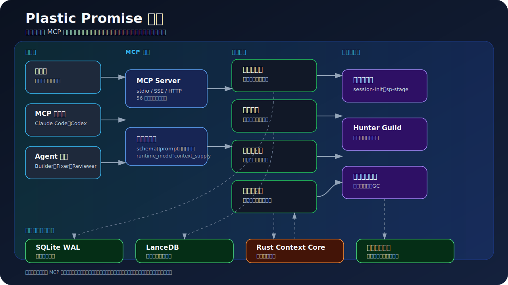

# Plastic Promise 中文指南

> 本文件是面向发行版用户的中文快速指南。英文默认入口见 [../README.md](../README.md)，更完整的项目目标与状态见 [GOAL.md](GOAL.md)。

## 这是什么

Plastic Promise 是一个本地优先的 MCP Agent 记忆、上下文、审计与任务调度系统。它把约定工程、记忆生命周期、信任分、自审计、任务调度和技能工作流组合成一个 Agent 治理底座。

它适合：

- Claude Code 或其他 MCP 客户端需要共享长期记忆时。
- 多 Agent 团队需要可追踪的任务派发、验收和信任分时。
- 项目希望把“先查上下文、再行动、后闭环”的工作方式固化为运行时工具时。

## 适用对象

Plastic Promise 面向需要长期上下文、明确治理规则和可审计任务交接的开发者与 Agent 团队。它不是单纯的记忆库，而是把记忆、原则、上下文、审计、防线、信任分和任务调度组合成一个本地优先的运行时。

| 需求 | Plastic Promise 的回答 |
|---|---|
| Agent 跨会话遗忘决策 | 用 worth、衰减、去重和图谱关联管理长期记忆。 |
| 上下文检索不稳定 | 用 `context_supply` 生成核心、关联、发散三层上下文包。 |
| 自动化需要防线 | 在共享状态变更前执行原则、审计、信任和防线检查。 |
| 多 Agent 工作难验收 | 通过 Hunter Guild 的认领、心跳、完成、验收状态机追踪任务。 |
| 工作流只停留在提示词里 | 将启动、记忆、闭环、审查和 SuperPowers 阶段暴露为 MCP 工具。 |

## 快速开始

### 安装

```bash
pip install plastic-promise
```

源码安装：

```bash
git clone https://github.com/ALdaisuki/plastic-promise-release.git
cd plastic-promise-release
pip install -e ".[dev]"
```

可选 Rust 加速器：

```bash
cd rust/context-engine-core
pip install maturin
maturin develop --release
```

### 启动

```bash
# 一键启动：MCP Server (:9020) + Maintenance Daemon + Watchdog
python scripts/init_and_start.py

# 自动化/后台启动时可显式指定运行模式
python scripts/init_and_start.py --mode rust-full

# Ollama 不可用时，使用 fallback embedder 降级模式
python scripts/init_and_start.py --skip-ollama-check
```

交互式终端未传 `--mode` 时，启动器会先询问启动模式；非交互启动默认使用 `rust-full`，保持 Rust 优先和完整 LanceDB 预热/维护路径。

| 模式 | Rust 加速 | 启动 LanceDB 预热 | 适用场景 |
|---|---:|---:|---|
| `light` | 否 | 否 | 最快启动；延迟 LanceDB，使用 Python 路径。 |
| `normal` | 否 | 否 | Python 路径，后续需要时再懒初始化 LanceDB。 |
| `rust-normal` | 是 | 否 | Rust 优先的上下文供给，不做启动重建。 |
| `full` | 否 | 是 | Python 路径，并在启动时执行 LanceDB init/backfill/rebuild。 |
| `rust-full` | 是 | 是 | Rust 优先，并执行完整 LanceDB 启动维护。 |

对 `full` 和 `rust-full` 而言，backfill/rebuild 属于启动器的启动预热工作。MCP 进程启动后，请求期 heavy init 只打开 LanceDB/domain 后端，并应保持 `LDB_BACKFILL_ON_INIT=0`、`LDB_REBUILD_ON_INIT=0`，避免普通 `context_supply` 或 debug recall 在热请求路径里重复跑维护。

启动后可通过 MCP 工具热更新当前进程模式：

```text
runtime_mode(action="get")
runtime_mode(action="set", mode="rust-normal")
```

启动器会将项目根目录放在子进程 `PYTHONPATH` 最前面，因此 Maintenance Daemon 等脚本式服务会导入当前源码树。Daemon 脚本在直接启动时也会自举项目根路径。

仅启动 MCP Server：

```bash
# stdio 模式
python -m plastic_promise

# Streamable HTTP 模式（共享 MCP Server，端口 9020）
python -m plastic_promise --streamable-http 9020

# 旧脚本兼容别名，仍可用
python -m plastic_promise --sse 9020
```

MCP Server 已启动时，也可以单独启动 Maintenance Daemon：

```bash
python daemons/maintenance_daemon.py
```

健康检查：

```bash
python -c "import urllib.request; print(urllib.request.urlopen('http://127.0.0.1:9020/health').read())"
```

`/health` 同时是部署身份契约。响应包含 `pid`、`source_root`、
`source_revision`、`fusion_policy` 和 `fusion_attestation`；其中 attestation
包含 `schema=retrieval-fusion-identity/v1`、请求策略、候选 ID 和配置哈希。
启动器接纳新进程前会核对 health PID 与刚启动的 PID、当前源码根，以及可用时
的预期 Git revision；复用已占用 9020 的进程时也必须通过源码根/revision 校验，
仅返回 HTTP 200 不能证明进程归属。

Windows 上执行 `python scripts/init_and_start.py --stop` 时，只读取当前工作树的
`var/run/mcp_server.pid` 和 `var/run/maintenance_daemon.pid`，并再次核对进程命令行
中的 source root；不会扫描或终止其他 Python 进程及其他工作树。

连接排查时请用 `/health` 判断服务是否存活；`/mcp` 是 Streamable HTTP MCP 协议端点，浏览器直接 GET 或普通探针访问可能出现 404，这不等价于 MCP 断线。Windows 客户端关闭长连接时的 Proactor 断连 traceback 会在服务端过滤。真实端到端验证使用 `python scripts/smoke_http_mcp.py --expected-version <version> --timeout 60 --sse-read-timeout 360 --json`。本地默认启动会设置 `EMBEDDER_TIMEOUT=30`，避免 Ollama 冷启动或首次 embedding 请求在 5 秒默认值下误判失败；已有环境变量会被保留。重启 MCP Server 后，部分 Codex 会话不会热重载动态 MCP 工具句柄，需要刷新/重开会话让工具表重新注册。

## MCP 配置

stdio 示例：

```json
{
  "mcpServers": {
    "plastic-promise": {
      "command": "python",
      "args": ["-m", "plastic_promise"]
    }
  }
}
```

Claude Code 项目级 `.mcp.json` 示例：

```json
{
  "mcpServers": {
    "plastic-promise": {
      "type": "http",
      "url": "http://127.0.0.1:9020/mcp"
    }
  }
}
```

现代共享 MCP 客户端连接：

```text
http://127.0.0.1:9020/mcp
```

旧 SSE 客户端仍可连接：

```text
http://127.0.0.1:9020/sse
```

### 中文运维控制台

设置 `PP_DASHBOARD_V2=1` 后，可直接打开：

```text
http://127.0.0.1:9020/dashboard
```

Dashboard V2 是仅限本机回环地址、按项目隔离、只读且有界的运维界面，包含总览、
记忆、请求、综合记忆、记忆谱系、检索解释、运行操作、信任问题和配置。记忆详情会
显示 `structure-v1` 结构化切片的标题路径、块类型、父记忆、source span、内容哈希和
截断状态；谱系页显示类型化节点、有向关系以及来源/目标切片锚点。

设置 `PP_RETRIEVAL_EXPLAIN=1` 后，可查看词法、向量、图通道分数、排序/过滤原因、
切片证据和实际请求/阶段耗时。没有计时证据时界面显示“暂无数据”，不会伪造 `0 ms`。

## 核心能力

| 能力 | 说明 |
|---|---|
| 记忆质量管道 | 对经验、事实、决策、实体、事件、模式进行提取、分类、去重、门控、嵌入和衰减。 |
| 上下文供给 | `context_supply` 根据当前任务生成核心、关联、发散三层上下文，并返回推荐原因与 project/global 来源标记。 |
| 审计与防线 | `audit_pre_check`、`audit_run`、`defense` 在写操作和风险动作前提供检查；`defense(action="evaluate_tool")` 可解释工具语义决策。 |
| 信任分驱动自治 | 信任分越高，自主权越大；信任分下降时需要更多显式确认。 |
| Hunter Guild 委托系统 | 通过 `task_enqueue -> task_claim -> task_complete -> task_verify` 管理多 Agent 协作。 |
| Skills / 治理工作流 | `session-init`、`smart-remember`、`step-closure` 和精简的 16 阶段 `sp-stage` 把工作流变成可追踪工具。 |
| Maintenance Daemon | 执行扫描、恢复、GC、任务生命周期维护和调度健康检查。 |
| P1 治理运行时 | 工具清单图、`runtime_events`、`mgp_shadow_bridge`、Context Recommender 为审计和推荐提供可解释元数据。 |
| 插件与市场 | 通过 pack 元数据加载知识、工作流、能力和适配器扩展。 |

长文本嵌入默认仍使用兼容的 legacy 切片。设置 `PP_MEMORY_CHUNKING=shadow` 时，正式向量请求和索引身份不变，只生成结构感知候选诊断；设置 `PP_MEMORY_CHUNKING=structure-v1` 才启用标题路径、段落、代码块、列表和表格感知的嵌入输入，并在有界请求预算内保留尾部。超过 `EMBEDDER_STRUCTURE_MAX_CHUNKS` 时会保留开头和尾部，并标记中间覆盖受资源限制。shadow 报告是只读观测，不调用 embedding 模型、不写 SQLite/LanceDB，也不能单独作为召回质量结论：

```powershell
python scripts/benchmark_chunking_shadow.py --source data/db/plastic_memory.db
python scripts/benchmark_chunking_shadow.py --source tests/fixtures/recall_quality/v1.json
```

在 `structure-v1` 产生权威切片后，可选的本地语义富化层只生成派生索引元数据，不修改 chunk 正文、顺序、标题路径或 source span。`PP_MEMORY_CHUNK_ENRICHMENT=shadow` 使用有界 daemon 队列调用本地 Ollama `qwen3:8b`，正式向量和索引身份不变；验证通过的结果写入默认位于主数据库旁的内容寻址 SQLite 缓存。`PP_MEMORY_CHUNK_ENRICHMENT=on` 应先在离线窗口完成索引重建或迁移，之后保持开启以便新写入和索引修复同步生成同一份精确 embedding plan；查询 embedding 永远不会调用富化模型。摘要、关键词、实体和标识符通过验证后才会前置到 embedding 输入，同时模型、提示词和 schema 版本会绑定到索引身份。需要可复现部署时可设置 `PP_MEMORY_CHUNK_ENRICHMENT_MODEL_DIGEST` 固定 Ollama digest，否则从 `/api/tags` 解析。

本地调用固定 `think=false`、`temperature=0` 并请求严格 JSON Schema，但不会信任 schema 本身。未知或缺失字段、摘要/证据/关键词/实体无法逐字回指原文、标识符不一致、JSON 截断、超时和模型不可用都会 fail-closed 回退原 chunk。默认模式仍为 `off`，且没有同时启用 `PP_MEMORY_CHUNKING=structure-v1` 时富化不会生效。

当前 `plastic_promise/mcp/server.py` 暴露 58 个 MCP 工具，包含 `session_init` / `sp_stage` 等兼容别名。`mgp_shadow_bridge` 是 MGP 兼容语义桥；P1 阶段只做 off/shadow/inject 模式管理与审计映射，不直接改写长期记忆。

`sp-stage` 保留 16 阶段流程，但对客户端只返回当前阶段与路由、必需产物和闭环提醒；服务端会校验每次转换，并在链违规时返回有效后继。Agent 不再需要加载或复述事无巨细的 SuperPowers 技能说明；会话/flow 隔离、审查、审计、信任检查和可追溯性仍由运行时执行。

重型 `memory_recall` / `context_supply` 调用可携带 `stage_session_id`、`flow_line_id` 和 `request_id`。系统会派生 `request_scope_id`，写入审计元数据并显示在 `context_supply` 输出中，同时用它隔离重叠 SuperPowers 阶段或多 Agent 流程中的召回缓存。

`runtime_events` 会记录工具调用和 Hunter Guild 任务流转的 `pending`、`running`、`completed`、`error` 状态，并携带 request scope、trust tier、defense decision 和 audit trace，方便回放与审计。

在 `rust-full` 模式下，`memory_recall(debug=true)` 在 Rust 健康且优先时仍走 Rust snapshot 热路径，并返回 Rust `pipeline_stats` / `per_item_stats`；只有 Rust 不可用或异常时才回退 Python。当 LanceDB 中已有向量行时，debug `pipeline_stats` 应显示非零 `vector_count`；只有查询没有向量命中时，`vector_hits` 才可能为 0。

### 受治理的综合记忆与提案

综合记忆默认关闭并采用 fail-closed 策略。SQLite 保存普通记忆、综合记忆生命周期、来源快照、提案审核和精确索引材料的权威状态；LanceDB 只是可重建的派生索引。

| 开关 | 默认值 | 启用后的行为 |
|---|---|---|
| `PP_SYNTHESIS_ARTIFACTS` | `off` | `shadow` 只评估资格，`on` 才允许创建受治理草稿。 |
| `PP_SYNTHESIS_RETRIEVAL` | `0` | `1` 只接纳证据完整且仍为当前版本的 `verified` 综合记忆。 |
| `PP_MEMORY_PROPOSALS` | `off` | `shadow` 只输出哈希诊断，`on` 将公开事实、偏好和决策送审。 |
| `PP_MEMORY_INDEX_TEXT_POLICY` | `legacy` | `compact-v2` 是有界 L0/L1 索引文本的实验候选。 |

生命周期为 `draft -> verified -> stale|contested`。刷新会创建新的 `draft` 修订版，必须重新记录审核者、调用 ID 和时间后才能进入召回。待审、拒绝和过期提案不会成为普通召回候选，也不会写入 LanceDB。

普通记忆中会影响召回的内容或可用性变更统一经过字段级权威事务。事务在提交前同时记录来源 lineage、将依赖的综合记忆标为 `stale`、递增权威记忆版本并写入带校验的索引任务。GC 合并要求候选项目非空且一致，并在事务内再次核对源记录和目标记录的权威项目；不一致时不会留下记忆、lineage、版本、outbox 或缓存的部分变更。

公开写操作的 actor、call、project 和 trust 证据由服务端运行时上下文提供，调用者声明的同名字段只用于审计。两个 `smart-remember` 别名在读取或修改已有记录前都必须取得 `memory_update` 权限。公开 `memory_forget` 仍是信任阈值 `0.80` 的关键操作；信任阈值 `0.60` 的 `audit_rollover` 只供内部审计轮转使用。

融合策略默认是 `legacy-auto`，`max-v1` 是固定比较基线；候选加权策略使用 `wrrf-v1:<sha256>` 不可变 ID，并必须与冻结 manifest 一致。未知、未带哈希、manifest 不匹配或配置非法时会 fail closed。校准阶段只读取 held-out 文件字节生成指纹，在 manifest 冻结前不会加载或查询 held-out case。

`0.1.15` 的一次性公开校准没有产生合格的 WRRF 候选，因此 held-out case 保持未开启，发行策略继续使用 `legacy-auto`，不声明已取得融合质量提升。

维护与恢复可通过生产同构的一次性入口验证：

```bash
python daemons/maintenance_daemon.py --once --json
python scripts/smoke_restart_recovery.py --artifact-dir .artifacts/recovery-smoke --json
```

`maintenance-heartbeat/v1` 将心跳绑定到 daemon PID；旧心跳仅保留 mtime 兼容。索引重放继续读取既有合法 `memory-index/v2` upsert，但所有新 upsert/delete 都写为带 action、project、memory version、material revision 和 expected embedding hash 的 `memory-index/v3`。

升级到 `0.1.19` 时，应先保持治理综合记忆、提案、Dashboard 和检索解释开关为默认值，同时重启 MCP Server 和 Maintenance Daemon，避免不同版本的写入进程混用事务约定。公开 MCP 工具和参数没有删除；已有 SQLite 记忆继续作为权威数据，LanceDB 可由持久化校验任务修复。LanceDB 最低版本仍为 `0.34.0`，固定在更早版本的环境必须先升级依赖。重启后按需启用 `PP_DASHBOARD_V2=1` 与 `PP_RETRIEVAL_EXPLAIN=1`，再执行：

```bash
python scripts/smoke_http_mcp.py --expected-version 0.1.19 --expected-mode rust-full
```

回滚时关闭四个开关即可，不要删除 SQLite 中的控制、来源、提案、lineage 或审计记录：

```bash
PP_SYNTHESIS_RETRIEVAL=0
PP_SYNTHESIS_ARTIFACTS=off
PP_MEMORY_PROPOSALS=off
PP_MEMORY_INDEX_TEXT_POLICY=legacy
PP_RETRIEVAL_FUSION_POLICY=legacy-auto
```

同时取消 `PP_RETRIEVAL_RRF_K`、`PP_RETRIEVAL_RRF_WEIGHTS_JSON`、`PP_RETRIEVAL_RRF_WINDOWS_JSON`。保留 SQLite、来源与 outbox 数据，重启两类进程，运行 one-shot maintenance 重放默认索引策略，再执行 HTTP 与 restart-recovery smoke。

切换 `PP_MEMORY_CHUNKING` 后，应在放量前重建派生 LanceDB；回滚到 `off` 后也要再次重建，确保不会混用不同切片身份的向量：

```powershell
$env:PP_MEMORY_CHUNKING = "structure-v1"
python scripts/rebuild_lancedb.py
$env:PP_MEMORY_CHUNKING = "off"
python scripts/rebuild_lancedb.py
```

语义富化建议先 shadow 验证，再在离线窗口启用 on 并重建派生索引；重建完成后保持 on，使在线写入和修复沿用同一索引身份：

```powershell
$env:PP_MEMORY_CHUNKING = "structure-v1"
$env:PP_MEMORY_CHUNK_ENRICHMENT = "shadow"
# 用代表性写入或回填预热并检查富化诊断/缓存。

$env:PP_MEMORY_CHUNK_ENRICHMENT = "on"
python scripts/rebuild_lancedb.py

# 回滚保留 SQLite 权威正文；关闭富化后必须重建派生索引以恢复 legacy 身份。
$env:PP_MEMORY_CHUNK_ENRICHMENT = "off"
python scripts/rebuild_lancedb.py
```

## 架构概览

<p align="center">
  
</p>

上方矢量图把运行时分成五层：参与者、MCP 入口、治理核心、自动化闭环、本地持久化与加速。README 中保留的是一眼可读的总览；更细的 C4、时序和组件图仍放在架构目录中。

更多架构文档：

- [SYSTEM_FULL_CHAIN.md](SYSTEM_FULL_CHAIN.md)
- [architecture/architecture.md](architecture/architecture.md)
- [architecture/plastic-promise-flow.svg](architecture/plastic-promise-flow.svg)
- [architecture/plastic-promise-flow.zh-CN.svg](architecture/plastic-promise-flow.zh-CN.svg)
- [architecture/diagrams/c4-level1-context.txt](architecture/diagrams/c4-level1-context.txt)
- [architecture/diagrams/c4-level2-container.txt](architecture/diagrams/c4-level2-container.txt)
- [architecture/diagrams/c4-level3-component.txt](architecture/diagrams/c4-level3-component.txt)

## 核心概念

### 约定工程

约定工程不是只在入口处拦截动作，而是让 Agent 在行动前主动检索相关约定、历史决策和上下文，并在行动后沉淀经验。

### 记忆不是档案

记忆会被使用、强化、合并、衰减。系统目标不是保存一切，而是让当前真正有用的上下文更容易被检索。

### 每步闭环

实质产出后应执行 `step-closure`，记录经验、改进、根因和下一步优化动作。闭环结果会影响未来记忆和信任分。

### 显式降级

默认数据存储在本地。外部 Agent、托管 embedding、托管 reranker 或 LLM 集成只有在配置后才会发生网络调用。可选服务不可用时，系统应明确标注降级状态，而不是静默假装完整路径成功。

### 多 Agent 可追踪协作

Hunter Guild 把任务发布、认领、心跳、完成、验收变成可追踪状态机，避免多 Agent 工作变成不可审计的提示词堆叠。

## 配置要点

| 项 | 默认 |
|---|---|
| Streamable HTTP 端口 | `9020`，默认端点 `/mcp` |
| MCP 入口 | `python -m plastic_promise` |
| 一键启动 | `python scripts/init_and_start.py` |
| 启动模式 | `light`、`normal`、`rust-normal`、`full`、`rust-full`，非交互默认 `rust-full` |
| 守护进程 | `daemons/maintenance_daemon.py` |
| 默认 embedding | Ollama `mxbai-embed-large`，长文本切块池化，可降级 fallback embedder |
| 默认 embedding 超时 | `EMBEDDER_TIMEOUT=30`，可用环境变量覆盖 |
| 可选切片富化 | 默认关闭；本地 Ollama `qwen3:8b`、严格来源校验、SQLite 缓存；先离线重建启用 `on`，服务期间保持 `on` |
| Dashboard V2 | `PP_DASHBOARD_V2=1`；中文、仅本机、按项目隔离、只读，入口 `/dashboard` |
| 检索解释 | `PP_RETRIEVAL_EXPLAIN=1`；保存有界快照并显示真实请求/阶段耗时，不生成虚假零耗时 |
| 默认 reranker | Ollama `qwen2.5:3b`，失败时回退 cosine/original 排序 |
| SQLite | `data/db/plastic_memory.db`，可用 `PLASTIC_DB_PATH` 覆盖 |
| LanceDB | `data/lancedb`，可用 `PLASTIC_LANCEDB_PATH` 覆盖 |
| 运行日志 | `var/log/` |
| PID/心跳 | `var/run/` |

## 路线图快照

当前路线图入口仍是 [TODO List/README.md](TODO%20List/README.md)。高层方向包括：

| 方向 | 当前重点 |
|---|---|
| 运行时可靠性 | 保持 `session-init`、`context_supply`、`runtime_mode`、守护进程启动和降级路径可预测。 |
| Rust 加速 | 继续让可选 Rust Context Core 与 Python 权威管线语义收敛。 |
| Hunter Guild | 强化任务队列策略、扫描质量、重派、验收和信任分影响。 |
| 插件市场 | 稳定 pack 校验、安装、启用、禁用和元数据边界。 |
| 公开文档 | 让 README、架构图、快速开始和路线图与源码真相保持一致；后续发布文档需要英文和中文同步维护。 |

## 开发与贡献

```bash
pip install -e ".[dev]"
pytest
ruff check plastic_promise/
```

发行版 live sync 会先确认发行仓库工作树干净、位于 `main`、`origin` 与预期一致，
且当前版本 tag 在本地和远端均不存在。校验完成后只暂存计算得到的发行路径；任何
额外 staged、unstaged 或 untracked 路径都会阻止发行。先执行 dry-run；第一次且唯一
一次 live 调用必须带 `--push`。该进程会创建 commit 与 annotated tag，重新校验固定的
commit/tag 对象和远端状态，再原子推送 `main` 与精确 tag。不要先执行不带 `--push`
的 live 调用，否则遗留的本地 commit/tag 会导致下一次预检失败；也不要改用手工 push
或 `git push --tags` 绕过发行证明。

```bash
python scripts/release-sync.py --from <base>..<merged> --audit-range <base>..<merged> \
  --version v0.1.19 --release-repo F:/Agent/plastic-promise-release \
  --expected-source-branch main \
  --expected-source-origin https://github.com/ALdaisuki/plastic-promise.git \
  --expected-origin https://github.com/ALdaisuki/plastic-promise-release.git \
  --validation-profile full --dry-run
# dry-run 和全部发行门禁通过后，以相同参数改用 --push 执行一次 live 发布。
```

贡献约定：

- 使用 Conventional Commits。
- PR 保持小粒度、可审查。
- 行为变化必须同步更新文档。
- PR 描述中包含验证结果。
- 未经维护者明确授权不得合并 PR。
- 项目文件保持专业文本风格，不使用 emoji 作为状态标记。

## 路线图

当前未完成事项见 [TODO List/README.md](TODO%20List/README.md)。长期目标和系统状态见 [GOAL.md](GOAL.md)。
