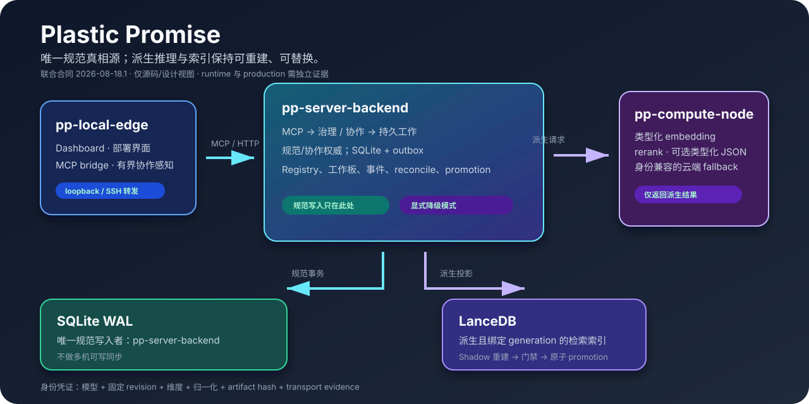
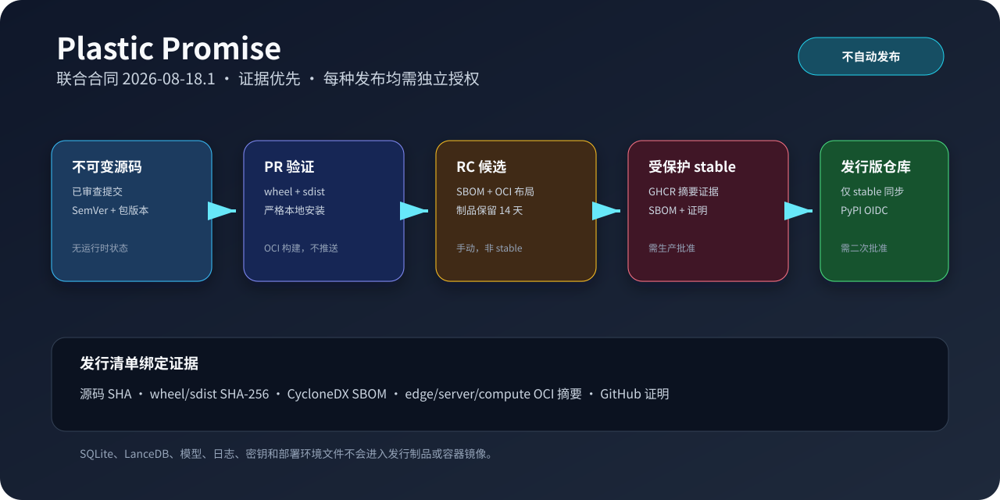
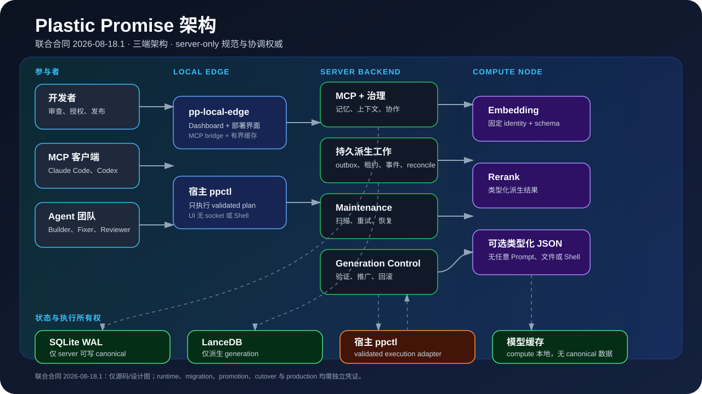
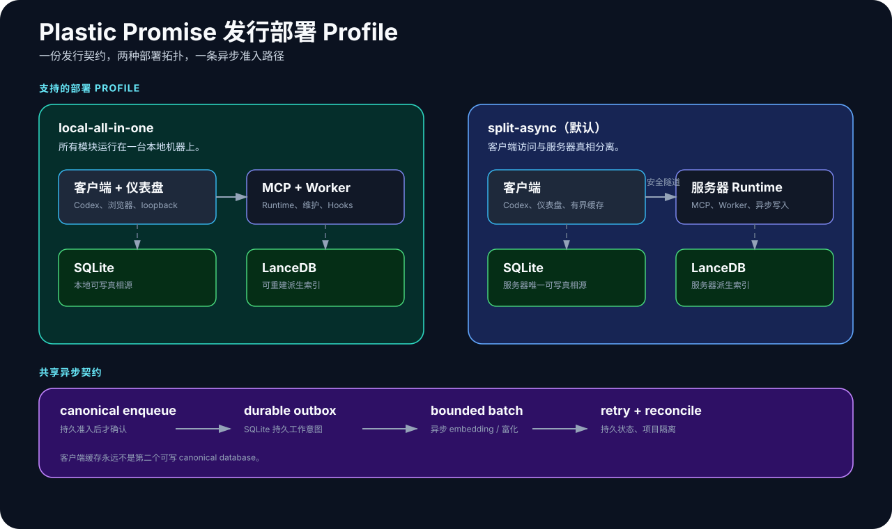

# Plastic Promise 中文指南

> 本文件是面向发行版用户的中文快速指南。英文默认入口见 [../README.md](../README.md)，更完整的项目目标与状态见 [GOAL.md](GOAL.md)。

> **当前联合交付权威：**可组合部署与项目协作恢复线以机器可读的
> [联合六 PR 合同](standards/union-six-pr-contract.json) revision `2026-08-18.1`
> 为规范范围。只有每个交付范围（`delivery_scope`）、协作范围
> （`collaboration_scope`）与所需证据（`required_evidence`）条目均通过证据门禁，
> PR 才算完成；任一单侧完成都不等于 PR 完成。本文描述的源码合同不等于
> runtime 或 production 证据。

<div align="center">

[](https://pypi.org/project/plastic-promise/)
[](https://github.com/ALdaisuki/plastic-promise/actions/workflows/ci.yml)
[](https://github.com/ALdaisuki/plastic-promise/actions/workflows/release-verify.yml)
[](https://www.python.org/)
[](https://www.rust-lang.org/)
[](https://modelcontextprotocol.io/)
[](../LICENSE)


</div>

<p align="center">
  
</p>

<details>
<summary>查看运行时架构图示说明</summary>

```text
画布：1280 x 640，深色基础设施配色，使用青色与紫色数据路径。
目的：说明 canonical 数据所有权，不把 provider 或计算节点描述为数据库。

区块：
1. LOCAL EDGE：Dashboard、Deployment Center、MCP bridge 与 Codex Hook。
2. SERVER BACKEND：MCP、治理、持久工作、Maintenance 与路由。
3. TRUTH：只有 pp-server-backend 写 SQLite；LanceDB 可重建且属于派生状态。
4. COMPUTE：pp-compute-node 只返回类型化派生结果；显式配置的云 provider 受同一 identity 合同约束。
5. SAFETY：不存在第二 SQLite writer、公开推理 listener，也不让前端访问 Docker、SSH 私钥或任意 shell。

样式：高对比度、紧凑矢量架构；不使用照片，不声明未经验证的运行状态。
```

</details>

## 受控发行交付（v0.2.16 起已实测）

<p align="center">
  
</p>

稳定版本通过一条经实测的 fail-closed 链发布：GitHub Actions 构建以摘要固定的
OCI 镜像并把精确的 Python 分发物发布到 PyPI；随后在已发布镜像上运行**治理计算
节点向量冒烟**（strict 健康策略，不允许 text-only 降级豁免）；生成无密钥的服务
器部署回执与 12 字段证据对象，绑定源码提交、scope 摘要和制品哈希；最后
`release-sync.py --push` 在全部门禁通过后原子推送 `main` 与附注标签。

### 一键发行验证

```bash
# 环境预检（工具链、代理、TZ 策略、WSL 连通、计算节点服务）
python scripts/release_pipeline.py doctor

# CI 完成后：把计算节点接入发行容器、经治理路由写入金丝雀记忆、
# 运行 strict 只读冒烟，并产出回执与证据 JSON：
python scripts/release_pipeline.py all \
  --manifest <下载的 release-manifest.json> \
  --version v0.2.17 --base v0.2.16

# 审阅 /tmp/pp-release-out/ 后经受证路径发布：
python scripts/release_pipeline.py publish \
  --version v0.2.17 --base v0.2.16 \
  --evidence /tmp/pp-release-out/release-evidence.json \
  --manifest <下载的 release-manifest.json> \
  --receipt /tmp/pp-release-out/server-deployment-receipt.json
```

**简化的是操作编排，不是质量门。** `handshake` 通过控制面（`PP_CONTROL_PLANE=1`、
固定节点身份、私有传输探针）把运行中的发行容器接入异构推理节点；嵌入推理始终留
在计算节点上——server 进程永远不是推理执行面。`publish` 仍然走 
`release-sync.py --push` 的完整 fail-closed 校验：干净树、预期 origin、全量验
证档案、12 字段证据绑定、提交/标签对象重审与原子推送；任何一步失败都中止发行。

## 这是什么

Plastic Promise 是一个本地优先的 MCP Agent 记忆、上下文、审计与任务调度系统。它把约定工程、记忆生命周期、信任分、自审计、任务调度和技能工作流组合成一个 Agent 治理底座。

它适合：

- Claude Code 或其他 MCP 客户端需要共享长期记忆时。
- 多 Agent 团队需要可追踪的任务派发、验收和信任分时。
- 项目希望把“先查上下文、再行动、后闭环”的工作方式固化为运行时工具时。

## 适用对象

Plastic Promise 面向需要长期上下文、明确治理规则和可审计任务交接的开发者与 Agent 团队。它不是单纯的记忆库，而是把记忆、原则、上下文、审计、防线、信任分和任务调度组合成一个本地优先的运行时。

| 需求 | Plastic Promise 的回答 |
|---|---|
| Agent 跨会话遗忘决策 | 用 worth、衰减、去重和图谱关联管理长期记忆。 |
| 上下文检索不稳定 | 用 `context_supply` 生成核心、关联、发散三层上下文包。 |
| 自动化需要防线 | 在共享状态变更前执行原则、审计、信任和防线检查。 |
| 多 Agent 工作难验收 | 通过 Hunter Guild 的认领、心跳、完成、验收状态机追踪任务。 |
| 工作流只停留在提示词里 | 自动注入固定版本 Matt Pocock 工作流、调用权限和 MCP 衔接。 |

## 快速开始

### 安装

从 PyPI 安装已审查的稳定包：

```bash
pip install plastic-promise
```

源码检出或本地开发请改用仓库安装：

```bash
git clone https://github.com/ALdaisuki/plastic-promise-release.git
cd plastic-promise-release
pip install -e ".[dev]"
```

基础安装和 `dev` extra 不包含进程内本地模型运行时，云服务器可保持轻量。
只有明确需要 `sentence-transformers` 本地 Embedding Provider 时才安装：

```bash
pip install -e ".[dev,local-inference]"
```

可选 Rust 加速器：

```bash
cd rust/context-engine-core
pip install maturin
maturin develop --release
```

### 发行包与部署选择

Endpoint Contract V2 现已把 `local-all-in-one`、`local-cloud` 与
`split-accelerated` 三种部署档案表达为可验证的无 secret 契约；PR 3 的源码级
`ContainerArtifactCompiler` 还能产生可检查的 role/platform/variant policy 与 descriptor。
实际 image activation、部署执行、迁移与发行仍是 PR 4–6 的目标工作，不能据此宣称 image
已经构建或生产已迁移。
Endpoint image、生成的原生启动 asset 与 Dashboard timestamp formatter 统一使用逻辑
`TZ=UTC`，canonical timestamp 保持 timezone-aware UTC；这不会修改 Linux、macOS 或 Windows
宿主时区，也不会挂载宿主时区文件。
当前用户应使用源码、经过审查的精确 wheel，或带 SHA-256、SBOM 和 OCI digest 的
发行清单。服务器 OCI 镜像与 Linux NVIDIA 推理节点镜像都不包含 SQLite、
LanceDB、模型、日志、密钥或运行态文件；这些内容只能在通过部署预检后由
运行时挂载。

PR 只验证构建，RC 只产生候选工件；TestPyPI 演练、GHCR stable digest、
PyPI 发布和 `plastic-promise-release` 同步均要求独立的受保护环境审批，
不会由普通 `main` 推送自动触发。部署、资源预检、节点身份和发行推广的中文
操作面分别见 [部署与运行指南](deployment/README.zh-CN.md)、
[发行交付与受控推广](release/delivery.zh-CN.md) 与
[六 PR 就绪度与受控部署计划](release/six-pr-readiness.zh-CN.md)、
[发行交付架构](architecture/release-delivery/architecture.zh-CN.md)、
[Release Builder 规格](release-builder.zh-CN.md)；英文逐项参考
保留在对应目录，便于与代码、模板和错误码交叉核对。

### 启动

```bash
# 一键启动：MCP Server (:9020) + Maintenance Daemon + Watchdog
python scripts/init_and_start.py

# 自动化/后台启动时可显式指定运行模式
python scripts/init_and_start.py --mode rust-full

# 仅兼容旧路径：跳过可选 Ollama 探针
python scripts/init_and_start.py --skip-ollama-check
```

交互式终端未传 `--mode` 时，启动器会先询问启动模式；非交互启动默认使用 `rust-full`，保持 Rust 优先和完整 LanceDB 预热/维护路径。

| 模式 | Rust 加速 | 启动 LanceDB 预热 | 适用场景 |
|---|---:|---:|---|
| `light` | 否 | 否 | 最快启动；延迟 LanceDB，使用 Python 路径。 |
| `normal` | 否 | 否 | Python 路径，后续需要时再懒初始化 LanceDB。 |
| `rust-normal` | 是 | 否 | Rust 优先的上下文供给，不做启动重建。 |
| `full` | 否 | 是 | Python 路径，并在启动时执行 LanceDB init/backfill/rebuild。 |
| `rust-full` | 是 | 是 | Rust 优先，并执行完整 LanceDB 启动维护。 |

对 `full` 和 `rust-full` 而言，backfill/rebuild 属于启动器的启动预热工作。MCP 进程启动后，请求期 heavy init 只打开 LanceDB/domain 后端，并应保持 `LDB_BACKFILL_ON_INIT=0`、`LDB_REBUILD_ON_INIT=0`，避免普通 `context_supply` 或 debug recall 在热请求路径里重复跑维护。

启动后可通过 MCP 工具热更新当前进程模式：

```text
runtime_mode(action="get")
runtime_mode(action="set", mode="rust-normal")
```

启动器会将项目根目录放在子进程 `PYTHONPATH` 最前面，因此 Maintenance Daemon 等脚本式服务会导入当前源码树。Daemon 脚本在直接启动时也会自举项目根路径。

仅启动 MCP Server：

```bash
# stdio 模式
python -m plastic_promise

# Streamable HTTP 模式（共享 MCP Server，端口 9020）
python -m plastic_promise --streamable-http 9020

# 旧脚本兼容别名，仍可用
python -m plastic_promise --sse 9020
```

MCP Server 已启动时，也可以单独启动 Maintenance Daemon：

```bash
python daemons/maintenance_daemon.py
```

健康检查：

```bash
python -c "import urllib.request; print(urllib.request.urlopen('http://127.0.0.1:9020/health').read())"
```

`/health` 同时是部署身份契约。响应包含 `pid`、`source_root`、
`source_revision`、`fusion_policy` 和 `fusion_attestation`；其中 attestation
包含 `schema=retrieval-fusion-identity/v1`、请求策略、候选 ID 和配置哈希。
启动器接纳新进程前会核对 health PID 与刚启动的 PID、当前源码根，以及可用时
的预期 Git revision；复用已占用 9020 的进程时也必须通过源码根/revision 校验，
仅返回 HTTP 200 不能证明进程归属。

Windows 上执行 `python scripts/init_and_start.py --stop` 时，只读取当前工作树的
`var/run/mcp_server.pid` 和 `var/run/maintenance_daemon.pid`，并再次核对进程命令行
中的 source root；不会扫描或终止其他 Python 进程及其他工作树。

连接排查时请用 `/health` 判断服务是否存活；`/mcp` 是 Streamable HTTP MCP 协议端点，浏览器直接 GET 或普通探针访问可能出现 404，这不等价于 MCP 断线。Windows 客户端关闭长连接时的 Proactor 断连 traceback 会在服务端过滤。真实端到端验证使用 `python scripts/smoke_http_mcp.py --expected-version <version> --timeout 60 --sse-read-timeout 360 --json`。本地默认启动设置 `EMBEDDER_TIMEOUT=10`；已有环境变量会被保留。重启 MCP Server 后，部分 Codex 会话不会热重载动态 MCP 工具句柄，需要刷新/重开会话让工具表重新注册。

### 本地模型配置推荐套餐

针对 CUDA/WSL2 计算节点（例如 RTX 5080），Plastic Promise 推荐以下本地模型
组合。默认计算档使用两个独立的本地 llama.cpp server 分别承担 embedding 与
rerank。用户可以选择其他兼容 runtime，但必须返回结构化向量/分数并绑定精确模型
身份与固定维度；任何文本生成（包括 prompt `yes`/`no`）都不能冒充 rerank。

| 档位 | Embedding | 维度 | Rerank | 模型预算 | 适用场景 |
| --- | --- | --- | --- | --- | --- |
| CUDA 质量档 | llama.cpp + `Qwen3-Embedding-4B-GGUF` | 2560，L2 | llama.cpp 结构化 rerank endpoint + `Qwen3-Reranker-4B-GGUF`，或官方 CrossEncoder worker | 由量化与 runtime 决定 | 中英与代码检索的推荐质量档；显存无法同时驻留两个模型时改用低内存档 |
| 低内存档 | llama.cpp + `Qwen3-Embedding-0.6B-GGUF` | 1024，L2 | `Qwen3-Reranker-0.6B-GGUF` | 较小量化制品 | 显存/时延压力场景 |
| 兼容档 | BGE GGUF 或本地 BGE embedding worker | 模型原生维度，L2 | BGE sequence-classification reranker | 由制品决定 | 治理化兼容后备 |

上游 revision 策略：

- 仓库不会凭空生成或提交占位用的上游 revision。
- 安装器根据操作者选择解析准确 revision 和模型层/制品 digest，并将结果写入本地
  `model-manifest.json`。
- 生产激活拒绝仅有可变 tag 或占位 revision 的配置；manifest 必须包含模型名、固定
  revision、输出维度、归一化方式和观测到的 digest。
- 生成的 manifest 保留在本地，不提交到 Git。某一真实节点的 manifest 只是该节点的
  部署证据，不能冒充所有安装的统一上游 revision。

revision 属于操作者部署配置而非仓库默认：请在节点 `.env` 中固定你已验证的上游
revision，绝不能只依赖可变 tag。

身份规则：embedding 输出固定为已声明的模型原生维度（推荐 4B 档 2560，推荐
0.6B 档 1024）并做 L2 归一化。manifest 必须记录模型名、不可变 revision、
artifact digest、维度、归一化和 backend。后续 MRL 降维属于新的
embedding 身份，需要重新 shadow rebuild 与 generation promotion。

## MCP 配置

stdio 示例：

```json
{
  "mcpServers": {
    "plastic-promise": {
      "command": "python",
      "args": ["-m", "plastic_promise"]
    }
  }
}
```

Claude Code 项目级 `.mcp.json` 示例：

```json
{
  "mcpServers": {
    "plastic-promise": {
      "type": "http",
      "url": "http://127.0.0.1:9020/mcp"
    }
  }
}
```

现代共享 MCP 客户端连接：

```text
http://127.0.0.1:9020/mcp
```

旧 SSE 客户端仍可连接：

```text
http://127.0.0.1:9020/sse
```

### 中文运维控制台

一键启动器默认开启 Dashboard V2 与有界检索解释
（`PP_DASHBOARD_V2=1`、`PP_RETRIEVAL_EXPLAIN=1`），启动后直接打开：

```text
http://127.0.0.1:9020/dashboard
```

通过标准 SSH 转发访问服务器时使用 `http://127.0.0.1:19020/dashboard`。
Dashboard 顶部提示区会显式展示结构化切片、语义富化、知识库语义和云推理的当前
默认模式；“有效配置”用于查看实际生效值，“云端期望配置”用于受控暂存与校验
provider 配置。API Key 始终留在 compute-node 的密钥通道，不会返回浏览器。

Dashboard V2 是仅限本机回环地址、按项目隔离、只读且有界的运维界面。本机运维者可从
服务器 SQLite 活动中发现并选择项目，但每次请求仍只绑定一个项目；该选择器不是远程
多租户鉴权边界。界面包含总览、
记忆、请求、综合记忆、记忆谱系、检索解释、运行操作、信任问题和配置。记忆详情会
显示 `structure-v1` 结构化切片的标题路径、块类型、父记忆、source span、内容哈希和
截断状态；谱系页显示类型化节点、有向关系以及来源/目标切片锚点。

检索解释页可查看词法、向量、图通道分数、排序/过滤原因、
切片证据和实际请求/阶段耗时。没有计时证据时界面显示“暂无数据”，不会伪造 `0 ms`。

## 核心能力

| 能力 | 说明 |
|---|---|
| 记忆质量管道 | 对经验、事实、决策、实体、事件、模式进行提取、分类、去重、门控、嵌入和衰减。 |
| 上下文供给 | `context_supply` 根据当前任务生成核心、关联、发散三层上下文，并返回推荐原因与 project/global 来源标记。 |
| 审计与防线 | `audit_pre_check`、`audit_run`、`defense` 在写操作和风险动作前提供检查；`defense(action="evaluate_tool")` 可解释工具语义决策。 |
| 信任分驱动自治 | 信任分越高，自主权越大；信任分下降时需要更多显式确认。 |
| Hunter Guild 委托系统 | 通过同一 canonical `project_id` 下的 `task_enqueue -> task_claim -> task_heartbeat -> task_complete -> task_verify` 管理 legacy/current 多 Agent 委托队列；它不是 PR 5 的持久 `AgentRegistry` / `ProjectWorkBoard`。 |
| Skills / 治理工作流 | `session-init`、`smart-remember`、`step-closure` 和官方工作流兼容入口 `sp-stage` 把调用链变成可追踪工具。 |
| Maintenance Daemon | 执行扫描、恢复、GC、任务生命周期维护和调度健康检查。 |
| P1 治理运行时 | 工具清单图、`runtime_events`、`mgp_shadow_bridge`、Context Recommender 为审计和推荐提供可解释元数据。 |
| 插件与市场 | 通过 pack 元数据加载知识、工作流、能力和适配器扩展。 |

Hunter Guild 的七个 Task Queue 工具（包括 `task_inbox` 与 `task_abandon`）都必须显式
传入同一个 canonical `project_id`。成功的
`session-init(project_id="project:example")` 会把项目绑定到可信 loopback MCP session。
`agent_name`、`from_agent`、`trust_score`、`verified_by` 等调用方字段只用于路由、展示
和审计；写操作权威来自服务器持有的 session actor，不能由这些字段自行取得。

一键启动器默认使用 `PP_MEMORY_CHUNKING=structure-v1`：在把派生 embedding 请求发送给 compute node 前，先按标题路径、段落、代码块、列表和表格生成权威切片，并在有界预算内保留尾部。`shadow` 仍可用于只读对照，不调用 embedding 模型、不写 SQLite/LanceDB，也不能单独作为召回质量结论：

```powershell
python scripts/benchmark_chunking_shadow.py --source data/db/plastic_memory.db
python scripts/benchmark_chunking_shadow.py --source tests/fixtures/recall_quality/v1.json
```

在 `structure-v1` 产生权威切片后，语义富化只生成派生索引元数据，不修改 chunk 正文、顺序、标题路径或 source span。一键启动器默认设置 `PP_MEMORY_CHUNK_ENRICHMENT=shadow` 与 `PP_MEMORY_CHUNK_ENRICHMENT_PROVIDER=openai-compatible`；结构化 JSON 调用统一由 `pp-compute-node` 执行，server backend 不持有 provider endpoint 或 API Key。shadow 模式只运行有界队列和内容寻址缓存，不改变正式向量；`on` 仅在经过审查的离线重建/迁移后启用，并保持用于后续写入和修复。模型、不可变 revision、provider/backend、提示词、schema 与制品 digest 都会绑定到派生身份。

请求固定 `temperature=0` 并使用严格 JSON contract，但不会盲目信任 provider。未知或缺失字段、无法回指原文的摘要/证据、标识符不一致、JSON 截断、超时和模型不可用都会显式 defer/retry/reconcile，不会冒充成功，也不会静默在服务器回退到本地模型。没有同时启用 `PP_MEMORY_CHUNKING=structure-v1` 时富化不会生效。

当前 `plastic_promise/mcp/server.py` 暴露 58 个 MCP 工具，包含 `session_init` / `sp_stage` 等兼容别名。`mgp_shadow_bridge` 是 MGP 兼容语义桥；P1 阶段只做 off/shadow/inject 模式管理与审计映射，不直接改写长期记忆。

`sp-stage` 仅为已有客户端保留名称；可注册阶段和 route 只来自固定版本 `mattpocock/skills@ed37663cc5fbef691ddfecd080dff42f7e7e350d`。`UserPromptSubmit` Hook 会自动注入官方 flow、完整主链、声明分支、当前/下一阶段、`[user]`/`[model]` 调用权限，以及必须由 `session-init` 和后续 `sp-stage` 原样复用的 project/session/flow ID。canonical memory、临时 proposal 与 route 共用一个严格总字符预算：可以省略完整可选区块，但不会输出截断的 XML-like 合同，默认预算优先保留带 scope 的 route 调用。每个显式 `/skill-name` 都会选择以对应官方 Skill 为首节点的合法 route；自然语言 Skill 短语只有在句首表达正向命令时才生成 user attestation，疑问、否定、状态陈述和引用仍按任务类型路由。`implement` 与 `grill-me` 是复合 Skill，其内部测试/审查或提问循环不会重复成为外层游标阶段；复合 receipt 必须通过 `evidence.invoked_skills` 声明实际内部调用，服务端据此创建 `tracking_basis=composite_receipt` 的确定性 entity-only 子链，而不会伪装成独立 Hook 观测。`small-build` 与 `prototype-detour` 都共享父链 `grill-with-docs` 分支点；未声明的 route 切换仍会被拒绝。无 `execution_receipt` 的首次调用只返回固定 revision/hash 的执行合同，不运行 Codex Skill、不推进游标；客户端实际运行对应 Skill 后，再提交包含 Skill 名、上游 revision、`SKILL.md` SHA256、completed 状态和无 secret JSON evidence 的 caller attestation，服务端不能以密码学方式证明客户端已运行 Skill。治理适配器成功后，receipt 与 cursor 按 project/session/flow scope 在 SQLite 中原子提交；receipt-scoped 确定性 tracking ID 保证提交窗口崩溃后的重试不会重复生成实体。相同 receipt 重放是幂等的，同一 scope/route step 的不同物料会被拒绝。`skill_auto_track` 仅是外部客户端显式兼容入口，不能推进官方游标；Codex 当前不存在自动 `PreToolUse`/`PostToolUse` Skill 追踪。生产只允许一个 MCP 写入进程连接同一 SQLite；进程内锁不是分布式 exactly-once 租约。

重型 `memory_recall` / `context_supply` 调用可携带 `stage_session_id`、`flow_line_id` 和 `request_id`。系统会派生 `request_scope_id`，写入审计元数据并显示在 `context_supply` 输出中，同时用它隔离重叠官方工作流阶段或多 Agent 流程中的召回缓存。

`runtime_events` 会记录工具调用和 Hunter Guild 任务流转的 `pending`、`running`、`completed`、`error` 状态，并携带 request scope、trust tier、defense decision 和 audit trace，方便回放与审计。

在 `rust-full` 模式下，`memory_recall(debug=true)` 在 Rust 健康且优先时仍走 Rust snapshot 热路径，并返回 Rust `pipeline_stats` / `per_item_stats`；只有 Rust 不可用或异常时才回退 Python。当 LanceDB 中已有向量行时，debug `pipeline_stats` 应显示非零 `vector_count`；只有查询没有向量命中时，`vector_hits` 才可能为 0。

### 受治理的综合记忆与提案

综合记忆默认关闭并采用 fail-closed 策略。SQLite 保存普通记忆、综合记忆生命周期、来源快照、提案审核和精确索引材料的权威状态；LanceDB 只是可重建的派生索引。

| 开关 | 默认值 | 启用后的行为 |
|---|---|---|
| `PP_SYNTHESIS_ARTIFACTS` | `off` | `shadow` 只评估资格，`on` 才允许创建受治理草稿。 |
| `PP_SYNTHESIS_RETRIEVAL` | `0` | `1` 只接纳证据完整且仍为当前版本的 `verified` 综合记忆。 |
| `PP_MEMORY_PROPOSALS` | `off` | `shadow` 只输出哈希诊断，`on` 将公开事实、偏好和决策送审。 |
| `PP_MEMORY_INDEX_TEXT_POLICY` | `legacy` | `compact-v2` 是有界 L0/L1 索引文本的实验候选。 |

生命周期为 `draft -> verified -> stale|contested`。刷新会创建新的 `draft` 修订版，必须重新记录审核者、调用 ID 和时间后才能进入召回。待审、拒绝和过期提案不会成为普通召回候选，也不会写入 LanceDB。

普通记忆中会影响召回的内容或可用性变更统一经过字段级权威事务。事务在提交前同时记录来源 lineage、将依赖的综合记忆标为 `stale`、递增权威记忆版本并写入带校验的索引任务。GC 合并要求候选项目非空且一致，并在事务内再次核对源记录和目标记录的权威项目；不一致时不会留下记忆、lineage、版本、outbox 或缓存的部分变更。

公开写操作的 actor、call、project 和 trust 证据由服务端运行时上下文提供，调用者声明的同名字段只用于审计。两个 `smart-remember` 别名在读取或修改已有记录前都必须取得 `memory_update` 权限。公开 `memory_forget` 仍是信任阈值 `0.80` 的关键操作；信任阈值 `0.60` 的 `audit_rollover` 只供内部审计轮转使用。

融合策略默认是 `legacy-auto`，`max-v1` 是固定比较基线；候选加权策略使用 `wrrf-v1:<sha256>` 不可变 ID，并必须与冻结 manifest 一致。未知、未带哈希、manifest 不匹配或配置非法时会 fail closed。校准阶段只读取 held-out 文件字节生成指纹，在 manifest 冻结前不会加载或查询 held-out case。

`0.1.15` 的一次性公开校准没有产生合格的 WRRF 候选，因此 held-out case 保持未开启，发行策略继续使用 `legacy-auto`，不声明已取得融合质量提升。

维护与恢复可通过生产同构的一次性入口验证：

```bash
python daemons/maintenance_daemon.py --once --json
python scripts/smoke_restart_recovery.py --artifact-dir .artifacts/recovery-smoke --json
```

`maintenance-heartbeat/v1` 将心跳绑定到 daemon PID；旧心跳仅保留 mtime 兼容。索引重放继续读取既有合法 `memory-index/v2` upsert，但所有新 upsert/delete 都写为带 action、project、memory version、material revision 和 expected embedding hash 的 `memory-index/v3`。

升级到 `0.2.15rc1` RC 时，应先保持治理综合记忆、提案、Dashboard、检索解释、云推理、被动语义捕获与自动晋升开关为默认值，同时重启所有已启用的写入服务，避免不同版本的进程混用事务和派生工作约定。公开 MCP 工具和参数没有删除；已有 SQLite 记忆继续作为权威数据，LanceDB 可由持久化校验任务修复。LanceDB 最低版本仍为 `0.34.0`，固定在更早版本的环境必须先升级依赖。重启后按需逐项启用功能，再执行：

```bash
python scripts/smoke_http_mcp.py --expected-version 0.2.15rc1 --expected-mode rust-full
```

只有在受保护的 stable promotion 已把包与运行时版本切换为 `0.2.15` 后，才将
上述命令替换为 `--expected-version 0.2.15`。RC 不能在 stable 推广之前用最终
版本号做精确 smoke 校验。

回滚时关闭四个开关即可，不要删除 SQLite 中的控制、来源、提案、lineage 或审计记录：

```bash
PP_SYNTHESIS_RETRIEVAL=0
PP_SYNTHESIS_ARTIFACTS=off
PP_MEMORY_PROPOSALS=off
PP_MEMORY_INDEX_TEXT_POLICY=legacy
PP_RETRIEVAL_FUSION_POLICY=legacy-auto
```

同时取消 `PP_RETRIEVAL_RRF_K`、`PP_RETRIEVAL_RRF_WEIGHTS_JSON`、`PP_RETRIEVAL_RRF_WINDOWS_JSON`。保留 SQLite、来源与 outbox 数据，重启两类进程，运行 one-shot maintenance 重放默认索引策略，再执行 HTTP 与 restart-recovery smoke。

切换 `PP_MEMORY_CHUNKING` 后，应在放量前重建派生 LanceDB；回滚到 `off` 后也要再次重建，确保不会混用不同切片身份的向量：

```powershell
$env:PP_MEMORY_CHUNKING = "structure-v1"
python scripts/rebuild_lancedb.py
$env:PP_MEMORY_CHUNKING = "off"
python scripts/rebuild_lancedb.py
```

语义富化建议先 shadow 验证，再在离线窗口启用 on 并重建派生索引；重建完成后保持 on，使在线写入和修复沿用同一索引身份：

```powershell
$env:PP_MEMORY_CHUNKING = "structure-v1"
$env:PP_MEMORY_CHUNK_ENRICHMENT = "shadow"
# 用代表性写入或回填预热并检查富化诊断/缓存。

$env:PP_MEMORY_CHUNK_ENRICHMENT = "on"
python scripts/rebuild_lancedb.py

# 回滚保留 SQLite 权威正文；关闭富化后必须重建派生索引以恢复 legacy 身份。
$env:PP_MEMORY_CHUNK_ENRICHMENT = "off"
python scripts/rebuild_lancedb.py
```

## 架构概览

<p align="center">
  
</p>

上方矢量图展示三个端模块及其状态所有权。Endpoint Contract V2 与 PR 3 的源码级
artifact policy 已可验证
`pp-server-backend` 的 canonical SQLite 单写者、promotion/receipt 权威，
`pp-local-edge` 的净化状态投影以及 `pp-compute-node` 的类型化派生结果边界。
`ContainerArtifactCompiler` 只产生 plan/descriptor/evidence，不在本地 activation Docker、
Compose、tunnel 或 deployment；受保护 CI 可以执行不 push OCI build verification。独立端
容器、实际 Deployment Center 执行、迁移与生产 cutover 仍是目标架构，不表示 image 已构建
或生产环境已经完成迁移。

### C4 部署视图（V2 契约和制品策略当前已实现；运行时部署仍为目标）

标准发行版共用三个端模块，只改变放置位置，不改变所有权。V2 契约不接受 SSH
host、私有地址、路径或密钥；实际镜像、Compose、宿主 `ppctl`、迁移与 promotion
仍须在后续 PR 完成。

```text
+-------------------------- 用户主机 --------------------------+
| Browser / Codex Hooks -> pp-local-edge                       |
| Dashboard + Deployment Center + MCP bridge                   |
|                      仅宿主 validated plan -> ppctl           |
+------------------------------+-------------------------------+
                               | loopback / 受限 SSH
                               v
+-------------------------- 服务器 ----------------------------+
| pp-server-backend                                             |
| MCP + 治理 + durable work + Maintenance + routing             |
| SQLite WAL：唯一写入者 | LanceDB：派生 generation             |
+------------------------------+-------------------------------+
                               | 受限 reverse SSH
                               v
+-------------------------- 运算主机 --------------------------+
| pp-compute-node：类型化 embedding / rerank / 可选 JSON        |
| 无 SQLite、LanceDB promotion、文件、Shell 或任意 Prompt       |
+--------------------------------------------------------------+
```

<p align="center">
  
</p>

<details>
<summary>查看信息图生成说明</summary>

```text
画布：1280 x 760，深色高对比架构信息图。
目标：对比端模块放置方式，同时保持相同的所有权规则。

分区：
1. 标题：Plastic Promise 发行部署 Profile。
2. 本地：pp-local-edge、pp-server-backend 和可选 pp-compute-node。
3. 分离：local edge、server backend 和 compute node 位于不同主机。
4. 异步链：manifest -> ppctl -> durable queue -> typed result -> reconcile。

约束：SQLite 是 canonical；LanceDB 是派生索引；客户端缓存不是可写真相源；
部署只改变模块位置，不改变模块所有权。
```

</details>

### 持久异步时序

```text
pp-local-edge     => pp-server-backend : 提交 MCP 或部署请求
pp-server-backend => SQLite            : canonical transaction + durable work
pp-server-backend => pp-compute-node   : 带租约的类型化推理请求
pp-compute-node   => pp-server-backend : identity-bound 结果或失败
失败              ~> durable queue     : 保留任务并使用文本退化
健康轮询          ~> 本地 + 云端       : 连续探针稳定后恢复
pp-server-backend => LanceDB           : 只更新 verified derived generation
```

客户端缓存永远不能成为第二个可写真相源。SQLite 保存 canonical 记忆与治理状态，
LanceDB 始终是可重建派生索引。V2 manifest、端点准入、receipt 与 fencing schema
当前可验证；图中的运行时执行和生产恢复路径仍是目标态。

更多架构文档：

- [SYSTEM_FULL_CHAIN.md](SYSTEM_FULL_CHAIN.md)
- [architecture/architecture.md](architecture/architecture.md)
- [architecture/plastic-promise-flow.svg](architecture/plastic-promise-flow.svg)
- [architecture/plastic-promise-flow.zh-CN.svg](architecture/plastic-promise-flow.zh-CN.svg)
- [architecture/distribution-profiles.svg](architecture/distribution-profiles.svg)
- [architecture/distribution-profiles.zh-CN.svg](architecture/distribution-profiles.zh-CN.svg)
- [三端目标架构中文规格](architecture/three-endpoint-deployment/architecture.zh-CN.md)
- [Three-endpoint target architecture](architecture/three-endpoint-deployment/architecture.md)
- [architecture/diagrams/c4-level1-context.txt](architecture/diagrams/c4-level1-context.txt)
- [architecture/diagrams/c4-level2-container.txt](architecture/diagrams/c4-level2-container.txt)
- [architecture/diagrams/c4-level3-component.txt](architecture/diagrams/c4-level3-component.txt)
- [deployment/README.zh-CN.md](deployment/README.zh-CN.md)
- [可组合部署路线图](roadmap/composable-deployment.zh-CN.md)
- [release/delivery.zh-CN.md](release/delivery.zh-CN.md)
- [release/six-pr-readiness.zh-CN.md](release/six-pr-readiness.zh-CN.md)

## 核心概念

### 约定工程

约定工程不是只在入口处拦截动作，而是让 Agent 在行动前主动检索相关约定、历史决策和上下文，并在行动后沉淀经验。

### 记忆不是档案

记忆会被使用、强化、合并、衰减。系统目标不是保存一切，而是让当前真正有用的上下文更容易被检索。

### 每步闭环

实质产出后应执行 `step-closure`，记录经验、改进、根因和下一步优化动作。闭环结果会影响未来记忆和信任分。

### 显式降级

默认数据存储在本地。外部 Agent、托管 embedding、托管 reranker 或 LLM 集成只有在配置后才会发生网络调用。可选服务不可用时，系统应明确标注降级状态，而不是静默假装完整路径成功。

### 云 embedding、重排与切片分析

推荐基线让 embedding 与 rerank 在 compute node 本地执行，同时把结构化语义富化
显式开启为安全 shadow 模式。一键启动器设置
`PP_MEMORY_CHUNK_ENRICHMENT=shadow` 和
`PP_MEMORY_CHUNK_ENRICHMENT_PROVIDER=openai-compatible`；在 compute node 的
provider、不可变模型 revision、API root 和费用策略通过校验前，不会把网络调用视为
已激活。托管调用具备输入/输出大小限制、重试、deadline、熔断、响应校验、内容
hash 缓存和脱敏诊断。API Key 只能放在权限为 `600` 的环境文件或交互式
密钥存储中，不能提交、写进命令行或日志。

远程配置中的 `embedding.cost_per_million_tokens`、`cost_currency` 和
`pricing_revision` 是一组必须同时填写的费用证据，当前支持 `USD` 与 `CNY`。价格变化
不会改变向量内容，因此不参与 embedding/index identity；但正式 generation 的质量门
仍要求非空单价、币种和可追溯的价格版本。Dashboard 推荐模板故意保留空值，操作员必须
按模型广场的当前价格填写，不能用零值冒充未知价格。

云优先服务器配置不安装、不启动 Ollama。只有在 Key 完成轮换并
通过受保护的服务器环境文件配置后，才启用托管 embedding、托管 rerank 和托管结构化
分析。本地 loopback Provider 传输只保留为后续部署的兼容代码，不作为云优先配置的
健康或验收条件。

必须配置 API 根地址，不能把文档站、Wiki 或产品首页当 API。应从服务商官方 API
文档获得真正的 `/v1` 根地址，例如 `https://provider.example/v1`，再写入 compute
node 的 `EMBEDDER_BASE_URL`、`PP_RERANK_BASE_URL` 或 `PP_INFERENCE_BASE_URL`。
地址可用不代表认证和模型权限可用，运行时只报告 provider、model、revision、
dimension、有限 usage 和安全 reason，不会把失败伪装成成功。

部分固定原生维度的 OpenAI-compatible embedding API 会拒绝可选的
`dimensions` 请求字段。只有在独立验证原生输出与 `PP_EMBEDDING_DIM` 完全一致后，
才可设置 `EMBEDDER_SEND_DIMENSIONS=0`；响应维度仍会严格校验，且 native 请求模式
会写入派生索引身份。

把凭据写入服务器环境文件前，先用合成数据探测候选 Provider：

```bash
python scripts/smoke_cloud_providers.py
```

该 smoke 只通过隐藏提示读取 Key，不输出凭据、向量或原文。`--keys-from-stdin`
仅用于受保护的交互管道；脚本刻意不接受命令行 Key 参数或环境变量 Key。

server dispatch contract 与 Provider 解耦。前端只提交规范化的 `id`、`text`、
`base_score`，`embedding` 可以省略；server 只记录有界 operation intent 与 identity
requirement，任何 local 或 hosted provider 调用都由认证的 `pp-compute-node` 执行。
前端提供的向量只有在维度、有限非零值、完整 embedding identity 和原文 SHA-256
全部匹配时，才允许在本次请求中复用。这只是结构和声明校验，并不能以密码学方式
证明该向量真的由所声明的模型生成；因此它不会获得正式 LanceDB 写入权限。Provider、
模型、base URL、path、prompt、response 与 credential 都留在 compute-node 边界内，
frontend 与 collaboration input 会拒绝这些字段。

PR 5 源码现在把 structured JSON 与 embedding、rerank 一样作为 `pp-compute-node` 的
一等 capability。它默认关闭，只有 backend、model、固定 revision 与有界 provider 配置
完成激活和 identity revalidation 后才启用。compute node 强制 prompt、payload、token、
timeout、UTF-8 与 response 限制；`pp-server-backend` 可以请求该 capability，但不得构造或
调用其 local、hosted 或 raw provider。该 source/test capability 不证明真实 provider
activation、runtime evidence、production acceptance 或 publication。

同步 rerank 作为无状态请求本身不会造成多设备冲突，危险发生在旧结果覆盖新状态。
后端结果会绑定 project、query、candidate set、embedding 物料、Provider policy 和
scoring 的版本哈希，客户端必须拒绝 stale 结果。`project_id` 必须由鉴权后的 gateway
派生，不能信任前端字段。后端可在调用 Provider 前生成纯请求绑定；若改为异步任务，
应持久化唯一 `(project_id, idempotency_key)`：同一 input hash 返回已有任务，不同
input hash 返回冲突。多 worker 仍需原子 claim、lease 和 CAS 完成；进程内缓存不能
冒充 durable job queue。异步包装只负责避免阻塞事件循环，不能代替持久幂等。云与
Ollama 回退链分别使用
`PP_RERANK_CLOUD_MODEL` 和 `PP_RERANK_OLLAMA_MODEL`。

前端可以发起 rerank，但不能提交权威最终排序或 Provider 凭据；只有当前 project 与
candidate-set version 仍匹配时，前端才应用返回结果。否则即使不破坏状态，也可能因
重复请求产生重复云费用。

后续若在前端设备运行本地模型，创建请求必须选择不可变模型身份（建议包含 revision 或
digest），后端会把它同时绑定到幂等请求 hash 与 `client-local-rerank/v2` 数据包。数据包
包含精确 query、候选文本、base score、原文 hash 和向量 hash，但不包含向量、Provider
配置或凭据。执行器配置的模型身份必须与数据包完全一致，否则在调用模型前拒绝任务；
同一幂等键更换模型也返回冲突。前端返回值只携带 package hash、已绑定的模型身份和候选分数。后端仅在鉴权
project、当前 request ID、query、`top_k`、candidate-set version/hash、embedding 身份和
维度都与服务端状态一致时接收；该结果只在本次请求内有效，不能写入 LanceDB。异步或
多设备 gateway 必须把权威 package 保存到按 project 隔离的 durable job，并用 CAS 完成
状态保证第一个合法结果胜出。不得根据客户端回传重建 package；无状态方案必须改用
服务端签名或 HMAC。该身份绑定解决并发一致性，不冒充远程模型证明；客户端结果仍然只在
当前请求内有效且非权威。核心纯校验器本身不冒充这些持久并发保证。

这里新增的是后端核心边界，不是未鉴权公网接口。现有 MCP/Dashboard Starlette
进程继续只监听 loopback；未来公网 API 必须由独立的鉴权、项目隔离 gateway 提供，
不能直接暴露完整 MCP 路由面。在该 gateway 完成前，这些前端 DTO 是核心集成契约，
并不是浏览器可直接调用的 API。

切片语义富化默认开启为有界 `shadow` 模式。`PP_MEMORY_CHUNKING=structure-v1` 下使用
`PP_MEMORY_CHUNK_ENRICHMENT=shadow`，它只运行有界队列而不改变正式向量；
通过 shadow 证据评审后，才在离线窗口设置 `on` 并重建派生索引。后续写入和
修复必须保持相同的 Provider/model/prompt/schema 身份；查询 embedding 永远
不会调用富化模型。

### 远程配置控制面

服务器状态和云配置由独立的无界面控制 API 提供，只监听 `127.0.0.1:9040`；Mac
通过 `LocalForward 19040 127.0.0.1:9040` 访问。9040 不得进入公网安全组、UFW
放行规则或公共反向代理，也不挂载到 MCP 9020 或推理网关 9030。控制面使用
`viewer < operator < secret-admin` 分级 Token；Provider Key 只能写入或清除，
任何 safe config、revision、审计或浏览器存储都不返回明文。

Dashboard V2 是唯一的运维前端：记忆、检索和运行证据继续来自 9020，服务器状态、
desired config、修订和审计由浏览器经 19040 直接调用 9040。控制 Token 只保留在
浏览器内存，不经过 MCP。旧 inference-gateway package 仅可作为完整开发安装中的兼容
测试资料，不能作为受治理 PR5 server runtime 或生产 provider 路径；Provider credential、
选择、prompt 和 response 只能留在经认证的 `pp-compute-node`，server 只记录有界 intent、
identity、lease 和 typed receipt。

Dashboard V2 当前已具备 PR 5 的只读 Agent topology、`ProjectWorkBoard` 与 collaboration
event timeline 投影，并支持 project/session/role filter 和浏览器内存 cursor 增量刷新；它不提供
协作 mutation 控件，也不推进 canonical collaboration cursor。仓库级 route/repository/static
测试已覆盖 empty/error/stale 与字段脱敏，但真实浏览器 smoke 和生产 runtime 证据仍待补齐。

普通变更使用 `GET safe config/ETag -> validate -> immutable stage -> If-Match
CAS activate -> 主机运维重启与 smoke`。所有 POST 都需要 JSON 和当前
`If-Match`；只有 `stage` 与 `activate` 还需要按操作稳定的 `Idempotency-Key`，
同一物料重试时复用，物料变化后更换。`activate` 只原子选择权限为 `0600` 的
`managed.env` 并返回
`restart_required=true`，不会调用 sudo、systemctl、Provider 或 LanceDB rebuild。
ETag 是随机的 256-bit 不透明 CAS Token，不由环境内容或 Provider Key 派生；只有
Embedding 身份变化时才接受 generation evidence，其他激活请求携带 evidence 会被拒绝。
数据库和 generation 路径、监听地址、控制面认证、systemd/Maintenance 策略、
gateway 身份与 Provider host allowlist 仍是 bootstrap-only。每个 revision 会私下
绑定进程可见的 bootstrap EnvironmentFile 指纹；激活和崩溃恢复发现漂移即拒绝，
该 secret-dependent 指纹不会通过 API 或对象表示返回。

Embedding 精确运行索引身份变化（包括 structure-v1 切片预算）必须先完成 Provider smoke、shadow rebuild、reconciliation、
固定中英文质量门和 `verify-candidate`。候选验证成功后仍保持 inactive；主机运维
随后停止 MCP/推理 worker、激活 revision 记录 desired generation、在相同
`managed.env` 下 promote 完整匹配的 generation，再重启并执行 health/retrieval
smoke。`/status` 同时显示 desired 与 current 的 generation ID 和完整 manifest
SHA-256；两者任一不一致都表示尚未完成切换。完整 API、systemd、SSH 隧道和验收
说明见 [Remote Configuration Control Plane](remote-control-plane.md)。

### 离线 index-material 迁移恢复

`scripts/migrate_index_material.py` 是显式的 canonical SQLite 离线迁移工具，
不是日常索引重建命令。未提供 `--apply` 时，它只检查现有数据库，并输出将来写入
所需的精确行数、源指纹、目标模型 digest 和 index-outbox 快照：

```bash
.venv/bin/python scripts/migrate_index_material.py \
  --db data/db/plastic_memory.db \
  --target-policy compact-v2
```

经批准的 `--apply` 必须提供现有备份目录，并带上该检查输出的全部 expectation。
它会在修改 canonical 行之前创建并验证在线备份。`--allow-unresolved-index-outbox`
是针对 `pending`、`blocked` 或 `failed` 索引任务的显式恢复模式；它仍会拒绝
`processing` 任务，也会在 outbox 快照变化时 fail closed。不要把这个命令用于普通
服务重启、shadow rebuild，或未经单独迁移授权的生产操作。

### 不可变 LanceDB generation

SQLite 是唯一真相源，LanceDB 是可重建投影。更换云模型必须从 SQLite
Backup API 快照构建 inactive shadow generation，不能复制运行中的数据库
WAL，也不能原地覆盖 current index。构建会记录源指纹、embedding 身份、质量
证据以及 index-outbox watermark/digest。评审 watermark 后，必须对同一个
SQLite 数据库显式执行 reconciliation，才能 promote：

```bash
python scripts/rebuild_lancedb.py \
  --generation-root data/lancedb-generations \
  --generation-id candidate-<utc> \
  --source-db data/db/plastic_memory.db \
  --quality-report path/to/publishable-quality-report.json \
  --candidate-manifest path/to/frozen-candidate-manifest.json

python scripts/manage_lancedb_generations.py \
  --root data/lancedb-generations reconcile candidate-<utc> \
  --db data/db/plastic_memory.db
python scripts/manage_lancedb_generations.py \
  --root data/lancedb-generations verify-candidate candidate-<utc> \
  --db data/db/plastic_memory.db \
  --embedding-index-identity '<与 staged revision 完全一致的索引身份>'

# 停止服务并激活匹配 revision 后，加载其 managed EnvironmentFile 再 promote。
python scripts/manage_lancedb_generations.py \
  --root data/lancedb-generations promote candidate-<utc> \
  --db data/db/plastic_memory.db
```

`reconcile` 会写 SQLite：只把快照覆盖的索引任务标记为 done 并保存 receipt。
出现更新任务、processing 任务、缺少不可变 outbox 列、WAL 变化或 receipt/数据库
不匹配时必须 fail closed。`verify-candidate` 会重新核验 artifact、质量报告、
SQLite freshness、embedding 身份和 staged runtime environment，但不会移动
`current`。生产顺序固定为 `verify-candidate -> stop -> activate desired state ->
promote -> restart/smoke`。`promote` 与 `rollback` 要求 generation 已验证且
已 reconciliation，并加载目标 MCP 的 EnvironmentFile；运行时以只读方式打开
所选索引，除非显式配置了与 generation 绑定的可写 live view。

需要让新的 checked `memory_index` / `synthesis_index` outbox 任务实时进入派生索引时，
从已验证的 current generation 创建私有 live root。current manifest 必须包含已完成
reconciliation 且能在数据库中验证 receipt 的 outbox 证据。先创建私有父目录，目标路径
本身必须不存在：

```bash
python scripts/manage_generation_live_index.py \
  --live-root data/lancedb-live/generation-<utc> \
  bootstrap --generation-root data/lancedb-generations
python scripts/manage_generation_live_index.py \
  --live-root data/lancedb-live/generation-<utc> \
  verify --generation-root data/lancedb-generations
```

重启 MCP 前，在 bootstrap EnvironmentFile 中同时设置
`PLASTIC_LANCEDB_GENERATION_ROOT` 和 `PLASTIC_LANCEDB_LIVE_ROOT`。Python 与 Rust
读取同一个 live index；runtime refresh 只报告有界 outbox lag，不再对 live view
执行全量 `sync_with_engine()`。Maintenance 只允许把 watermark 之后通过检查的 outbox
任务增量回放到副本，immutable generation 保持不变。每次 promotion 或 rollback 都会
创建并永久保留一个一次性的 `selections/<activation-id>` 链接，再原子切换 `current`；
live binding 包含该 activation ID，因此 A -> B -> A 回滚也不会让旧 A live root 重新
生效。selection 链接不得删除或复用，每次激活都必须创建新的 live root；清理旧 live
root 是需要单独授权的运维操作。旧式 `current -> generations/<id>` 仍可只读解析，但在
显式 promotion 或 rollback 创建 activation link 前不能作为 live view 的基线。

无参数的旧版
`rebuild_lancedb.py` 和 `smoke_http_mcp.py` 都可能写入索引、smoke 记忆或
outbox；除非明确要这些副作用，否则不要对生产数据库运行。

### 多 Agent 可追踪协作

Hunter Guild 把 legacy/current 委托的发布、认领、心跳、完成、验收变成可追踪状态机，
避免多 Agent 工作变成不可审计的提示词堆叠，但它不等同于 PR 5 的新协作运行时。

PR 5 当前 **source/test slice** 已包含 server-only durable collaboration store、可跨重启的认证
Hook continuation、服务器拥有的有界 work issuance/operation、普通 tool reconcile、有界 Stop
progress/submitted event、formal ResultReceipt 与类型化 `sp-stage` event、Maintenance
composition、shadow/inject awareness、只读 Dashboard collaboration projection，以及 accepted
result 到 pending-only outbox 的原子 promotion enqueue。`pp-compute-node` 独占 embedding、
rerank 与 structured JSON 执行，并受项目级 `local`/`cloud`/`hybrid` 路由控制；structured
JSON 默认关闭。真实 browser/runtime lifecycle、migration 执行、provider activation、
production acceptance 与 publication 仍未验证。PR 5、runtime 与 production 均不得据此标为
完成；PR 6 的最终跨 Agent 与发行工作也未提前完成。

## 配置要点

| 项 | 默认 |
|---|---|
| Streamable HTTP 端口 | `9020`，默认端点 `/mcp` |
| MCP 入口 | `python -m plastic_promise` |
| 一键启动 | `python scripts/init_and_start.py` |
| 启动模式 | `light`、`normal`、`rust-normal`、`full`、`rust-full`，非交互默认 `rust-full` |
| 守护进程 | `daemons/maintenance_daemon.py` |
| 远程配置 | 独立回环 `127.0.0.1:9040`；Mac SSH forward `19040`；只写 desired state，重启和 generation promote 由主机运维执行 |
| 默认 compute-node embedding | llama.cpp + 操作者固定的 `Qwen3-Embedding-4B-GGUF`，2560 维，L2；Ollama 仅作兼容模式 |
| 默认 embedding 超时 | `EMBEDDER_TIMEOUT=10`，可用环境变量覆盖 |
| 结构化切片 | 一键启动器默认 `PP_MEMORY_CHUNKING=structure-v1`；保留权威正文和 source span |
| 语义切片富化 | 一键启动器默认 `shadow`，推荐在 `pp-compute-node` 使用 OpenAI-compatible 云 provider；`on` 需先完成受审查的离线重建/迁移 |
| Dashboard V2 | 一键启动器默认开启；中文、仅本机、按项目隔离、只读，入口 `/dashboard` |
| 检索解释 | `PP_RETRIEVAL_EXPLAIN=1`；保存有界快照并显示真实请求/阶段耗时，不生成虚假零耗时 |
| 默认 compute-node rerank | llama.cpp 结构化 rerank endpoint + 固定的 `Qwen3-Reranker-4B-GGUF`；拒绝生成文本冒充分数 |
| SQLite | `data/db/plastic_memory.db`，可用 `PLASTIC_DB_PATH` 覆盖 |
| LanceDB | `data/lancedb`，可用 `PLASTIC_LANCEDB_PATH` 覆盖 |
| 运行日志 | `var/log/` |
| PID/心跳 | `var/run/` |

## 路线图快照

当前路线图入口仍是 [TODO List/README.zh-CN.md](TODO%20List/README.zh-CN.md)。高层方向包括：

| 方向 | 当前重点 |
|---|---|
| 运行时可靠性 | 保持 `session-init`、`context_supply`、`runtime_mode`、守护进程启动和降级路径可预测。 |
| Rust 加速 | 继续让可选 Rust Context Core 与 Python 权威管线语义收敛。 |
| Hunter Guild | 强化任务队列策略、扫描质量、重派、验收和信任分影响。 |
| 插件市场 | 稳定 pack 校验、安装、启用、禁用和元数据边界。 |
| 公开文档 | README、架构图、快速开始和路线图必须与源码真相一致；部署/发行不变量由中英文文档与自动化 parity 测试共同约束。 |

## 开发与贡献

### 标准发行版变体

`release/variants/standard.json` 是 Plastic Promise 标准发行版的版本化契约，
描述公开能力、支持平台与运行模式、SQLite/LanceDB 的真相源与派生索引角色、
配置名称、禁止进入发行版的运行状态、构建制品和发布证明门禁。它是发行版变体，
不是独立的知识库版本。

同一份标准发行契约的目标态支持三种部署 profile；PR 1/2 已建立受治理检索路由与
endpoint contract，PR 3 的 `ContainerArtifactCompiler` 只建立 source-level policy、
descriptor 与 immutable evidence。三端容器 activation、部署 profile 应用、迁移和发行推广
仍属于 PR 4–6：

- `local-all-in-one`：`pp-local-edge`、`pp-server-backend` 和
  `pp-compute-node` 作为独立端容器运行在同一台本机。
- `local-cloud`：local edge 与 server backend 保持本地；显式配置云推理，并以
  云端 embedding identity 为权威。
- `split-accelerated`：local edge 位于用户主机，server backend 独占可写 SQLite
  和派生 LanceDB generation，compute node 经受限反向隧道提供类型化推理。

交付后三种 profile 共用同一异步准入契约：canonical enqueue 成功后才确认请求，后台使用
durable outbox、有限批处理、持久重试状态和 reconcile，并强制项目隔离。分离模式的
客户端缓存不得包含可写 canonical database。

### 跨平台本地部署控制器

`plastic-promise deploy` 是主部署入口；`plastic-promise-deploy` 与
`scripts/plastic-promise-deploy.sh` / `scripts/plastic-promise-deploy.ps1` 是等价的薄入口。
它只管理用户明确选择的**本地**状态目录、
canonical SQLite、安装记录和已验证备份。先生成 plan 并通过资源预检；预检会确保
安装后仍至少保留 `max(20%, 10 GiB)` 空间。它不会启动/停止 systemd、Compose、
launchd 或 Windows 服务，不会创建 SSH 账户或隧道，也不会下载模型。

```bash
plastic-promise-deploy plan \
  --manifest deploy/manifests/local-all-in-one.example.json \
  --state-root ./var/deployment \
  --json
plastic-promise-deploy preflight \
  --manifest deploy/manifests/local-all-in-one.example.json \
  --state-root ./var/deployment \
  --json
```

每份计划都绑定具体操作、manifest/profile/module 意图、安装记录，以及 SQLite 主文件、
精确 `-wal`/`-shm` sidecar 和恢复源的非秘密指纹。操作、数据库、安装记录或恢复源在
审核后漂移都会被拒绝，不能把 install 计划拿去执行 migration/restore。空目标仅在已审核
的非 dry-run `apply`/`install` 中创建数据库；已有数据库默认执行完整性验证和在线备份后
才迁移。预检会计入控制器实际会写入的 online backup、sidecar、恢复候选与迁移临时空间。
已安装数据库的 `upgrade`/`repair` 绝不会在主库缺失时新建空库；需要恢复时必须使用单独的
`restore`/`replace-db` 高风险路径、在计划中声明同 profile 恢复源，并显式确认相关服务已经
停止。主库替换失败会还原旧 sidecar；恢复后的迁移失败会自动恢复本次 restore 前的备份。
更多示例、平台 doctor、模块管理和回退边界见
[`deployment/deploy-controller.md`](deployment/deploy-controller.md)。

该配置只记录环境变量名称，不记录秘密值。密码、Token、私钥、数据库、派生索引、
日志、备份和生产 EnvironmentFile 均禁止进入发行仓库。可在本地执行：

```bash
python scripts/validate_release_variant.py release/variants/standard.json --repo-root .
```

`release-sync.py` 会在编译和测试前执行同一套 fail-closed 校验，且
`release/variants/` 已纳入公开同步白名单。

```bash
pip install -e ".[dev]"
pytest
ruff check plastic_promise/
```

仅在开发或测试进程内本地 Embedding Provider 时使用
`pip install -e ".[dev,local-inference]"`；云服务开发和服务器部署保持 `dev` Profile。

发行版 live sync 会先确认发行仓库工作树干净、位于 `main`、`origin` 与预期一致，
且当前版本 tag 在本地和远端均不存在。校验完成后只暂存计算得到的发行路径；任何
额外 staged、unstaged 或 untracked 路径都会阻止发行。先执行 dry-run；第一次且唯一
一次 live 调用必须带 `--push`；不带 `--push` 的 live 调用会被拒绝。push 路径还必须使用
`--validation-profile full`，并提供绑定精确版本与源码 HEAD 的有界
`--release-evidence` JSON。该无自由文本、无秘密字段的维护者证明必须确认：自动审计分数
至少为 `0.60`、blocking/major 均为零，且高风险审查、秘密扫描、限定范围 Ruff、JavaScript 语法、
live HTTP、重启恢复、diff check 与 release-sync preview 全部通过。该进程会创建 commit
与 annotated tag，重新校验固定的 commit/tag 对象和远端状态，再原子推送 `main` 与
精确 tag。不要执行不带 `--push` 的 live 调用，也不要改用手工 push 或
`git push --tags` 绕过发行证明。

```bash
python scripts/release-sync.py --from <base>..<merged> --audit-range <base>..<merged> \
  --version v0.2.15 --release-repo ../plastic-promise-release \
  --expected-source-branch main \
  --expected-source-origin https://github.com/ALdaisuki/plastic-promise.git \
  --expected-origin https://github.com/ALdaisuki/plastic-promise-release.git \
  --validation-profile full --dry-run
# 全部门禁通过后，以相同参数改用 --push，并添加：
#   --release-evidence <path-to-release-evidence.json>
```

贡献约定：

- 使用 Conventional Commits。
- PR 保持小粒度、可审查。
- 行为变化必须同步更新文档。
- PR 描述中包含验证结果。
- 未经维护者明确授权不得合并 PR。
- 项目文件保持专业文本风格，不使用 emoji 作为状态标记。

## 路线图

当前未完成事项见 [TODO List/README.zh-CN.md](TODO%20List/README.zh-CN.md)。长期目标和系统状态见 [GOAL.md](GOAL.md)。
