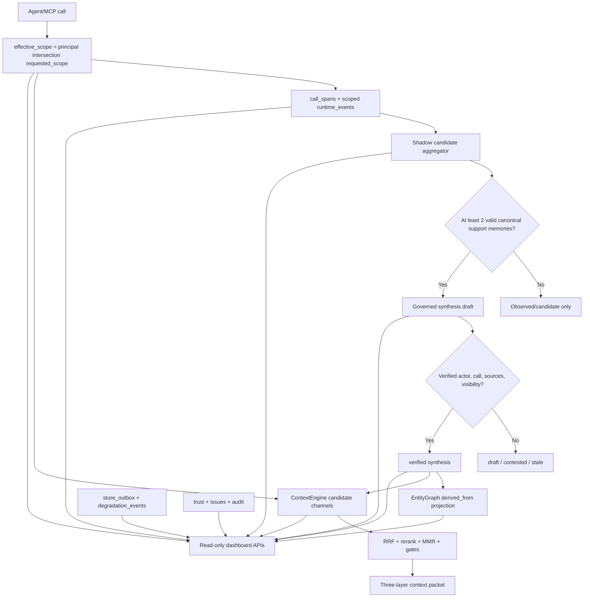

# MemOS and OpenMemory Memory Evolution and Operations Exemplar Research

## Executive Conclusion

The most valuable lesson is not that Plastic Promise needs another memory store. It is that a
memory system becomes operable when four surfaces share one evidence model:

1. events show what happened;
2. candidates show what might generalize;
3. governed artifacts show what has been verified;
4. an operations UI shows why a result exists and whether the system is healthy.

The two repositories contain four materially different references:

- MemOS Python is a useful multi-user, multi-cube orchestration design, but its public methods
  demonstrate why authorization and routing cannot be bolted on after selection.
- MemOS's TypeScript local plugin is the strongest memory-evolution design reference: episode ->
  trace -> policy -> world model -> skill, with candidate evidence, RRF, MMR, and stage telemetry.
  It is not a production governance baseline: the common event envelope exists at a bridge boundary,
  the bridge is incomplete, evolution queries are not namespace-isolated, and promotion defaults are
  deliberately permissive.
- Legacy `openmemory/` is sunset. Its information architecture is still useful, but its CORS,
  identity, transaction, ORM-hook, and teardown behavior are explicit anti-patterns.
- The newer mem0 `server/dashboard` is the better productization baseline: secure-by-default
  startup, first-admin bootstrap, hashed API keys, rotating refresh tokens, request telemetry,
  health-driven Compose startup, a setup wizard, and an operational dashboard. It authenticates
  requests, but it does not by itself prove tenant ownership of each supplied memory scope.

Plastic Promise already has the harder canonical pieces: SQLite truth, LanceDB as a rebuildable
index, `call_spans`, `memory_lineage`, `runtime_events`, `store_outbox`, retrieval score breakdowns,
EntityGraph, and a fail-closed synthesis lifecycle. The right move is therefore to project these
capabilities into a better control plane and add a shadow candidate stage, not to copy either
repository's database layout or introduce a second vector store.

Recommended target flow:

```text
call span / episode
  -> shadow candidate event
  -> evidence bucket
  -> governed synthesis draft
  -> verified synthesis
  -> EntityGraph projection / optional skill candidate
  -> stale | contested
```

Only `verified` artifacts whose sources still pass visibility and integrity checks may participate
in ordinary retrieval. Reward, value, priority, and retrieval score are evidence signals; none is a
substitute for trust, ownership, principle alignment, or verification.

## Evidence Scope and Method

The research is pinned to these source snapshots:

| Reference | Fixed snapshot | Evidence role |
|---|---|---|
| MemOS Python | [`554bb98`](https://github.com/MemTensor/MemOS/tree/554bb98ee7c28307dbaeac569a0dea49ff0062fd) | multi-user and multi-cube orchestration |
| MemOS local plugin | [`554bb98`](https://github.com/MemTensor/MemOS/tree/554bb98ee7c28307dbaeac569a0dea49ff0062fd/apps/memos-local-plugin) | event-driven memory evolution and retrieval |
| Legacy OpenMemory | [`ddaa655`](https://github.com/mem0ai/mem0/tree/ddaa655edf41e3ed375b263fb227da0bcd42ccb9/openmemory) | management UX patterns and legacy hazards |
| New mem0 server/dashboard | [`ddaa655`](https://github.com/mem0ai/mem0/tree/ddaa655edf41e3ed375b263fb227da0bcd42ccb9/server) | authentication, operations UI, and bootstrap |

Evidence labels used below:

- **[CODE]** behavior verified in executable source.
- **[TREE]** component or route existence verified from the fixed source tree, without claiming its
  runtime semantics.
- **[DOC]** a project statement, treated as intent rather than implementation proof.
- **[TEST]** test behavior or a targeted coverage gap verified in the fixed test tree; absence claims
  are based on repository-wide source search, not a claim about unobserved external tests. The label
  does not mean that this study executed the suite.

No upstream test suite or benchmark was executed for this study. Test files were inspected as
source, and no benchmark result was reproduced. Exact MemOS thresholds are reported to explain its
behavior, not proposed as production values. The local Plastic Promise comparison is fixed to
revision `dffee898788d20c80fef92f1bf975ac96b98272c`.

## Plastic Promise Baseline

The comparison starts from the code that already exists:

- **[CODE]** The traceability schema already owns `call_spans`, `memory_lineage`,
  `degradation_events`, `store_outbox`, and `runtime_events` in
  [traceability.py](../../plastic_promise/core/traceability.py#L124-L218). Outbox rows already carry
  dedupe, attempt, and next-attempt metadata in
  [traceability.py](../../plastic_promise/core/traceability.py#L249-L263).
  `enqueue_memory_index_job` can participate in a caller-owned SQLite transaction or create its own
  `BEGIN IMMEDIATE`, and binds canonical hash/version/dedupe material in
  [traceability.py](../../plastic_promise/core/traceability.py#L396-L505). The required
  canonical-plus-outbox atomicity is therefore an existing mechanism to reuse, not a new queue.
- **[CODE]** Synthesis maintenance already uses compare-and-swap claims, `updated_at` as a
  processing lease, expired-lease recovery, and bounded exponential backoff in
  [synthesis_maintenance.py](../../plastic_promise/core/synthesis_maintenance.py#L368-L382)
  and
  [synthesis_maintenance.py](../../plastic_promise/core/synthesis_maintenance.py#L925-L1054).
  Retry work should generalize and test this mechanism rather than add another queue.
- **[CODE]** A unified runtime-event protocol already defines kind/status registries and safe write
  helpers in [event_protocol.py](../../plastic_promise/core/event_protocol.py#L1-L104), with focused
  coverage in
  [test_unified_event_protocol.py](../../tests/test_unified_event_protocol.py#L1).
  `record_runtime_event` currently commits unconditionally, so evolution events must either be
  emitted post-commit or the helper must be changed to respect a caller-owned transaction; it
  cannot be called from the middle of a canonical mutation unchanged.
- **[CODE]** The ContextEngine already applies weighted RRF in
  [context_engine.py](../../plastic_promise/core/context_engine.py#L4205-L4226), records per-item
  score and gate explanations in
  [context_engine.py](../../plastic_promise/core/context_engine.py#L4437-L4459), and exposes rerank,
  MMR, channel rankings, and pipeline/per-item statistics in
  [context_engine.py](../../plastic_promise/core/context_engine.py#L4490-L4576).
- **[CODE]** Governed synthesis already defines `draft`, `verified`, `contested`, and `stale` in
  [synthesis.py](../../plastic_promise/core/synthesis.py#L16). Retrieval is feature-gated and
  fail-closed in
  [synthesis_retrieval.py](../../plastic_promise/core/synthesis_retrieval.py#L326-L365).
- **[CODE]** Synthesis admission already checks verified evidence, at least two sources,
  hashes/fingerprints, current source validity, and complete visibility in
  [synthesis_retrieval.py](../../plastic_promise/core/synthesis_retrieval.py#L764-L911).
  Draft creation resolves every `source_id` through the canonical memory loader in
  [synthesis.py](../../plastic_promise/core/synthesis.py#L962-L1019), and retrieval later reloads
  those memories and verifies their hashes, revisions, visibility, and availability in
  [synthesis_retrieval.py](../../plastic_promise/core/synthesis_retrieval.py#L835-L911).
  A call-span or runtime-event ID is therefore audit correlation, not synthesis source evidence.
- **[CODE]** The MCP HTTP surface already serves health, stats, issues, trust, audit, and a compact
  inline dashboard in [server.py](../../plastic_promise/mcp/server.py#L3619-L3707) and
  [server.py](../../plastic_promise/mcp/server.py#L3732-L3890).
- **[CODE]** Startup already includes recovery, LanceDB warm-up, service health, and watchdog
  handling in [init_and_start.py](../../scripts/init_and_start.py#L771-L834).

This means the main gaps are presentation, explicit scope binding, candidate staging, and operator
workflow. Storage and retrieval should be extended in place.

## Reference 1: MemOS Python

### Q1: What exactly does it do?

#### MOSCore coordinates users and memory cubes

**[CODE]** `MOSCore` presents itself as the operating-system layer above multiple MemCubes in
[core.py](https://github.com/MemTensor/MemOS/blob/554bb98ee7c28307dbaeac569a0dea49ff0062fd/src/memos/mem_os/core.py#L38-L43).
Chat resolves cubes accessible to the user and searches them in
[core.py](https://github.com/MemTensor/MemOS/blob/554bb98ee7c28307dbaeac569a0dea49ff0062fd/src/memos/mem_os/core.py#L251-L300).
The abstraction is valuable because the orchestration layer does not need to know each store's
implementation details.

**[CODE]** `BaseMemCube` declares textual, activation, parametric, and preference memory slots plus
`load` and `dump` in
[base.py](https://github.com/MemTensor/MemOS/blob/554bb98ee7c28307dbaeac569a0dea49ff0062fd/src/memos/mem_cube/base.py#L13-L29).
It is a composition boundary, not a complete unified search/write interface.
`CompositeCubeView` fans writes across its cubes in order and searches them through a thread pool in
[composite_cube.py](https://github.com/MemTensor/MemOS/blob/554bb98ee7c28307dbaeac569a0dea49ff0062fd/src/memos/multi_mem_cube/composite_cube.py#L29-L83).

#### Filters are explicit, but authorization is not uniformly enforced

**[CODE]** `SearchService` distinguishes a unified filter from per-cube filters and rejects mixed
top-level syntax in
[search_service.py](https://github.com/MemTensor/MemOS/blob/554bb98ee7c28307dbaeac569a0dea49ff0062fd/src/memos/search/search_service.py#L39-L65).
That is a clean API contract worth retaining.

There are five important boundary weaknesses:

1. **[CODE]** Activation-memory chat scans loaded cubes in dictionary order and breaks after the
   first accessible cube even when that cube has no activation memory in
   [core.py](https://github.com/MemTensor/MemOS/blob/554bb98ee7c28307dbaeac569a0dea49ff0062fd/src/memos/mem_os/core.py#L319-L328).
   This is neither an all-cube read nor a documented newest-cube policy.
2. **[CODE]** Search obtains the user's cube set, but an explicitly supplied `install_cube_ids` is
   not intersected with that set before retrieval in
   [core.py](https://github.com/MemTensor/MemOS/blob/554bb98ee7c28307dbaeac569a0dea49ff0062fd/src/memos/mem_os/core.py#L546-L609).
   The MCP search tool accepts caller-provided `cube_ids` and forwards them to this path in
   [mcp_serve.py](https://github.com/MemTensor/MemOS/blob/554bb98ee7c28307dbaeac569a0dea49ff0062fd/src/memos/api/mcp_serve.py#L271-L303).
3. **[CODE]** Add validates an explicitly selected cube, but when none is supplied it chooses
   `accessible_cubes[0]` in
   [core.py](https://github.com/MemTensor/MemOS/blob/554bb98ee7c28307dbaeac569a0dea49ff0062fd/src/memos/mem_os/core.py#L684-L726).
   Accessible cubes are returned newest-first in
   [user_manager.py](https://github.com/MemTensor/MemOS/blob/554bb98ee7c28307dbaeac569a0dea49ff0062fd/src/memos/mem_user/user_manager.py#L336-L352),
   so the effective default is the newest accessible cube, not an explicit configured default.
4. **[CODE]** Registering an already-loaded cube can directly add the supplied user to its ACL in
   [core.py](https://github.com/MemTensor/MemOS/blob/554bb98ee7c28307dbaeac569a0dea49ff0062fd/src/memos/mem_os/core.py#L510-L519),
   while `unregister_mem_cube` accepts but ignores `user_id` and removes the cube globally in
   [core.py](https://github.com/MemTensor/MemOS/blob/554bb98ee7c28307dbaeac569a0dea49ff0062fd/src/memos/mem_os/core.py#L534-L544).
5. **[CODE]** Explicit cube IDs in `dump` and `load` are checked only for being loaded, not for user
   access, in
   [core.py](https://github.com/MemTensor/MemOS/blob/554bb98ee7c28307dbaeac569a0dea49ff0062fd/src/memos/mem_os/core.py#L1089-L1130).
   Register and unregister are also exposed through MCP in
   [mcp_serve.py](https://github.com/MemTensor/MemOS/blob/554bb98ee7c28307dbaeac569a0dea49ff0062fd/src/memos/api/mcp_serve.py#L219-L269).

Composite writes are sequential, so an early cube can commit before a later cube fails; there is no
rollback or partial-success contract
([composite_cube.py](https://github.com/MemTensor/MemOS/blob/554bb98ee7c28307dbaeac569a0dea49ff0062fd/src/memos/multi_mem_cube/composite_cube.py#L29-L44)).
Composite search uses only two workers and calls `future.result()` without failure isolation, so one
cube exception can abort the aggregate instead of returning successful partitions plus degradation
metadata
([composite_cube.py](https://github.com/MemTensor/MemOS/blob/554bb98ee7c28307dbaeac569a0dea49ff0062fd/src/memos/multi_mem_cube/composite_cube.py#L46-L83)).

### Q2: How does our context differ?

Plastic Promise already has project, source, visibility, call-id, EntityGraph, domain, and trust
semantics. A MemCube-like boundary could clarify routing, but a new cube registry or backing store
would duplicate existing entities and indexes. More importantly, Plastic Promise's governance
requires scope to be applied before SQL, FTS, vector top-K, graph expansion, and pagination. A
caller-provided list can narrow authorized scope; it must never enlarge it.

The existing degradation-event and request-scope machinery also makes partial fan-out a better fit
than all-or-nothing aggregation. A failed channel or domain should be visible and bounded, unless it
is the canonical authorization or evidence gate.

### Q3: What should we adapt vs skip?

- **Adapt:** a logical cube/view interface over existing project/domain/source scopes, plus explicit
  unified/per-scope filter syntax. Integration: `ContextEngine` planning and MCP schemas; roughly
  160-260 LOC plus tests; no new database. Gate only if exposed as a new API,
  `PP_MEMORY_VIEWS=0|1`.
- **Redesign:** compute `effective_scope = intersection(authenticated_scope, requested_scope)` before every
  candidate query. Empty intersection must return empty/forbidden, never fall back to a default.
  Integration: memory tools, ContextEngine candidate producers, and dashboard APIs; roughly
  220-380 LOC plus negative authorization tests.
- **Redesign:** define write atomicity explicitly. Either use one canonical transaction or return a
  durable per-partition outcome and idempotent compensation/retry contract. Search fan-out should
  return successful partitions plus structured degradation metadata for recoverable channel
  failures. Canonical authorization, visibility, and integrity failures remain fail-closed.
- **Skip:** "first accessible cube" as a routing policy, a second cube database, and direct
  `future.result()` aggregation without failure classification.

## Reference 2: MemOS TypeScript Local Plugin

### Q1: What exactly does it do?

#### It turns execution into an observable evolution pipeline

**[CODE]** The agent contract declares a broad event vocabulary in
[events.ts](https://github.com/MemTensor/MemOS/blob/554bb98ee7c28307dbaeac569a0dea49ff0062fd/apps/memos-local-plugin/agent-contract/events.ts#L7-L66).
Its public `CoreEvent` contract uses a common envelope containing `type`, timestamp, sequence,
correlation ID, and payload in
[events.ts](https://github.com/MemTensor/MemOS/blob/554bb98ee7c28307dbaeac569a0dea49ff0062fd/apps/memos-local-plugin/agent-contract/events.ts#L74-L89).
Internally, each subsystem still publishes a separate `kind`-based union, including L2 and L3 in
[types.ts](https://github.com/MemTensor/MemOS/blob/554bb98ee7c28307dbaeac569a0dea49ff0062fd/apps/memos-local-plugin/core/memory/l2/types.ts#L198-L235)
and
[types.ts](https://github.com/MemTensor/MemOS/blob/554bb98ee7c28307dbaeac569a0dea49ff0062fd/apps/memos-local-plugin/core/memory/l3/types.ts#L198-L232).
The common shape is created by `event-bridge.ts`, not guaranteed end to end
([event-bridge.ts](https://github.com/MemTensor/MemOS/blob/554bb98ee7c28307dbaeac569a0dea49ff0062fd/apps/memos-local-plugin/core/pipeline/event-bridge.ts#L1-L58)).
The useful pattern is therefore the public correlation contract and decoupled buses, provided the
bridge has explicit coverage and failure semantics.

The evolution path is evidence-based rather than one blind summarization call:

```text
episode
  -> eligible L1 trace
  -> association with an existing L2 policy
  -> unmatched candidate bucket
  -> induction from distinct episodes
  -> gain/status evaluation and candidate recheck
  -> active policies clustered into an L3 world model
  -> optional skill materialization
```

**[CODE]** L2 first keeps traces whose value reaches `minTraceValue` and which have a summary or
action vector, then attempts policy association
([l2.ts](https://github.com/MemTensor/MemOS/blob/554bb98ee7c28307dbaeac569a0dea49ff0062fd/apps/memos-local-plugin/core/memory/l2/l2.ts#L70-L145)).
Unmatched traces enter a TTL-bound candidate pool. Buckets become inducible only after enough
distinct episodes, and one trace per episode is selected for induction; cheap vector duplicate
detection runs before the LLM path
([l2.ts](https://github.com/MemTensor/MemOS/blob/554bb98ee7c28307dbaeac569a0dea49ff0062fd/apps/memos-local-plugin/core/memory/l2/l2.ts#L147-L235)).
The remainder of the pipeline computes gain/status and rechecks candidates rather than treating the
first induction as final truth
([l2.ts](https://github.com/MemTensor/MemOS/blob/554bb98ee7c28307dbaeac569a0dea49ff0062fd/apps/memos-local-plugin/core/memory/l2/l2.ts#L236-L489)).

**[CODE]** Candidate rows do not have a status field. Their lifecycle is implicit in
`policy_id IS NULL`, `expires_at`, promotion, pruning, and deletion in
[candidate-pool.ts](https://github.com/MemTensor/MemOS/blob/554bb98ee7c28307dbaeac569a0dea49ff0062fd/apps/memos-local-plugin/core/memory/l2/candidate-pool.ts#L99-L177)
and the row shape in
[types.ts](https://github.com/MemTensor/MemOS/blob/554bb98ee7c28307dbaeac569a0dea49ff0062fd/apps/memos-local-plugin/core/types.ts#L357-L363).
It is useful staging behavior, but not an explicit candidate state machine.

**[CODE]** L3 selects active policies meeting gain/support requirements, clusters them, applies a
cooldown, builds evidence, and asks the model for an abstraction in
[l3.ts](https://github.com/MemTensor/MemOS/blob/554bb98ee7c28307dbaeac569a0dea49ff0062fd/apps/memos-local-plugin/core/memory/l3/l3.ts#L86-L180).
It then merges or creates world-model rows while preserving source episode and policy identifiers in
[l3.ts](https://github.com/MemTensor/MemOS/blob/554bb98ee7c28307dbaeac569a0dea49ff0062fd/apps/memos-local-plugin/core/memory/l3/l3.ts#L183-L318).
This is provenance structure, not a transactional fail-closed evidence chain: L2 can insert a policy,
promote its candidate rows, record individual trace-link failures as warnings, and still emit the
induction event
([l2.ts](https://github.com/MemTensor/MemOS/blob/554bb98ee7c28307dbaeac569a0dea49ff0062fd/apps/memos-local-plugin/core/memory/l2/l2.ts#L299-L357)).

#### Retrieval combines best-channel relevance, RRF, relative filtering, and MMR

**[CODE]** The ranker defaults include a relative threshold ratio of `0.2`, smart-seed ratio `0.7`,
and RRF contribution weight `0.4` in
[ranker.ts](https://github.com/MemTensor/MemOS/blob/554bb98ee7c28307dbaeac569a0dea49ff0062fd/apps/memos-local-plugin/core/retrieval/ranker.ts#L98-L108).
It adds per-channel RRF to best-channel relevance, drops candidates below `top * threshold`, and
lets candidates seen in at least two channels bypass that cutoff in
[ranker.ts](https://github.com/MemTensor/MemOS/blob/554bb98ee7c28307dbaeac569a0dea49ff0062fd/apps/memos-local-plugin/core/retrieval/ranker.ts#L122-L170).
Greedy MMR follows. Smart seeding admits at most one sufficiently relevant candidate per tier before
the normal MMR loop
([ranker.ts](https://github.com/MemTensor/MemOS/blob/554bb98ee7c28307dbaeac569a0dea49ff0062fd/apps/memos-local-plugin/core/retrieval/ranker.ts#L184-L252)).
The later helpers define the priority/eta boosts and `1 / (k + rank + 1)` RRF form in
[ranker.ts](https://github.com/MemTensor/MemOS/blob/554bb98ee7c28307dbaeac569a0dea49ff0062fd/apps/memos-local-plugin/core/retrieval/ranker.ts#L266-L379).

**[CODE]** Current defaults make the pipeline easy to activate: a 30-second reward window, one
exchange, 40 content characters, one episode for L2 induction, and minimum trace value `0.005` in
[defaults.ts](https://github.com/MemTensor/MemOS/blob/554bb98ee7c28307dbaeac569a0dea49ff0062fd/apps/memos-local-plugin/core/config/defaults.ts#L124-L165).
L3 can proceed with one policy, gain `0.02`, support one, and zero cooldown in
[defaults.ts](https://github.com/MemTensor/MemOS/blob/554bb98ee7c28307dbaeac569a0dea49ff0062fd/apps/memos-local-plugin/core/config/defaults.ts#L171-L197).
Skill defaults separately use support one, gain `0.02`, one candidate trial, and zero cooldown in
[defaults.ts](https://github.com/MemTensor/MemOS/blob/554bb98ee7c28307dbaeac569a0dea49ff0062fd/apps/memos-local-plugin/core/config/defaults.ts#L198-L224).
Retrieval defaults include tier sizes `3/5/2`, RRF constant `60`, MMR lambda `0.7`, relative
threshold `0.2`, and smart seed `0.7` in
[defaults.ts](https://github.com/MemTensor/MemOS/blob/554bb98ee7c28307dbaeac569a0dea49ff0062fd/apps/memos-local-plugin/core/config/defaults.ts#L241-L285).

These numbers prevent an early local system from starving. They are not evidence that one episode,
one policy, or one successful trial is enough to establish governed knowledge.
The adjacent L3 comment still says the default was lowered to two while the executable value is one,
and the advanced configuration document retains older values
([defaults.ts](https://github.com/MemTensor/MemOS/blob/554bb98ee7c28307dbaeac569a0dea49ff0062fd/apps/memos-local-plugin/core/config/defaults.ts#L171-L177),
[CONFIG-ADVANCED.md](https://github.com/MemTensor/MemOS/blob/554bb98ee7c28307dbaeac569a0dea49ff0062fd/apps/memos-local-plugin/docs/CONFIG-ADVANCED.md#L65-L125)).
The code values above are authoritative for this snapshot.

#### Seven implementation risks are visible in the fixed source

1. **Namespace result starvation. [CODE]** Vector/text/pattern search obtains top-K before the
   adapter applies `isVisibleTo` during row hydration in
   [retrieval-repos.ts](https://github.com/MemTensor/MemOS/blob/554bb98ee7c28307dbaeac569a0dea49ff0062fd/apps/memos-local-plugin/core/pipeline/retrieval-repos.ts#L15-L73)
   and
   [retrieval-repos.ts](https://github.com/MemTensor/MemOS/blob/554bb98ee7c28307dbaeac569a0dea49ff0062fd/apps/memos-local-plugin/core/pipeline/retrieval-repos.ts#L89-L102).
   Unauthorized rows can consume the candidate budget even when they are removed later.
2. **Evolution is not namespace-isolated. [CODE]** L2 association searches all active/candidate
   policies without an owner predicate
   ([associate.ts](https://github.com/MemTensor/MemOS/blob/554bb98ee7c28307dbaeac569a0dea49ff0062fd/apps/memos-local-plugin/core/memory/l2/associate.ts#L50-L75),
   [policies.ts](https://github.com/MemTensor/MemOS/blob/554bb98ee7c28307dbaeac569a0dea49ff0062fd/apps/memos-local-plugin/core/storage/repos/policies.ts#L150-L188)).
   Candidate induction scans all unpromoted rows and buckets only by signature
   ([candidate-pool.ts](https://github.com/MemTensor/MemOS/blob/554bb98ee7c28307dbaeac569a0dea49ff0062fd/apps/memos-local-plugin/core/memory/l2/candidate-pool.ts#L99-L154)).
   L3 lists all active policies, clusters by domain semantics rather than owner, and assigns a new
   world model the first policy's owner
   ([l3.ts](https://github.com/MemTensor/MemOS/blob/554bb98ee7c28307dbaeac569a0dea49ff0062fd/apps/memos-local-plugin/core/memory/l3/l3.ts#L86-L107),
   [cluster.ts](https://github.com/MemTensor/MemOS/blob/554bb98ee7c28307dbaeac569a0dea49ff0062fd/apps/memos-local-plugin/core/memory/l3/cluster.ts#L111-L124),
   [l3.ts](https://github.com/MemTensor/MemOS/blob/554bb98ee7c28307dbaeac569a0dea49ff0062fd/apps/memos-local-plugin/core/memory/l3/l3.ts#L342-L352)).
   This can cross-associate evidence, change support/gain, and create a mixed-owner abstraction; it
   is more severe than retrieval result starvation.
3. **The public event bridge is incomplete. [CODE]** L2 and L3 subscribers emit `l2.failed` and
   `l3.failed`
   ([subscriber.ts](https://github.com/MemTensor/MemOS/blob/554bb98ee7c28307dbaeac569a0dea49ff0062fd/apps/memos-local-plugin/core/memory/l2/subscriber.ts#L89-L102),
   [subscriber.ts](https://github.com/MemTensor/MemOS/blob/554bb98ee7c28307dbaeac569a0dea49ff0062fd/apps/memos-local-plugin/core/memory/l3/subscriber.ts#L81-L94)),
   but the corresponding bridge switches have no branches for them
   ([event-bridge.ts](https://github.com/MemTensor/MemOS/blob/554bb98ee7c28307dbaeac569a0dea49ff0062fd/apps/memos-local-plugin/core/pipeline/event-bridge.ts#L143-L180)).
   The bridge test covers only skill model refusal
   ([event-bridge.test.ts](https://github.com/MemTensor/MemOS/blob/554bb98ee7c28307dbaeac569a0dea49ff0062fd/apps/memos-local-plugin/tests/unit/pipeline/event-bridge.test.ts#L29-L70)).
4. **Provenance can be partial. [CODE]** Policy insertion and candidate promotion happen before
   trace-policy links finish; link errors become warnings and do not prevent the induction event
   ([l2.ts](https://github.com/MemTensor/MemOS/blob/554bb98ee7c28307dbaeac569a0dea49ff0062fd/apps/memos-local-plugin/core/memory/l2/l2.ts#L299-L357)).
5. **A retry job can become stranded. [CODE]** Re-enqueueing an `in_progress` job preserves its
   status but clears `claimed_by` and `lease_until` in
   [embedding_retry_queue.ts](https://github.com/MemTensor/MemOS/blob/554bb98ee7c28307dbaeac569a0dea49ff0062fd/apps/memos-local-plugin/core/storage/repos/embedding_retry_queue.ts#L83-L102).
   Claiming only recovers `in_progress` rows whose lease is non-null and expired in
   [embedding_retry_queue.ts](https://github.com/MemTensor/MemOS/blob/554bb98ee7c28307dbaeac569a0dea49ff0062fd/apps/memos-local-plugin/core/storage/repos/embedding_retry_queue.ts#L127-L157).
   The combined state `in_progress + lease_until NULL` is therefore not claimable.
6. **LLM filtering has two fallback meanings. [CODE]** A deliberately absent LLM passes candidates
   through in
   [llm-filter.ts](https://github.com/MemTensor/MemOS/blob/554bb98ee7c28307dbaeac569a0dea49ff0062fd/apps/memos-local-plugin/core/retrieval/llm-filter.ts#L113-L137),
   whereas an attempted call that fails takes a mechanical safe-cutoff path in
   [llm-filter.ts](https://github.com/MemTensor/MemOS/blob/554bb98ee7c28307dbaeac569a0dea49ff0062fd/apps/memos-local-plugin/core/retrieval/llm-filter.ts#L147-L229)
   and
   [llm-filter.ts](https://github.com/MemTensor/MemOS/blob/554bb98ee7c28307dbaeac569a0dea49ff0062fd/apps/memos-local-plugin/core/retrieval/llm-filter.ts#L335-L390).
   Operators must be able to distinguish disabled, degraded, and successful modes.
7. **Promotion can bypass meaningful probation. [CODE]** New world models are created directly as
   `active`
   ([abstract.ts](https://github.com/MemTensor/MemOS/blob/554bb98ee7c28307dbaeac569a0dea49ff0062fd/apps/memos-local-plugin/core/memory/l3/abstract.ts#L175-L194)).
   A non-decision-guidance candidate skill whose eta clears the retrieval floor can be promoted by
   a lifecycle tick without any trial
   ([lifecycle.ts](https://github.com/MemTensor/MemOS/blob/554bb98ee7c28307dbaeac569a0dea49ff0062fd/apps/memos-local-plugin/core/skill/lifecycle.ts#L204-L217),
   [subscriber.ts](https://github.com/MemTensor/MemOS/blob/554bb98ee7c28307dbaeac569a0dea49ff0062fd/apps/memos-local-plugin/core/skill/subscriber.ts#L213-L227)).
   `candidateTrials: 1` therefore does not describe every activation path.

### Q2: How does our context differ?

Plastic Promise already captures most of the substrate this plugin creates: call spans and runtime
events can represent episodes and traces; EntityGraph and lineage can represent evidence; synthesis
already owns draft/verified/stale/contested; ContextEngine already has weighted RRF, rerank, MMR,
channel rankings, and per-item explanations.

The semantic difference is governance. A local personal plugin can optimize for rapid adaptation
and accept low-support policies. Plastic Promise operates across agents and projects, so an
assistant-authored reflection cannot become durable shared truth solely because its reward or gain
is positive. Verification must establish source validity, actor/call evidence, scope, and principle
alignment. Trust controls authority; it is not a synonym for reward, `V`, priority, eta, or retrieval
relevance.

### Q3: What should we adapt vs skip?

- **Adapt:** the public event envelope, not the incomplete bridge implementation. Map
  `type/ts/seq/correlationId/payload` by extending the existing `event_protocol.py` kind/status
  registry and `runtime_events` metadata, with versioning, unknown-event behavior, and coverage for
  every source-event union. Emit post-commit or make the helper respect a caller-owned transaction;
  do not let its current unconditional commit split a canonical mutation. Integration:
  `event_protocol.py`, traceability writers, and dashboard projection; roughly 180-300 LOC plus
  tests; gate `PP_MEMORY_EVOLUTION=shadow`.
- **Redesign:** evidence buckets and distinct-source induction. Store observed/candidate state in
  `runtime_events`, include effective owner/project scope in both the bucket key and every query,
  and only create a governed synthesis `draft` after configurable distinct episode, source, and
  time-span requirements. Promotion additionally requires at least two canonical ordinary
  `support_memory_ids` that the existing synthesis store can load and validate; episode and call IDs
  remain audit links. Candidates without canonical support stay shadow-only. Integration: daemon or
  post-task worker plus `synthesis.py`; roughly 450-750 LOC for shadow collection, then 350-600 LOC
  for draft promotion.
- **Adapt:** retrieval explanations, but expose Plastic Promise's existing channel rankings,
  score breakdown, gates, rerank, and MMR rather than porting a second ranker. Integration: read-only
  API and dashboard; roughly 300-500 LOC; gate `PP_RETRIEVAL_EXPLAIN=0|1`.
- **Redesign:** L3 world models as verified synthesis with `derived_from` graph edges. Generation
  produces a draft; human/system verification and current-source checks control admission.
- **Redesign:** skill crystallization as a separate governed promotion requiring provenance,
  verification, trust tier, principle evaluation, support, and successful trials across distinct
  contexts.
- **Redesign:** push project/tenant/visibility predicates into every retrieval and evolution SQL,
  FTS, graph, and vector candidate query before top-K, association, grouping, support/gain updates,
  and abstraction. Post-hydration checks remain defense in depth.
- **Redesign:** make retry state transitions total and test every `(status, lease)` combination;
  re-enqueue must either preserve both claim and lease or reset the row to `pending` atomically.
- **Skip:** incomplete event bridging, one-episode policy promotion, one-policy or mixed-owner
  world-model generation, active-at-create abstractions, zero/first-trial skill activation, a second
  SQLite/vector stack, and equating reward metrics with governance trust.

## Reference 3: Legacy OpenMemory

### Q1: What exactly does it do?

#### It has a useful management shape but is explicitly sunset

**[DOC]** The legacy project's own README marks it sunset in
[README.md](https://github.com/mem0ai/mem0/blob/ddaa655edf41e3ed375b263fb227da0bcd42ccb9/openmemory/README.md#L3).
Its route tree still demonstrates a useful operator information architecture: memory list/detail,
filters, pagination, app management, category management, status actions, and access history
([UI tree](https://github.com/mem0ai/mem0/tree/ddaa655edf41e3ed375b263fb227da0bcd42ccb9/openmemory/ui/app)).
That is **[TREE]** evidence for UX coverage, not an endorsement of its backend contracts.

#### Identity, transaction, and lifecycle boundaries are unsafe defaults

- **[CODE]** CORS allows every origin in
  [main.py](https://github.com/mem0ai/mem0/blob/ddaa655edf41e3ed375b263fb227da0bcd42ccb9/openmemory/api/main.py#L13-L21).
- **[CODE]** Memory requests accept `user_id` from request parameters without a demonstrated
  authenticated-principal binding in
  [memories.py](https://github.com/mem0ai/mem0/blob/ddaa655edf41e3ed375b263fb227da0bcd42ccb9/openmemory/api/app/routers/memories.py#L100-L124).
  The inspected create, update, and delete routes likewise use caller-provided user identifiers and
  do not declare an authentication dependency
  ([memories.py](https://github.com/mem0ai/mem0/blob/ddaa655edf41e3ed375b263fb227da0bcd42ccb9/openmemory/api/app/routers/memories.py#L212-L227),
  [memories.py](https://github.com/mem0ai/mem0/blob/ddaa655edf41e3ed375b263fb227da0bcd42ccb9/openmemory/api/app/routers/memories.py#L350-L390),
  [memories.py](https://github.com/mem0ai/mem0/blob/ddaa655edf41e3ed375b263fb227da0bcd42ccb9/openmemory/api/app/routers/memories.py#L512-L530)).
- **[CODE]** The list path paginates before a transformer performs access filtering in
  [memories.py](https://github.com/mem0ai/mem0/blob/ddaa655edf41e3ed375b263fb227da0bcd42ccb9/openmemory/api/app/routers/memories.py#L167-L184).
  This can underfill pages and makes authorization consume pagination budget. The separate filter
  route does not call the access check at all in
  [memories.py](https://github.com/mem0ai/mem0/blob/ddaa655edf41e3ed375b263fb227da0bcd42ccb9/openmemory/api/app/routers/memories.py#L545-L636).
- **[CODE]** `global_pause` is not scoped to one user in
  [memories.py](https://github.com/mem0ai/mem0/blob/ddaa655edf41e3ed375b263fb227da0bcd42ccb9/openmemory/api/app/routers/memories.py#L434-L442).
- **[CODE]** SQLAlchemy `after_insert`/`after_update` hooks synchronously invoke LLM classification
  and commit in
  [models.py](https://github.com/mem0ai/mem0/blob/ddaa655edf41e3ed375b263fb227da0bcd42ccb9/openmemory/api/app/models.py#L190-L243).
  The categorizer performs external model I/O with up to three retries in
  [categorization.py](https://github.com/mem0ai/mem0/blob/ddaa655edf41e3ed375b263fb227da0bcd42ccb9/openmemory/api/app/utils/categorization.py#L18-L43).
  This couples a remote, fallible side effect to ORM flush and transaction lifecycle.
- **[CODE]** The create path writes the vector store before committing SQLite and reports an error
  without a compensating transaction in
  [memories.py](https://github.com/mem0ai/mem0/blob/ddaa655edf41e3ed375b263fb227da0bcd42ccb9/openmemory/api/app/routers/memories.py#L257-L326).
  Delete can mark SQLite deleted after vector deletion fails, while update changes SQLite without a
  corresponding vector update
  ([memories.py](https://github.com/mem0ai/mem0/blob/ddaa655edf41e3ed375b263fb227da0bcd42ccb9/openmemory/api/app/routers/memories.py#L381-L390),
  [memories.py](https://github.com/mem0ai/mem0/blob/ddaa655edf41e3ed375b263fb227da0bcd42ccb9/openmemory/api/app/routers/memories.py#L517-L530)).
- **[CODE]** `make down` runs `docker compose down -v` and deletes the SQLite database in
  [Makefile](https://github.com/mem0ai/mem0/blob/ddaa655edf41e3ed375b263fb227da0bcd42ccb9/openmemory/Makefile#L32-L34).
  Ordinary shutdown is therefore destructive.

The legacy MCP path contains a still sharper authorization bug. **[CODE]** Search obtains ten
candidates before filtering, and when the authorized-ID result is empty it converts that result to
`None`, which disables the filter instead of representing "deny all" in
[mcp_server.py](https://github.com/mem0ai/mem0/blob/ddaa655edf41e3ed375b263fb227da0bcd42ccb9/openmemory/api/app/mcp_server.py#L169-L193)
and
[permissions.py](https://github.com/mem0ai/mem0/blob/ddaa655edf41e3ed375b263fb227da0bcd42ccb9/openmemory/api/app/utils/permissions.py#L48-L53).
The only legacy test module's user-isolation case verifies ContextVar separation, not data
authorization or authentication
([test_mcp_server.py](https://github.com/mem0ai/mem0/blob/ddaa655edf41e3ed375b263fb227da0bcd42ccb9/openmemory/api/tests/test_mcp_server.py#L275-L324)).

### Q2: How does our context differ?

Plastic Promise treats SQLite as canonical, LanceDB as rebuildable, and degradation/outbox state as
auditable. An ORM hook that performs model I/O or a route that writes the derived index before the
canonical commit conflicts with those invariants. Plastic Promise also has multiple agents,
projects, source labels, trust levels, and governed synthesis; request-supplied user identifiers are
not an adequate ownership boundary.

The useful part of legacy OpenMemory is visual: operators need a place to inspect memories,
lineage, categories/domains, app/agent activity, state transitions, and access evidence. Those views
should read canonical Plastic Promise APIs rather than inherit the old backend.

### Q3: What should we adapt vs skip?

- **Adapt:** memory list/detail, typed filters, pagination, source/access history, and explicit
  lifecycle actions as dashboard interaction patterns.
- **Redesign:** pagination and top-K over an already-authorized query; return total, filtered total,
  stable cursor, and active scope in response metadata.
- **Redesign:** commit the canonical memory mutation and idempotent outbox row atomically in the
  same SQLite transaction, then let a rebuildable index worker consume it. Model enrichment runs
  outside ORM callbacks and records call/degradation evidence.
- **Skip:** wildcard CORS, parameter-based identity, cross-user global actions, model calls in ORM
  lifecycle hooks, non-transactional dual writes, and destructive default shutdown.

## Reference 4: New mem0 Server and Dashboard

### Q1: What exactly does it do?

#### Authentication is a substantially safer default boundary

**[CODE]** Passwords and API keys use bcrypt hashes; the API-key plaintext is only available at
creation time in
[auth.py](https://github.com/mem0ai/mem0/blob/ddaa655edf41e3ed375b263fb227da0bcd42ccb9/server/auth.py#L25-L48)
and
[api_keys.py](https://github.com/mem0ai/mem0/blob/ddaa655edf41e3ed375b263fb227da0bcd42ccb9/server/routers/api_keys.py#L39-L76).
Refresh-token JTI consumption uses a conditional update, giving rotation atomic replay protection in
[auth.py](https://github.com/mem0ai/mem0/blob/ddaa655edf41e3ed375b263fb227da0bcd42ccb9/server/auth.py#L63-L94).
API-key prefixes narrow candidates before hash verification in
[auth.py](https://github.com/mem0ai/mem0/blob/ddaa655edf41e3ed375b263fb227da0bcd42ccb9/server/auth.py#L126-L141).
Request authentication supports JWT, `X-API-Key`, and an explicit local-development bypass in
[auth.py](https://github.com/mem0ai/mem0/blob/ddaa655edf41e3ed375b263fb227da0bcd42ccb9/server/auth.py#L144-L170).

**[CODE]** Registration is limited to the first admin in
[routers/auth.py](https://github.com/mem0ai/mem0/blob/ddaa655edf41e3ed375b263fb227da0bcd42ccb9/server/routers/auth.py#L88-L122).
The route's count-then-insert race is closed by a database partial unique index on the `admin` role
in
[004_unique_admin_role.py](https://github.com/mem0ai/mem0/blob/ddaa655edf41e3ed375b263fb227da0bcd42ccb9/server/alembic/versions/004_unique_admin_role.py#L20-L27),
with `IntegrityError` mapped back to closed registration.
Login performs a dummy bcrypt check for a missing email, reducing account-enumeration timing
differences in
[routers/auth.py](https://github.com/mem0ai/mem0/blob/ddaa655edf41e3ed375b263fb227da0bcd42ccb9/server/routers/auth.py#L125-L140).
Refresh rotation is exposed in
[routers/auth.py](https://github.com/mem0ai/mem0/blob/ddaa655edf41e3ed375b263fb227da0bcd42ccb9/server/routers/auth.py#L144-L164).
The dashboard proxy replaces the refresh token in an HttpOnly, SameSite=Lax cookie in
[refresh/route.ts](https://github.com/mem0ai/mem0/blob/ddaa655edf41e3ed375b263fb227da0bcd42ccb9/server/dashboard/src/app/api/auth/refresh/route.ts#L21-L53).

**[CODE]** Authentication defaults on; startup rejects a missing JWT secret instead of silently
running open in
[main.py](https://github.com/mem0ai/mem0/blob/ddaa655edf41e3ed375b263fb227da0bcd42ccb9/server/main.py#L89-L103).
CORS is restricted to the dashboard URL in
[main.py](https://github.com/mem0ai/mem0/blob/ddaa655edf41e3ed375b263fb227da0bcd42ccb9/server/main.py#L159-L166).
Configuration reads are recursively redacted in
[main.py](https://github.com/mem0ai/mem0/blob/ddaa655edf41e3ed375b263fb227da0bcd42ccb9/server/main.py#L221-L228).

The auth tables model API keys, request logs, and refresh JTIs in
[models.py](https://github.com/mem0ai/mem0/blob/ddaa655edf41e3ed375b263fb227da0bcd42ccb9/server/models.py#L30-L62).

#### Request observability and dashboard IA are deliberately operational

**[CODE]** Middleware records method, path, status, latency, and authentication type and returns an
`X-Request-ID` in
[main.py](https://github.com/mem0ai/mem0/blob/ddaa655edf41e3ed375b263fb227da0bcd42ccb9/server/main.py#L261-L318).

This is useful operational telemetry, not a canonical audit trail. **[CODE]** Its database row has no
request ID, principal, scope, or correlation field in
[models.py](https://github.com/mem0ai/mem0/blob/ddaa655edf41e3ed375b263fb227da0bcd42ccb9/server/models.py#L43-L52).
Persistence is dispatched to an unawaited executor; failure is logged without an outbox or retry
([main.py](https://github.com/mem0ai/mem0/blob/ddaa655edf41e3ed375b263fb227da0bcd42ccb9/server/main.py#L270-L318)).
The Requests API includes only `api_key` and `admin_api_key` records in
[requests.py](https://github.com/mem0ai/mem0/blob/ddaa655edf41e3ed375b263fb227da0bcd42ccb9/server/routers/requests.py#L27-L46),
and the UI's total, success rate, and average latency are calculated from at most the latest 200 of
those rows
([requests/page.tsx](https://github.com/mem0ai/mem0/blob/ddaa655edf41e3ed375b263fb227da0bcd42ccb9/server/dashboard/src/app/%28root%29/dashboard/requests/page.tsx#L27-L28),
[requests/page.tsx](https://github.com/mem0ai/mem0/blob/ddaa655edf41e3ed375b263fb227da0bcd42ccb9/server/dashboard/src/app/%28root%29/dashboard/requests/page.tsx#L83-L114)).

**[TREE]** The main navigation exposes Requests, Memories, Entities, API Keys, Configuration, and
Settings in
[main-nav.tsx](https://github.com/mem0ai/mem0/blob/ddaa655edf41e3ed375b263fb227da0bcd42ccb9/server/dashboard/src/app/%28root%29/dashboard/components/main-nav.tsx#L65-L106)
and
[main-nav.tsx](https://github.com/mem0ai/mem0/blob/ddaa655edf41e3ed375b263fb227da0bcd42ccb9/server/dashboard/src/app/%28root%29/dashboard/components/main-nav.tsx#L199-L240).

**[CODE]** The Requests page loads request records and derives success rate and average latency,
then presents method/path/status/latency/auth columns in
[requests/page.tsx](https://github.com/mem0ai/mem0/blob/ddaa655edf41e3ed375b263fb227da0bcd42ccb9/server/dashboard/src/app/%28root%29/dashboard/requests/page.tsx#L83-L169).
It implements refresh, empty, and pagination states in
[requests/page.tsx](https://github.com/mem0ai/mem0/blob/ddaa655edf41e3ed375b263fb227da0bcd42ccb9/server/dashboard/src/app/%28root%29/dashboard/requests/page.tsx#L171-L277).
The Configuration page loads and saves settings and restricts provider/model/API-key controls to
admins in
[configuration/page.tsx](https://github.com/mem0ai/mem0/blob/ddaa655edf41e3ed375b263fb227da0bcd42ccb9/server/dashboard/src/app/%28root%29/dashboard/configuration/page.tsx#L32-L108)
and
[configuration/page.tsx](https://github.com/mem0ai/mem0/blob/ddaa655edf41e3ed375b263fb227da0bcd42ccb9/server/dashboard/src/app/%28root%29/dashboard/configuration/page.tsx#L110-L224).

#### Bootstrap verifies readiness and first-use credentials

**[CODE]** The Makefile checks ports, builds Compose services, waits for API and dashboard, separates
ordinary `down` from destructive `clean`, and exposes readiness/health targets in
[Makefile](https://github.com/mem0ai/mem0/blob/ddaa655edf41e3ed375b263fb227da0bcd42ccb9/server/Makefile#L7-L48).
`bootstrap` composes startup, readiness waits, and seeding; it verifies reachability and auth
provisioning, not the memory lifecycle
([Makefile](https://github.com/mem0ai/mem0/blob/ddaa655edf41e3ed375b263fb227da0bcd42ccb9/server/Makefile#L43)).

**[CODE]** The seed script creates the first admin, logs in, creates an API key, supports JSON
output, and displays the secret once in
[seed.sh](https://github.com/mem0ai/mem0/blob/ddaa655edf41e3ed375b263fb227da0bcd42ccb9/server/scripts/seed.sh#L15-L71).
Compose starts the API after Postgres is healthy and defines health checks for pgvector/Postgres and
the dashboard in
[docker-compose.yaml](https://github.com/mem0ai/mem0/blob/ddaa655edf41e3ed375b263fb227da0bcd42ccb9/server/docker-compose.yaml#L17-L69).

**[CODE]** The setup wizard is a five-step Admin -> Providers -> API Key -> Use Case -> Quick Test
flow in
[setup/page.tsx](https://github.com/mem0ai/mem0/blob/ddaa655edf41e3ed375b263fb227da0bcd42ccb9/server/dashboard/src/app/setup/page.tsx#L38-L50).
It creates the first API key and finishes with a real memory POST rather than a decorative success
screen in
[setup/page.tsx](https://github.com/mem0ai/mem0/blob/ddaa655edf41e3ed375b263fb227da0bcd42ccb9/server/dashboard/src/app/setup/page.tsx#L237-L303).
The wizard therefore exercises one store call, but neither it nor `bootstrap` verifies recall or
context supply. A Plastic Promise bootstrap smoke must cover the full store -> recall -> context
path and report which stage failed.

The interaction design is stronger than the current automation contract:

- **[CODE]** Readiness loops have no timeout, and `bootstrap` repeats waits already performed by
  `up` in
  [Makefile](https://github.com/mem0ai/mem0/blob/ddaa655edf41e3ed375b263fb227da0bcd42ccb9/server/Makefile#L7-L43).
- **[CODE]** Seeding is not idempotent: its default password is regenerated, an existing admin
  requires the caller to know the prior password, and a successful run creates another API key.
  Both text and JSON modes print plaintext password and key in
  [seed.sh](https://github.com/mem0ai/mem0/blob/ddaa655edf41e3ed375b263fb227da0bcd42ccb9/server/scripts/seed.sh#L7-L71),
  which is unsafe for routine CI logs.
- **[CODE]** The Compose project identifies itself as development, mounts source, uses reload, and
  installs `mem0ai` at startup rather than providing a fixed production artifact in
  [docker-compose.yaml](https://github.com/mem0ai/mem0/blob/ddaa655edf41e3ed375b263fb227da0bcd42ccb9/server/docker-compose.yaml#L1-L21).
  The dashboard's multi-stage, non-root image is a better build pattern
  ([Dockerfile](https://github.com/mem0ai/mem0/blob/ddaa655edf41e3ed375b263fb227da0bcd42ccb9/server/dashboard/Dockerfile#L15-L51)).

#### Authentication is not the same as tenant ownership

**[CODE]** `verify_auth` returns a user, but memory handlers bind it to an unused `_auth`. An
authenticated caller can create an arbitrary `user_id`, `agent_id`, or `run_id` scope, list/search
arbitrary supplied scopes, and perform ID-based operations without an ownership comparison in
[main.py](https://github.com/mem0ai/mem0/blob/ddaa655edf41e3ed375b263fb227da0bcd42ccb9/server/main.py#L366-L477)
and
[main.py](https://github.com/mem0ai/mem0/blob/ddaa655edf41e3ed375b263fb227da0bcd42ccb9/server/main.py#L486-L523).
Entity listing has the same authentication-without-ownership shape in
[entities.py](https://github.com/mem0ai/mem0/blob/ddaa655edf41e3ed375b263fb227da0bcd42ccb9/server/routers/entities.py#L43-L67).
API-key list/revoke is a useful counterexample because it does bind rows to the owner in
[api_keys.py](https://github.com/mem0ai/mem0/blob/ddaa655edf41e3ed375b263fb227da0bcd42ccb9/server/routers/api_keys.py#L39-L93).
The precise conclusion is therefore:

> The new server substantially improves authentication and operations, but its default memory model
> is effectively single-operator: business identifiers are caller-controlled labels, not tenant
> scopes owned by the authenticated subject.

This is narrower than saying the server has no access control. It has request authentication; the
remaining issue is entity-scope ownership and pre-query enforcement.

#### Security coverage has drifted behind the implementation

**[CODE]** Existing tests still assume that an empty `ADMIN_API_KEY` disables authentication,
while current runtime code requires `AUTH_DISABLED` or a JWT secret
([test_server_auth.py](https://github.com/mem0ai/mem0/blob/ddaa655edf41e3ed375b263fb227da0bcd42ccb9/tests/test_server_auth.py#L59-L68),
[test_server_auth.py](https://github.com/mem0ai/mem0/blob/ddaa655edf41e3ed375b263fb227da0bcd42ccb9/tests/test_server_auth.py#L428-L449)).
The parameter suite demonstrates that arbitrary entity IDs flow into filters, but contains no
principal-ownership negative case in
[test_server_params.py](https://github.com/mem0ai/mem0/blob/ddaa655edf41e3ed375b263fb227da0bcd42ccb9/tests/test_server_params.py#L660-L719).
The main CI path filter does not include `server/**` or the dashboard, and the dashboard package has
build/lint/typecheck but no test script
([ci.yml](https://github.com/mem0ai/mem0/blob/ddaa655edf41e3ed375b263fb227da0bcd42ccb9/.github/workflows/ci.yml#L59-L64),
[package.json](https://github.com/mem0ai/mem0/blob/ddaa655edf41e3ed375b263fb227da0bcd42ccb9/server/dashboard/package.json#L6-L12)).
These are coverage gaps, not proof that the source behavior is wrong; they raise the regression risk
of copying it wholesale.

### Q2: How does our context differ?

Plastic Promise is currently a local-first MCP service with trust, principles, project visibility,
call spans, degradation events, issues, outbox state, and retrieval explanations. It does not need
to copy mem0's Postgres stack or immediately acquire a full Next.js build chain to gain the useful
operator workflow.

The existing inline dashboard is small enough that a versioned static application and stable JSON
API can deliver most value first. Remote exposure changes the threat model; only then should hashed
API keys, sessions, refresh rotation, admin roles, audit retention, CSRF/cookie policy, and explicit
principal-to-scope grants become one coordinated security feature.

### Q3: What should we adapt vs skip?

- **Adapt:** the dashboard information architecture, especially Requests, Memories, Entities,
  Configuration, API Keys/Auth, and Settings. Add Plastic Promise-specific Lineage, Synthesis,
  Degradation/Outbox, Trust, Issues, and Retrieval Explain views.
- **Adapt:** request IDs and method/path/status/latency/auth-mode telemetry, but project existing
  `call_spans` rather than create a competing request-log truth source. Include principal, effective
  scope, correlation/call ID, and degradation state that mem0's lightweight rows omit.
- **Adapt:** first-run setup that validates configuration, reports credentials once through an
  explicitly selected secure output channel, uses bounded waits, resumes idempotently, and executes
  a real store -> recall -> context smoke.
- **Adapt:** `down` for non-destructive stop, `clean` for derived/runtime cleanup, and a separately
  named, confirmed `purge` for canonical data deletion.
- **Redesign:** authenticate a principal and calculate allowed project/domain/source/user scopes
  server-side. Body/query scopes may only narrow that set.
- **Redesign:** start with fixed read-only JSON contracts and static dashboard assets. Introduce a
  separate frontend build only when component complexity and release ownership justify it.
- **Skip:** Postgres/pgvector as a second canonical stack, mirroring mem0's entity model, or assuming
  authenticated requests are automatically tenant-authorized. Also skip its development Compose
  and seed script as a production release baseline.

## Source Test Gaps That Matter

- **[TEST]** MemOS has focused unified/per-cube filter tests in
  [test_resolve_filter_for_cube.py](https://github.com/MemTensor/MemOS/blob/554bb98ee7c28307dbaeac569a0dea49ff0062fd/tests/search/test_resolve_filter_for_cube.py#L11-L78),
  but no targeted regression was found for explicit `install_cube_ids` exceeding a user's ACL,
  register/unregister authorization, or explicit dump/load access.
- **[TEST]** `CompositeCubeView` tests cover add-stage timing, but no targeted test was found for a
  later write failing after an earlier cube committed or for one search future failing while others
  succeed
  ([test_add_stage_logging.py](https://github.com/MemTensor/MemOS/blob/554bb98ee7c28307dbaeac569a0dea49ff0062fd/tests/test_add_stage_logging.py#L359-L415)).
- **[TEST]** No targeted behavior test was found that makes newest-accessible-cube routing an
  intentional default rather than an incidental consequence of list ordering.
- **[TEST]** Local-plugin namespace tests verify list visibility, but not pre-top-K starvation or
  cross-namespace L2 association, candidate grouping, L3 clustering, and owner assignment
  ([memory-core.test.ts](https://github.com/MemTensor/MemOS/blob/554bb98ee7c28307dbaeac569a0dea49ff0062fd/apps/memos-local-plugin/tests/unit/pipeline/memory-core.test.ts#L394-L452)).
- **[TEST]** Retry tests cover re-enqueueing terminal jobs, not the `in_progress` re-enqueue state that
  clears its lease
  ([retry-queue.test.ts](https://github.com/MemTensor/MemOS/blob/554bb98ee7c28307dbaeac569a0dea49ff0062fd/apps/memos-local-plugin/tests/unit/embedding/retry-queue.test.ts#L151-L188)).
- **[TEST]** The ranker test intended to show RRF lift also gives the multi-channel item a stronger
  best-channel score, so it does not isolate RRF's effect
  ([ranker.test.ts](https://github.com/MemTensor/MemOS/blob/554bb98ee7c28307dbaeac569a0dea49ff0062fd/apps/memos-local-plugin/tests/unit/retrieval/ranker.test.ts#L356-L375)).
  L2/L3 integration tests commonly use stricter thresholds than the executable defaults, leaving the
  one-episode/one-policy noise behavior without a representative default-path acceptance test
  ([l3.integration.test.ts](https://github.com/MemTensor/MemOS/blob/554bb98ee7c28307dbaeac569a0dea49ff0062fd/apps/memos-local-plugin/tests/unit/memory/l3/l3.integration.test.ts#L40-L65),
  [openclaw-full-chain.test.ts](https://github.com/MemTensor/MemOS/blob/554bb98ee7c28307dbaeac569a0dea49ff0062fd/apps/memos-local-plugin/tests/integration/adapters/openclaw-full-chain.test.ts#L350-L375)).

## Cross-Reference Decision Matrix

| Pattern | Decision | Plastic Promise integration | Estimate | Gate |
|---|---|---|---:|---|
| Public event envelope and correlation | Adapt | extend `event_protocol.py`; project `runtime_events`/`call_spans` into dashboard | 180-300 LOC | `PP_MEMORY_EVOLUTION=shadow` |
| Logical multi-scope memory views | Adapt | ContextEngine plan and MCP filter schema | 160-260 LOC | `PP_MEMORY_VIEWS=0|1` |
| Scoped L2 distinct-evidence buckets | Redesign | owner/project-keyed shadow events -> governed synthesis draft | 450-750 + 350-600 LOC | `PP_MEMORY_EVOLUTION=off|shadow|on` |
| L3 models and skill crystallization | Redesign | verified synthesis + `derived_from` graph + separate skill promotion gate | 550-900 LOC | `PP_SYNTHESIS_ARTIFACTS` + `PP_SKILL_CRYSTALLIZATION` |
| RRF/MMR and retrieval explanation | Adapt | expose existing ContextEngine ranking/debug projection; do not port another ranker | 300-500 LOC UI/API | `PP_RETRIEVAL_EXPLAIN=0|1` |
| Dashboard IA, request telemetry, and lineage | Adapt | static views over `call_spans`, canonical memories, lineage, outbox, trust | 700-1100 LOC | `PP_DASHBOARD_V2=0|1` |
| Setup and readiness smoke | Adapt | extend `init_and_start.py` with bounded, idempotent store -> recall -> context checks | 200-350 LOC | `PP_BOOTSTRAP_SMOKE=0|1` |
| Teardown semantics | Adapt | separate non-destructive `down`, derived cleanup, and confirmed canonical `purge` | 50-100 LOC | unconditional safety |
| Remote auth and pre-query scope | Redesign | hashed credentials plus principal grants; intersect before query/limit | 500-850 LOC | `PP_DASHBOARD_AUTH=local|token|required` |
| Fan-out and retry state completeness | Redesign | per-partition outcomes; reuse `_claim_job`/`_replay_outbox_jobs`; add total state-table tests | 250-450 LOC | unconditional correctness |
| Second SQLite/vector/Postgres stack | Skip | retain SQLite canonical + rebuildable LanceDB | 0 | n/a |
| Model I/O in ORM callbacks | Skip | explicit worker/outbox with degradation records | existing architecture | n/a |
| Incomplete bridge and permissive auto-promotion | Skip | do not import silent event loss, mixed-owner abstraction, or zero-trial activation | tests are mandatory | n/a |

Estimates describe implementation order-of-magnitude, including focused tests, not commitments.

## Target Architecture



### State and storage mapping

| Concept learned from MemOS | Plastic Promise representation | Retrieval authority |
|---|---|---|
| episode / L1 trace | existing `call_spans` and `runtime_events`; IDs are audit links | none by itself |
| unmatched candidate | `runtime_events` with owner/project-scoped evidence bucket key | none |
| induced L2 candidate | governed synthesis `draft` backed by at least two canonical `support_memory_ids` | none |
| accepted L2 policy / L3 model | `verified` synthesis plus lineage and graph projection | allowed only while sources remain valid |
| retired or contradicted knowledge | `stale` or `contested` | denied |
| embedding/index work | existing idempotent `store_outbox` | derived index only |

No stage writes a second canonical copy. Candidate events are operational evidence; synthesis rows
are governed derived artifacts; LanceDB remains rebuildable.

## Dashboard V2 Contract

The first dashboard increment should be boring in the best sense: read-only, stable, inspectable,
and build-light.

| View | Source of truth | Minimum operator questions |
|---|---|---|
| Overview | health/stats/runtime mode | Is the service ready, degraded, or recovering? |
| Requests | `call_spans` | Which call failed, how long did it take, and what scope/auth mode was used? |
| Memories | canonical memory rows | What exists, who/what created it, and what is its lifecycle state? |
| Lineage | `memory_lineage` + EntityGraph | Which sources support or supersede this item? |
| Synthesis | synthesis control/evidence | Why is this draft/verified/stale/contested, and who verified it? |
| Retrieval Explain | existing debug projection | Which channels found it, what scores/gates changed it, and why was it kept/dropped? |
| Degradation & Outbox | `degradation_events`, `store_outbox` | What is pending, retrying, stranded, or permanently failed? |
| Trust & Issues | existing trust/issues/audit APIs | What authority is active and what requires intervention? |
| Configuration | redacted effective config | Which mode/gate/model is active without leaking secrets? |

API rules:

1. Authorization/scope predicates execute before count, page/cursor, graph expansion, or top-K.
2. Direct-ID detail, history, update, and delete execute as `WHERE id AND effective_scope`; fetching
   by ID and checking ownership afterward is not an accepted contract.
3. Every collection returns active scope, stable cursor/page metadata, and degradation status.
4. Secret values are never returned; distinguish unset, configured, and invalid.
5. Mutation endpoints are a later phase with explicit audit and trust checks. Read-only UI ships
   first.
6. Retrieval Explain projects existing debug data. It must not rerun retrieval with different
   semantics simply to make a chart.

## Delivery Order

1. **Freeze read-only API contracts and retrieval-explain projection.** Add request/correlation IDs,
   scoped pagination, and tests that unauthorized rows cannot consume limits. Estimated 300-500
   LOC.
2. **Replace the inline page with versioned static assets.** Add Requests, Memories, Lineage,
   Synthesis, Degradation/Outbox, Trust/Issues, and Explain. Estimated 700-1100 LOC.
3. **Run memory evolution in shadow.** Emit normalized stage events and candidate statistics only;
   no new synthesis and no retrieval effect. Estimated 450-750 LOC.
4. **Promote eligible candidates to governed drafts.** Reuse current evidence, source-validity,
   actor, and verification controls. Estimated 350-600 LOC.
5. **Strengthen bootstrap.** Add machine-readable output, readiness, recovery status, explicit
   non-destructive stop, and a real store -> recall -> context smoke. Estimated 200-350 LOC.
6. **Add remote auth only with remote exposure.** Implement hashed API keys/session rotation and,
   crucially, authenticated-principal-to-scope grants. Estimated 350-600 LOC.

The static dashboard recommendation is deliberate. A Next.js application is reasonable after the
API and ownership model stabilize, but introducing its build, dependency, and release surface first
would make the UI decide backend contracts by accident.

## Shadow Rollout and Acceptance Gates

### Feature gates

```text
PP_MEMORY_EVOLUTION=off|shadow|on       # default off
PP_MEMORY_VIEWS=0|1                     # default 0
PP_DASHBOARD_V2=0|1                     # default 0
PP_RETRIEVAL_EXPLAIN=0|1                # default 0
PP_DASHBOARD_AUTH=local|token|required  # local until remote exposure is intentional
PP_BOOTSTRAP_SMOKE=0|1                  # default 0; opt in to a mutating end-to-end smoke
PP_SKILL_CRYSTALLIZATION=off|shadow|on  # default off
```

Reuse the existing governance gates rather than aliasing them:

```text
PP_SYNTHESIS_ARTIFACTS=off|shadow|on
PP_SYNTHESIS_RETRIEVAL=0|1
PP_MEMORY_PROPOSALS=off|shadow|on
```

`PP_MEMORY_EVOLUTION=off` emits no evolution candidates. `shadow` records scoped diagnostic events
but cannot create a draft. `on` may create a governed draft only when
`PP_SYNTHESIS_ARTIFACTS=on`; `PP_SYNTHESIS_ARTIFACTS=shadow` remains diagnostic and `off` is
fail-closed. No evolution mode may implicitly set `PP_SYNTHESIS_RETRIEVAL=1`, mark an artifact
verified, or enable skill crystallization.

Dashboard auth mode is also a binding contract:

- `local` enforces a loopback bind and a configured local-operator scope; requested scope can only
  narrow it.
- `token` requires a bearer/API key on every protected route and derives effective scope from the
  credential's grants. First-credential setup remains loopback-only.
- `required` also disables setup/bypass paths and refuses startup without auth material plus an
  explicit principal grant.

### Promotion gates

- Scope correctness: cross-project/user/agent/run negative tests prove unauthorized candidates do
  not consume SQL pages, FTS/vector top-K, graph budgets, or counts. Separate direct-ID negative
  tests cover detail, history, update, and delete and verify that selection itself is constrained by
  `effective_scope`.
- Evidence correctness: every promoted draft has at least two loadable canonical ordinary
  `support_memory_ids`, source hashes, distinct episode/source audit links, creation call ID,
  model/prompt metadata when applicable, and deterministic scoped bucket identity. A call span or
  runtime event cannot be passed as `source_id`; unresolved candidates remain shadow-only.
- Lifecycle correctness: only verified artifacts with complete verifier actor/call/time fields and
  currently valid sources are retrievable; stale/contested/draft artifacts remain inspectable but
  excluded.
- Retry correctness: property/table tests cover every retry status and lease-nullability
  combination; no state is permanently unclaimable.
- Retrieval non-regression: run the same versioned bilingual corpus, real non-fallback model,
  split, warmup, and repeat metadata for control and candidate. Measure Recall@K, MRR/nDCG,
  wrong-scope rate, provenance completeness, latency, and fallback rate.
- Dashboard correctness: API contract tests plus desktop/mobile browser screenshots verify empty,
  loading, degraded, long-text, and pagination states without exposing secrets.
- Recovery correctness: kill during canonical commit, outbox enqueue, index write, and retry claim;
  restart must converge without duplicate canonical records or missing derived index entries.
- Teardown correctness: normal stop preserves canonical SQLite and audit history. Only an explicitly
  named, confirmed purge may delete them.

## Risks and Residual Questions

1. **Scope vocabulary is not yet a principal model.** Project/source/domain labels are useful, but a
   remotely exposed dashboard needs an explicit grant model and migration story.
2. **Event volume can become another opaque log.** The envelope needs a bounded schema registry,
   retention, and correlation conventions; otherwise the UI merely makes noise attractive.
3. **Candidate evidence can amplify one bad episode.** Distinct episode/call IDs are insufficient if
   all observations share one originating mistake. Promotion requires canonical support memories,
   but source diversity and temporal/context diversity still need separate gates.
4. **A dashboard can accidentally become a mutation bypass.** Read-only first keeps trust,
   principle, proposal, and verification decisions in their existing tool boundaries until a
   mutation contract is audited.
5. **Python/Rust parity remains a release gate.** Any pre-top-K scope predicate or synthesis
   admission change must behave identically across active paths or degrade explicitly.
6. **Thresholds require Plastic Promise data.** MemOS's permissive defaults are product choices,
   not transferable empirical evidence.
7. **Remote auth is one feature, not a checkbox.** Key hashing without scope binding, audit
   retention, rotation, rate limits, and secure transport would create a false security boundary.

## Quality Review

Review status: passed.

- Separate MemOS and mem0 evidence reviews checked authorization, evolution, retrieval, retry,
  transaction, auth, dashboard, bootstrap, and upstream test behavior against the fixed snapshots.
- A final document review returned PASS with no remaining blockers after direct-ID authorization,
  canonical `support_memory_ids`, feature-gate interlocks, unconditional teardown safety, and
  existing retry/event-protocol reuse were made explicit.
- All four references answer Q1, Q2, and Q3. Behavioral claims are labeled `[CODE]`; repository
  structure, project intent, and test-source evidence are distinguished as `[TREE]`, `[DOC]`, and
  `[TEST]`.
- Automated validation resolved 130 fixed-snapshot source links and 18 local source links and
  confirmed that every cited line range exists. The sole out-of-range citation found during review
  was corrected.
- `git diff --check` passes and the file contains no non-ASCII characters. Exact formulas and
  thresholds are descriptive, not production recommendations.
- Focused local checks passed: `29 passed` across `tests/test_exemplar_research.py` and
  `tests/test_unified_event_protocol.py`. Pytest also emitted three unclosed-SQLite-connection
  `ResourceWarning` messages; they did not fail the run and were not attributed to this document.
- The design reuses SQLite canonical storage, caller-transaction outbox publication,
  `event_protocol.py`, synthesis maintenance leases, ContextEngine RRF/MMR/debug output, and the
  governed synthesis lifecycle. It adds no second canonical store or duplicate ranker.
- Upstream suites and benchmarks were not executed. Remaining uncertainty is empirical and is
  intentionally captured by the shadow rollout and acceptance gates rather than presented as a
  release-quality result.
